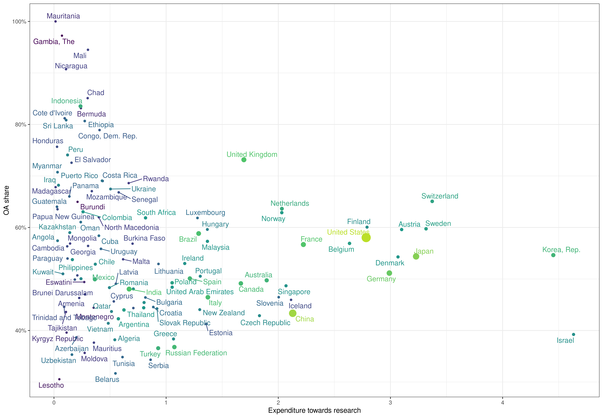
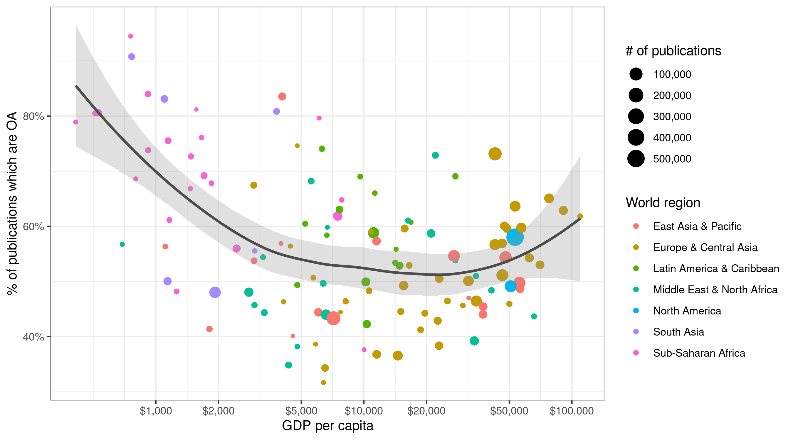
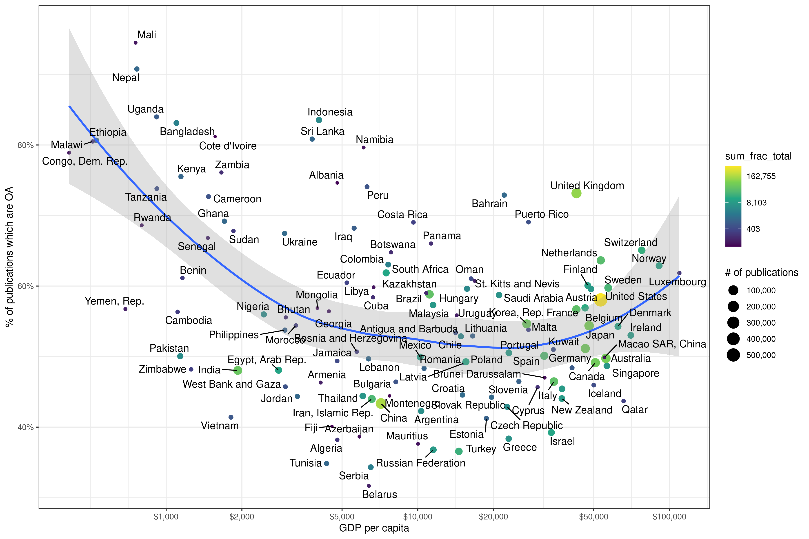
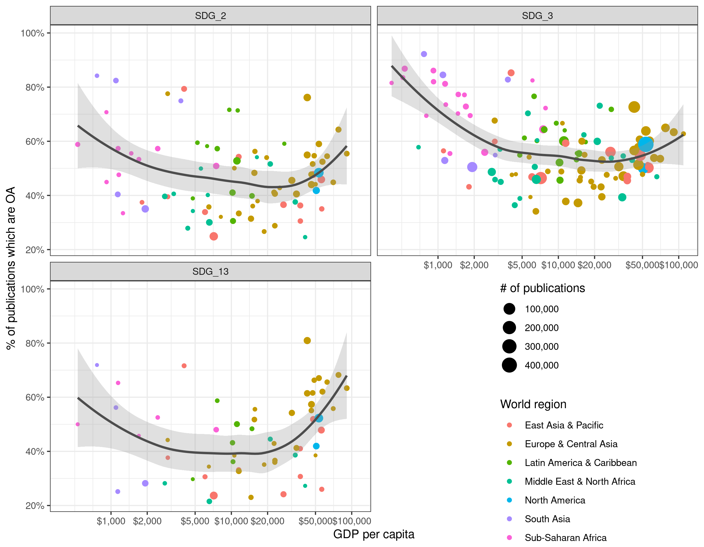
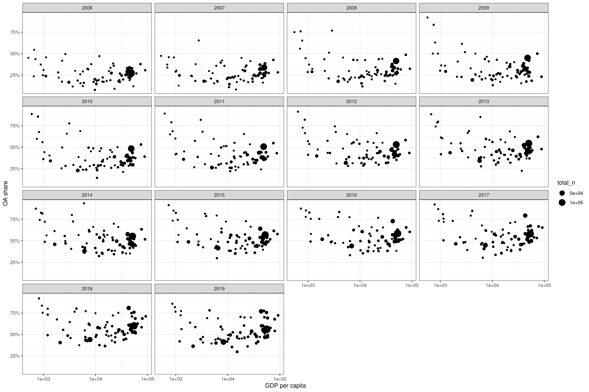
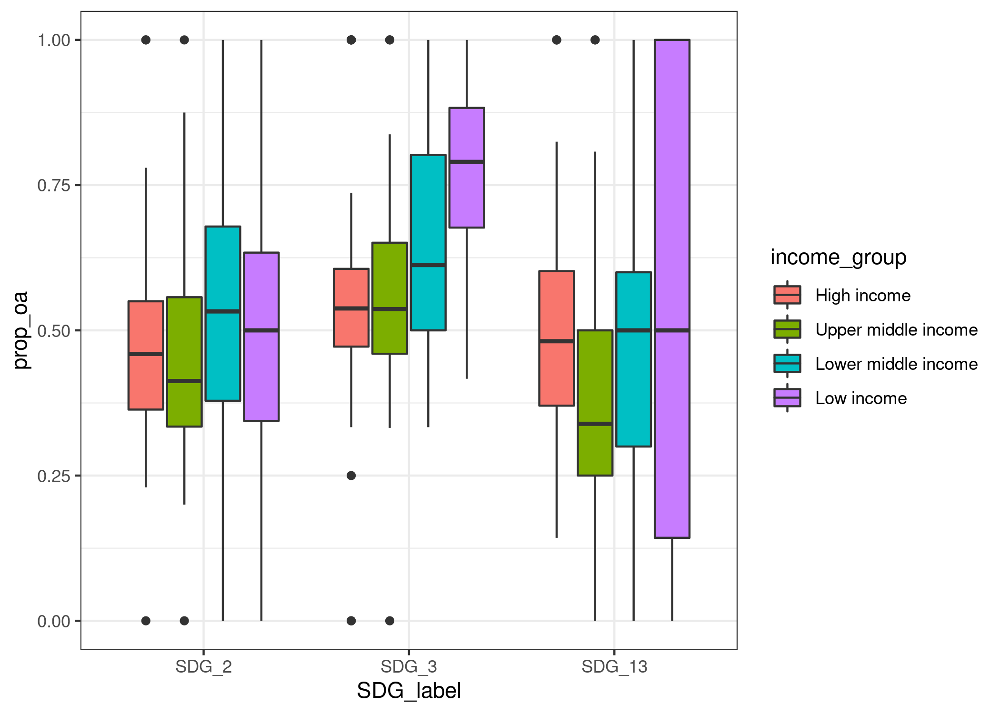
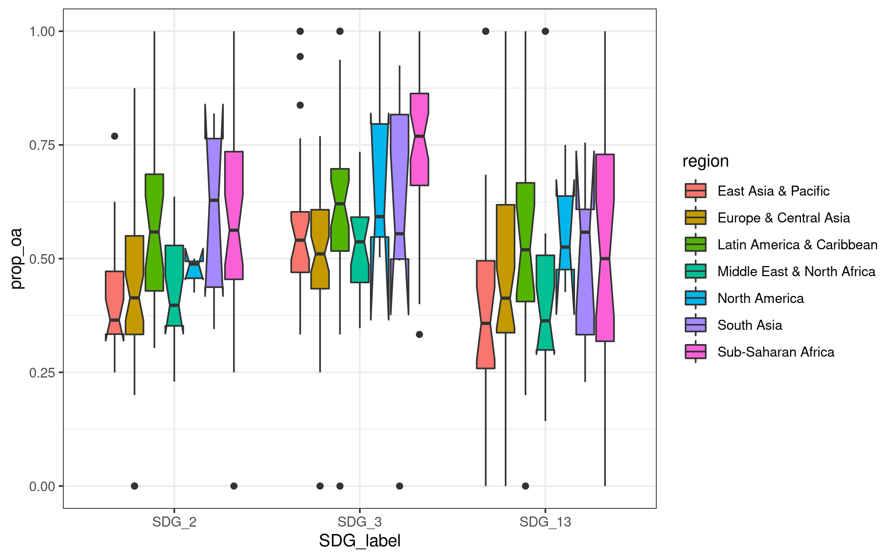

# OA by FOS and year

```r
# aggregate oa_status -----
oa_status <- papers %>%
  filter(!is.na(is_oa)) %>%
  select(paperid, SDG_label, year, is_oa, provider_cat) 


oa_per_year <- oa_status %>%
  count(SDG_label, year, is_oa) %>%
  collect()

oa_status_per_year <- oa_status %>%
  count(SDG_label, year, provider_cat) %>%
  collect()
```


```r
oa_per_year %>%
  group_by(SDG_label, year) %>%
  mutate(oa_share = n/sum(n)) %>%
  filter(is_oa) %>%
  ggplot(aes(as_year(year), oa_share, colour = SDG_label,
             group = SDG_label)) +
  geom_point() +
  geom_line() +
  scale_y_continuous(labels = function(x) scales::percent(x, accuracy = 1)) +
  labs(x = NULL, title = "OA share by SDG",
       y = NULL, colour = NULL) +
  theme(legend.position = "top")
```

<!-- -->


```r
oa_status_per_year %>%
  group_by(SDG_label, year) %>%
  filter(!is.na(provider_cat), provider_cat != "Not OA") %>%
  mutate(oa_share = n/sum(n)) %>%
  ggplot(aes(as_year(year), oa_share,
             colour = SDG_label,
             group = SDG_label)) +
  geom_point() +
  geom_line() +
  facet_wrap(vars(provider_cat)) +
  scale_y_continuous(labels = function(x) scales::percent(x, accuracy = 1)) +
  labs(x = NULL, title = "OA share by SDG",
       y = NULL, colour = NULL) +
  theme(legend.position = "top")
```

<!-- -->

The rise in OA is thus mainly due to rise in gold OA, slightly rise in hybrid.
However, unpaywall prefers gold over green: redo this figure with new 
categorisation.


# OA per funder 

```r
funder_overview <- papers %>% 
  # restrict to unpaywall
  filter(!is.na(is_oa), !is.na(is_funded)) %>% 
  group_by(is_funded, year, SDG_label) %>% 
  summarise(mean_oa = mean(as.numeric(is_oa))) %>% 
  collect()
```


```r
funder_overview %>% 
  ggplot(aes(as_year(year), mean_oa, colour = is_funded)) +
  geom_line() +
  geom_point() +
  facet_wrap(vars(SDG_label)) +
  scale_y_continuous(labels = scales::percent) +
  labs(x = NULL, y = "% of publications which are OA", 
       title = "OA by funding status") +
  theme(legend.position = "top")
```

<!-- -->


```r
paper_oa_flag <- papers %>%
  select(paperid, is_oa, provider_cat, year, SDG_label)

oa_per_funder <- funded_projects %>%
  left_join(paper_oa_flag)
```

```
## Joining, by = "paperid"
```

```r
oa_per_funder_aggregated <- oa_per_funder %>%
  select(doi, funder_name, year, is_oa) %>%
  distinct() %>% # remove duplicate rows since many papers are funded by multiple projects
  group_by(year, funder_name) %>%
  count(is_oa) %>%
  filter(!is.na(is_oa)) %>%
  mutate(oa_share = n/sum(n),
         total_papers = sum(n)) %>%
  collect()
```


```r
text_labels <- oa_per_funder_aggregated %>%
  group_by(funder_name) %>%
  summarise(nn_papers = sum(total_papers)) %>%
  mutate(label = glue::glue("n = {format(nn_papers, big.mark = '.', decimal.mark = ',')}"))


oa_per_funder_aggregated %>%
  filter(is_oa) %>%
  ggplot(aes(lubridate::ymd(year, truncated = 2L), oa_share,
             group = funder_name)) +
  geom_point() +
  geom_line() +
  geom_text(aes(x = lubridate::ymd("2017-01-01"),
                y = .4,
                label = label),
            data = text_labels) +
  facet_wrap(vars(str_wrap(funder_name, 50))) +
  scale_y_continuous(labels = function(x) scales::percent(x, accuracy = 1)) +
  labs(x = NULL, title = "OA share by funder",
       y = NULL, colour = NULL) +
  theme(legend.position = "top")
```

<!-- -->

Share of OA going down for CA institutes of health. There is an explanation
for this in the Nature 2018 paper by Lariviere and Sugimoto.


# OA by country

```r
oa_per_affiliation <- oa_status %>%
  left_join(author_paper_affiliations) %>%
  right_join(affils)
```

```
## Joining, by = "paperid"
```

```
## Joining, by = "affiliationid"
```

```r
oa_per_affiliation_selected <- oa_per_affiliation %>%
  group_by(paperid) %>%
  mutate(frac_count = 1 / max(authorsequencenumber, na.rm = TRUE)) %>%
  select(paperid, authorid, is_oa, provider_cat, year, country, frac_count,
         SDG_label) 

oa_per_country <- oa_per_affiliation_selected %>%
  group_by(country, is_oa) %>%
  summarise(sum_frac_oa = sum(frac_count)) %>%
  mutate(prop_oa = sum_frac_oa/sum(sum_frac_oa),
         sum_frac_total = sum(sum_frac_oa)) %>%
  collect()
```


## Correlation between indicators

```r
# use the mean of the 2015-2018 for now to reduce missing data
# maybe better to to lag values (drag forward if missing)
wb_local <- wb_indicators %>%
  filter(year >= 2015 & year <= 2018) %>%
  group_by(country_name, country_code, indicator_code, indicator_name) %>% 
  summarise(value = mean(value, na.rm = TRUE)) %>% 
  collect()

proper_countries <- wb_countries %>% 
  filter(!is.na(`Currency Unit`)) %>% 
  select(country_code = `Country Code`, short_name = `Short Name`,
         region = Region, income_group = `Income Group`)

wb_2015_2018 <- wb_local %>% 
  select(country_code, country_name, indicator_name, value) %>% 
  pivot_wider(names_from = "indicator_name", values_from = "value") %>% 
  right_join(proper_countries)
```

```
## Joining, by = "country_code"
```

```r
cor_matrix <- wb_2015_2018 %>% 
  select(-starts_with("country"), -short_name, -region, -income_group) %>% 
  cor(use = "pairwise.complete.obs")
```


```r
wb_2015_2018 %>% 
  filter(!is.na(country_name)) %>% 
  select(-short_name) %>% 
  vis_miss(cluster = TRUE)
```

<!-- -->

Quite a large portion (about 40%) of ocuntries does not have data for R&D 
expenditure, even when averaging over the years 2015-2018. 


```r
plot_correlation(cor_matrix, cluster = TRUE)
```

<!-- -->


```r
## OA per gdp, % spent on research
oa_with_r_d_gdp <- oa_per_country %>%
  left_join(wb_local, by = c("country" = "country_code")) %>%
  select(-indicator_name) %>%
  filter(indicator_code %in% c("GB.XPD.RSDV.GD.ZS", "NY.GDP.MKTP.KD")) %>%
  pivot_wider(names_from = indicator_code, values_from = value) %>%
  drop_na() %>%
  filter(is_oa)
oa_with_r_d_gdp %>%
  ggplot(aes(GB.XPD.RSDV.GD.ZS, prop_oa, colour = NY.GDP.MKTP.KD)) +
  geom_point(aes(size = NY.GDP.MKTP.KD), show.legend = FALSE) +
  scale_colour_viridis_c(trans = "log", option = "D", end = .9) +
  ggrepel::geom_text_repel(aes(label = country_name), show.legend = FALSE) +
  labs(x = "Expenditure towards research", y = "OA share") +
  scale_y_continuous(labels = scales::percent)
```

<!-- -->


```r
oa_with_gdp_per_cap <- oa_per_country %>%
  left_join(wb_local, by = c("country" = "country_code")) %>%
  select(-indicator_name) %>%
  filter(indicator_code %in% c("NY.GDP.PCAP.KD")) %>%
  pivot_wider(names_from = indicator_code, values_from = value) %>%
  drop_na() %>%
  filter(is_oa)

p <- oa_with_gdp_per_cap %>%
  filter(sum_frac_total >= 100) %>%
  left_join(proper_countries, by = c("country" = "country_code")) %>% 
  ggplot(aes(NY.GDP.PCAP.KD, prop_oa)) +
  geom_point(aes(size = sum_frac_total)) +
  labs(x = "GDP per capita", y = "% of publications which are OA",
       size = "# of publications") +
  scale_size_continuous(trans = "sqrt", labels = scales::comma) +
  scale_y_continuous(labels = scales::percent) +
  scale_x_log10(breaks = c(1e+03, 2e+03, 5e+03, 1e+04, 2e+04, 5e+04, 1e+05),
                labels = scales::comma) +
  theme_bw() 

p1 <- p +
  aes(colour = region)
p1 +
    geom_smooth(aes(colour = NULL), alpha = .3, show.legend = FALSE,
                colour = "grey30") +
  labs(colour = "World region")
```

```
## `geom_smooth()` using method = 'loess' and formula 'y ~ x'
```

<!-- -->


```r
plotly::ggplotly(p1)
```

preservef897a2cbedb9b277


```r
p + 
  geom_smooth(alpha = .3, show.legend = FALSE) +
  aes(colour  = sum_frac_total) +
  ggrepel::geom_text_repel(aes(label = country_name, colour = NULL),
                           seed = 66324613) +
  scale_colour_viridis_c(
    trans = "log", 
    # https://stackoverflow.com/a/20901094/3149349
    labels = scales::trans_format("identity", 
                                  format = function(x) scales::comma(round(x)))) 
```

```
## `geom_smooth()` using method = 'loess' and formula 'y ~ x'
```

<!-- -->

### split by SDG

```r
oa_per_country_per_SDG <- oa_per_affiliation_selected %>%
  group_by(country, SDG_label, is_oa) %>%
  summarise(sum_frac_oa = sum(frac_count)) %>%
  mutate(prop_oa = sum_frac_oa/sum(sum_frac_oa),
         sum_frac_total = sum(sum_frac_oa)) %>%
  collect()

oa_sdg__with_gdp_per_cap <- oa_per_country_per_SDG %>%
  left_join(wb_local, by = c("country" = "country_code")) %>%
  select(-indicator_name) %>%
  filter(indicator_code %in% c("NY.GDP.PCAP.KD")) %>%
  pivot_wider(names_from = indicator_code, values_from = value) %>%
  drop_na() %>%
  filter(is_oa)
```


```r
oa_sdg__with_gdp_per_cap %>%
  filter(sum_frac_total >= 100) %>%
  left_join(proper_countries, by = c("country" = "country_code")) %>% 
  ggplot(aes(NY.GDP.PCAP.KD, prop_oa)) +
  geom_point(aes(size = sum_frac_total, colour = region)) +
  geom_smooth(alpha = .3, show.legend = FALSE, colour = "grey30") +
  labs(x = "GDP per capita", y = "% of publications which are OA",
       colour = "World region", size = "# of publications") +
  scale_size_continuous(trans = "sqrt", labels = scales::comma) +
  scale_y_continuous(labels = scales::percent) +
  scale_x_log10(breaks = c(1e+03, 2e+03, 5e+03, 1e+04, 2e+04, 5e+04, 1e+05),
                labels = scales::comma) +
  theme_bw() +
  facet_wrap(vars(fct_relevel(SDG_label, "SDG_13", after = 3)), nrow = 2) +
  theme(legend.position = c(.8, .2))
```

```
## `geom_smooth()` using method = 'loess' and formula 'y ~ x'
```

<!-- -->

Pattern is stable across all three SDGs. 

Maybe reposition the legend here: https://stackoverflow.com/questions/52060601/ggplot-multiple-legends-arrangement


```r
make_buckets <- function(df) {
  df %>% 
    mutate(year_bucket = case_when(year %in% 2009:2013 ~ "2009-2013",
                                   year %in% 2014:2018 ~ "2014-2018",
                                   TRUE ~ NA)) %>% 
    filter(!is.na(year_bucket))
  
}

oa_per_country_year <- oa_per_affiliation_selected %>%
  make_buckets() %>% 
  group_by(country, year_bucket, is_oa) %>%
  summarise(sum_frac_oa = sum(frac_count)) %>%
  mutate(prop_oa = sum_frac_oa/sum(sum_frac_oa),
         sum_frac_total = sum(sum_frac_oa)) %>%
  collect()


wb_buckets <- wb_indicators %>%
  make_buckets() %>% 
  group_by(country_name, country_code, indicator_code, indicator_name, 
           year_bucket) %>% 
  summarise(value = mean(value, na.rm = TRUE)) %>% 
  collect()


oa_with_gdp_per_cap <- oa_per_country_year %>%
  left_join(wb_buckets, by = c("country" = "country_code", "year_bucket")) %>%
  select(-indicator_name) %>%
  filter(indicator_code %in% c("NY.GDP.PCAP.KD")) %>% # removing "GB.XPD.RSDV.GD.ZS" because of missing values
  pivot_wider(names_from = indicator_code, values_from = value) %>%
  drop_na() %>%
  filter(is_oa)
```


```r
pdata <- oa_with_gdp_per_cap %>%
  group_by(country) %>% 
  mutate(all_in = all(sum_frac_total > 100)) %>% 
  filter(all_in) %>% 
  ungroup() %>% 
  select(country, year_bucket, prop_oa,
         gdp = NY.GDP.PCAP.KD) %>% 
  pivot_wider(names_from = year_bucket, values_from = c(prop_oa, gdp)) %>% 
  mutate(oa_increase = if_else(`prop_oa_2009-2013` < `prop_oa_2014-2018`, TRUE,
                               FALSE),
         oa_diff = `prop_oa_2014-2018` - `prop_oa_2009-2013`) %>% 
  left_join(proper_countries, by = c("country" = "country_code"))
```


```r
pdata %>% 
  ggplot(aes(oa_diff, fct_reorder(region, oa_diff))) +
  geom_boxplot(outlier.alpha = 0, width = .7) +
  geom_jitter(height = .11) +
  scale_x_continuous(labels = function(x) scales::percent(x, accuracy = 1)) +
  labs(x = "Percentage point increase in OA publications", 
       y = NULL,
       title = "Change in OA publication propensity across regions",
       subtitle = "Time window: 2009-2013 vs 2014-2018") +
  theme_bw()
```

<!-- -->


```r
pdata %>% 
  ggplot(
    aes(oa_diff, 
        factor(income_group, 
               levels = c("Low income", "Lower middle income",
                          "Upper middle income", "High income"))
        )
    ) +
  geom_boxplot(outlier.alpha = 0, width = .7) +
  geom_jitter(height = .11) +
  scale_x_continuous(labels = function(x) scales::percent(x, accuracy = 1)) +
  labs(x = "Percentage point increase in OA publications", 
       y = NULL,
       title = "Change in OA publication propensity across income groups",
       subtitle = "Time window: 2009-2013 vs 2014-2018") +
  theme_bw()
```

<!-- -->


```r
pdata <- oa_with_gdp_per_cap %>%
  group_by(country) %>% 
  mutate(all_in = all(sum_frac_total > 100)) %>% 
  filter(all_in) %>% 
  ungroup() %>% 
  select(country_name, year_bucket, prop_oa,
         gdp = NY.GDP.PCAP.KD) %>% 
  arrange(country_name) %>% 
  pivot_wider(names_from = year_bucket, values_from = c(prop_oa, gdp)) %>% 
  mutate(oa_increase = if_else(`prop_oa_2009-2013` < `prop_oa_2014-2018`, TRUE,
                               FALSE),
         oa_diff = `prop_oa_2014-2018` - `prop_oa_2009-2013`)
  

p <- ggplot(pdata, aes(x = `gdp_2009-2013`, y = `prop_oa_2009-2013`,
             xend = `gdp_2014-2018`, yend = `prop_oa_2014-2018`)) +
  geom_segment(arrow = arrow(length = unit(.15, "inches")),
               lineend = "round", linejoin = "round",
               size = 1) +
  scale_y_continuous(labels = scales::percent) +
  scale_x_log10(breaks = c(1e+03, 5e+03, 1e+04, 5e+04, 1e+05),
                labels = scales::comma) +
  theme_bw() +
  labs(x = "GDP per capita", y = "% of publications which are OA")

p +
  aes(colour = oa_increase)
```

<!-- -->

Only very few countries dropping in terms of OA.


```r
p +
  aes(colour = oa_diff*100) +
  scale_color_gradient2(mid = "grey75", low = "red") +
  labs(colour = "Change in percentage points",
       title = "Change in OA from 2009-2013 to 2014-2018") +
  theme(legend.position = "top") 
```

<!-- -->

Where are biggest increases?

- No clear picture. Increases at the top of OA % are lower. 
- Some LIC made big jumps, but not all of them. Big jumps also happening in HIC.


# OA by country with author groups

```r
oa_per_affiliation <- paper_oa_flag %>%
  select(-SDG_label) %>%
  left_join(author_paper_affiliations_w_groups) %>%
  right_join(affils) %>% 
  filter(!is.na(is_oa))
```

```
## Joining, by = "paperid"
```

```
## Joining, by = "affiliationid"
```

```r
oa_per_country_over_years <- oa_per_affiliation %>%
  count(country, year, author_position, is_oa) %>%
  group_by(country, year, author_position) %>% 
  mutate(prop_oa = n/sum(n)) %>%
  collect()
```


## author positions by country


```r
country_names <- wb_indicators %>% 
  distinct(country_name, country_code) %>% 
  collect()
pdata <- oa_per_country_over_years %>% 
  group_by(country, author_position) %>% 
  summarise(n = sum(n)) %>% 
  add_proportion(n, order_var = author_position,
                 order_string = "first") %>% 
  left_join(country_names, by = c("country" = "country_code")) %>% 
  drop_na()
```

```
## `summarise()` has grouped output by 'country'. You can override using the `.groups` argument.
```

```r
p <- pdata %>% 
  ggplot(aes(fct_reorder(country_name, order), prop, fill = author_position)) +
  geom_col() +
  coord_flip() +
  labs(x = NULL, y = "Proportion")
plotly::ggplotly(p)
```

preserve43b488b15eeb9586

Here we could also look into the proportion of papers coming from single, dual 
or multi-author papers.


```r
gdp_p_cap <- wb_indicators %>% 
  filter(indicator_code == "NY.GDP.PCAP.KD") %>% 
  collect()
pdata <- oa_per_country_over_years %>% 
  group_by(country) %>% 
  mutate(country_with_low_n = any(n < 5)) %>% 
  filter(!country_with_low_n) %>% 
  left_join(gdp_p_cap, by = c("year", "country" = "country_code")) %>% 
  rename(gdp_p_cap = value) %>% 
  group_by(country, year, author_position) %>% 
  mutate(total_n = sum(n)) %>% 
  filter(is_oa)
pdata %>% 
  ggplot(aes(gdp_p_cap, prop_oa, size = total_n)) +
  geom_point() +
  facet_grid(rows = vars(year),
             cols = vars(author_position)) +
  # ggrepel::geom_text_repel(aes(label = country_name)) +
  labs(x = "GDP per capita", y = "OA share") +
  scale_y_continuous(labels = scales::percent) +
  scale_x_log10()
```

<!-- -->


### Only for first authors

```r
pdata %>% 
  filter(author_position == "first_author") %>% 
  ggplot(aes(gdp_p_cap, prop_oa, size = total_n)) +
  geom_point() +
  facet_wrap(vars(year)) +
  # ggrepel::geom_text_repel(aes(label = country_name)) +
  labs(x = "GDP per capita", y = "OA share") +
  scale_y_continuous(labels = scales::percent) +
  scale_x_log10()
```

<!-- -->


## Animated and for all

```r
# approach for saving and embedding from https://stackoverflow.com/a/54849281/3149349
# and https://stackoverflow.com/a/50394922/3149349
p <- pdata %>%
  # filter(author_position == "first_author") %>%
  ggplot(aes(gdp_p_cap, prop_oa, size = n, group = country)) +
  geom_point() +
  facet_wrap(vars(author_position),
             nrow = 3) +
  # ggrepel::geom_text_repel(aes(label = country_name)) +
  labs(x = "GDP per capita", y = "OA share") +
  scale_y_continuous(labels = scales::percent) +
  labs(title = 'Year: {frame_time}') +
  transition_time(year) +
  ease_aes('linear')
anim_save(here::here("animations/oa_by_country_author_position.mp4"), p, 
          renderer = ffmpeg_renderer())
```

<video width="960" height="720" controls>
  <source src="../animations/oa_by_country_author_position.mp4" type="video/mp4">
</video>


## Investigate country per SDG
Avenues to follow:

- only for first authors
- focus on SDG 3, but look if sample is big enough in other areas
- 2018


```r
oa_per_affiliation <- oa_status %>%
  left_join(author_paper_affiliations_w_groups) %>%
  right_join(affils)
```

```
## Joining, by = "paperid"
```

```
## Joining, by = "affiliationid"
```

```r
oa_per_affil_firsts <- oa_per_affiliation %>% 
  filter(author_position == "first_author", year %in% 2015:2018) %>% 
  group_by(country, SDG_label) %>% 
  summarise(prop_oa = mean(as.numeric(is_oa)),
            n_papers = n()) %>% 
  collect()
```

New approach by sampling based on country. Sampling could be avoided, if the 
"proper countries" df was in spark. Then could aggregate directly.


```r
oa_per_region_summarised <- oa_per_affiliation %>% 
  filter(author_position == "first_author", year %in% 2015:2018) %>% 
  left_join(wb_countries_spark, by = c("country" = "Country_Code")) %>% 
  group_by(SDG_label, Region) %>% 
  summarise(prop_oa = mean(as.numeric(is_oa))) %>% 
  collect() %>% 
  drop_na(Region) %>% 
  rename(region = Region)
```


```r
oa_per_region_summarised %>% 
  mutate(prop_non_oa = 1 - prop_oa) %>% 
  pivot_longer(starts_with("prop")) %>% 
  ggplot(aes(value, region, fill = name)) +
  geom_col() +
  facet_wrap(vars(fct_relevel(SDG_label, "SDG_13", after =  3)),
             nrow = 2) +
  theme(legend.position = c(.8, .2))
```

<!-- -->


```r
oa_per_affil_firsts_w_groups <- oa_per_affil_firsts %>% 
  left_join(proper_countries, by = c("country" = "country_code")) %>% 
  filter(!is.na(income_group)) %>% 
  mutate(income_group = fct_relevel(income_group, "High income", 
                                    "Upper middle income", 
                                    "Lower middle income", "Low income"),
         SDG_label = fct_relevel(SDG_label, "SDG_13", after = 3))
```


---------------------

TODO here:

do not visualise countries with boxplot, but sample from the data and plot, or
use dbplot variante.

  Actually: this are two distinct things. One shows how countries vary in a given
  regions, the other shows, how the total of the regions compares.


-----------------------


```r
oa_per_affil_firsts_w_groups %>% 
  ggplot(aes(SDG_label, prop_oa, fill = income_group)) +
  geom_boxplot()
```

<!-- -->


```r
oa_per_affil_firsts_w_groups %>% 
  filter(!is.na(region)) %>% 
  ggplot(aes(SDG_label, prop_oa, fill = region)) +
  geom_boxplot(notch = TRUE)
```

```
## notch went outside hinges. Try setting notch=FALSE.
## notch went outside hinges. Try setting notch=FALSE.
## notch went outside hinges. Try setting notch=FALSE.
## notch went outside hinges. Try setting notch=FALSE.
## notch went outside hinges. Try setting notch=FALSE.
## notch went outside hinges. Try setting notch=FALSE.
## notch went outside hinges. Try setting notch=FALSE.
## notch went outside hinges. Try setting notch=FALSE.
## notch went outside hinges. Try setting notch=FALSE.
```

<!-- -->

This has the issue of treating Bermuda and USA equally (one data point in north
america).


```r
oa_per_affil_firsts_w_groups %>% 
  filter(!is.na(region)) %>% 
  group_by(region, SDG_label) %>% 
  summarise(mean_oa = weighted.mean(prop_oa, n_papers)) %>% 
  ggplot(aes(SDG_label, mean_oa, colour = region, group = region)) +
  geom_point() +
  geom_line()
```

```
## `summarise()` has grouped output by 'region'. You can override using the `.groups` argument.
```

<!-- -->


```r
oa_per_affil_firsts_w_groups %>% 
  ggplot(aes(region, prop_oa)) +
  geom_beeswarm(aes(colour = region, group = region, size = n_papers),
                show.legend = FALSE, alpha = .6) +
  geom_point(data = oa_per_region_summarised, colour = "grey10",
             aes(y = prop_oa), size = 3.5,
             shape = 18, show.legend = FALSE) +
  scale_size_continuous(trans = "sqrt") +
  scale_y_continuous(labels = scales::percent) +
  facet_wrap(vars(fct_relevel(SDG_label, "SDG_13", after = 3)), nrow = 2) +
  theme_bw() +
  theme(legend.position = c(.8, .1),
        axis.text.x = element_text(angle = 90, vjust = .5, hjust = 1)) +
  labs(x = NULL, y = "% of papers which are OA")
```

<!-- -->

This figure is good to go in terms of setup. Add manual indication of what the diamond
means with inkscape or similar.


Results:

- sub saharan africa higher in SDG 3, but not in others. 
- Europe highest in SDG 13
- Asia, middle east and northern africa always lowest
  - why this divide between sub saharan africa and northern africa & middle east?


Now by income group


```r
oa_per_income_summarised <- oa_per_affiliation %>% 
  filter(author_position == "first_author", year %in% 2015:2018) %>% 
  left_join(wb_countries_spark, by = c("country" = "Country_Code")) %>% 
  group_by(SDG_label, Income_Group) %>% 
  summarise(prop_oa = mean(as.numeric(is_oa))) %>% 
  collect() %>% 
  drop_na(Income_Group) %>% 
  rename(income_group = Income_Group)
```


```r
oa_per_affil_firsts_w_groups %>% 
  ggplot(aes(income_group, prop_oa)) +
  geom_beeswarm(aes(colour = income_group, group = income_group,
                    size = n_papers),
                show.legend = FALSE, alpha = .6) +
  geom_point(data = oa_per_income_summarised, colour = "grey10",
             aes(y = prop_oa), size = 3.5,
             shape = 18, show.legend = FALSE) +
  scale_size_continuous(trans = "sqrt") +
  scale_y_continuous(labels = scales::percent) +
  facet_wrap(vars(fct_relevel(SDG_label, "SDG_13", after = 3)), nrow = 2) +
  theme_bw() +
  theme(legend.position = c(.8, .1),
        axis.text.x = element_text(angle = 90, vjust = .5, hjust = 1)) +
  labs(x = NULL, y = "% of papers which are OA")
```

<!-- -->

- LIC higher, except for SDG 13
- MIC always lower than rest.


