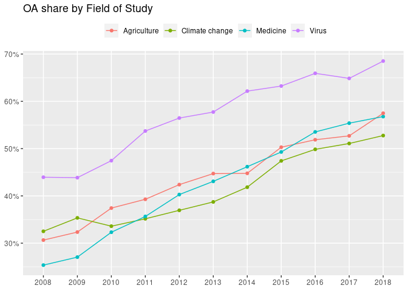
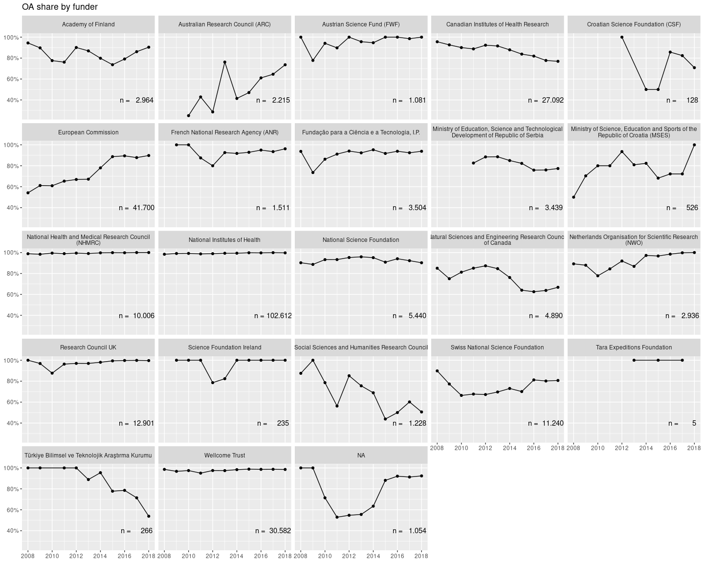

# OA by FOS and year

```r
# aggregate oa_status -----
oa_status <- papers %>%
  filter(!is.na(is_oa)) %>%
  select(paperid, fos_displayname, year, is_oa, oa_status) %>%
  distinct()


oa_per_year <- oa_status %>%
  count(fos_displayname, year, is_oa) %>%
  collect()

oa_status_per_year <- oa_status %>%
  count(fos_displayname, year, oa_status) %>%
  collect()
```


```r
oa_per_year %>%
  group_by(fos_displayname, year) %>%
  mutate(oa_share = n/sum(n)) %>%
  filter(is_oa) %>%
  ggplot(aes(as.factor(year), oa_share, colour = fos_displayname,
             group = fos_displayname)) +
  geom_point() +
  geom_line() +
  scale_y_continuous(labels = function(x) scales::percent(x, accuracy = 1)) +
  labs(x = NULL, title = "OA share by Field of Study",
       y = NULL, colour = NULL) +
  theme(legend.position = "top")
```

<!-- -->


```r
oa_status_per_year %>%
  group_by(fos_displayname, year) %>%
  filter(!is.na(oa_status)) %>%
  mutate(oa_share = n/sum(n)) %>%
  ggplot(aes(lubridate::ymd(year, truncated = 2L), oa_share,
             colour = fos_displayname,
             group = fos_displayname)) +
  geom_point() +
  geom_line() +
  facet_wrap(vars(oa_status)) +
  scale_y_continuous(labels = function(x) scales::percent(x, accuracy = 1)) +
  labs(x = NULL, title = "OA share by Field of Study",
       y = NULL, colour = NULL) +
  theme(legend.position = "top")
```

<!-- -->

The rise in OA is thus mainly due to rise in gold OA, slightly rise in hybrid.
However, unpaywall prefers gold over green: redo this figure with new 
categorisation.


# OA per funder 

```r
paper_oa_flag <- papers %>%
  select(paperid, is_oa, oa_status, year, fos_displayname)

oa_per_funder <- funded_projects %>%
  left_join(paper_oa_flag)
```

```
## Joining, by = "paperid"
```

```r
oa_per_funder_aggregated <- oa_per_funder %>%
  select(doi, funder_name, year, is_oa) %>%
  distinct() %>% # remove duplicate rows since many papers are funded by multiple projects
  group_by(year, funder_name) %>%
  count(is_oa) %>%
  filter(!is.na(is_oa)) %>%
  mutate(oa_share = n/sum(n),
         total_papers = sum(n)) %>%
  collect()
```


```r
text_labels <- oa_per_funder_aggregated %>%
  group_by(funder_name) %>%
  summarise(nn_papers = sum(total_papers)) %>%
  mutate(label = glue::glue("n = {format(nn_papers, big.mark = '.', decimal.mark = ',')}"))


oa_per_funder_aggregated %>%
  filter(is_oa) %>%
  ggplot(aes(lubridate::ymd(year, truncated = 2L), oa_share,
             group = funder_name)) +
  geom_point() +
  geom_line() +
  geom_text(aes(x = lubridate::ymd("2017-01-01"),
                y = .4,
                label = label),
            data = text_labels) +
  facet_wrap(vars(str_wrap(funder_name, 50))) +
  scale_y_continuous(labels = function(x) scales::percent(x, accuracy = 1)) +
  labs(x = NULL, title = "OA share by funder",
       y = NULL, colour = NULL) +
  theme(legend.position = "top")
```

<!-- -->

Share of OA going down for CA institutes of health. There is an explanation
for this in the Nature 2018 paper by Lariviere and Sugimoto.


