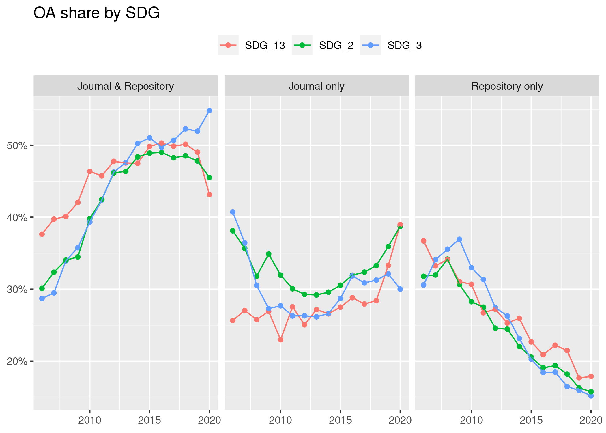
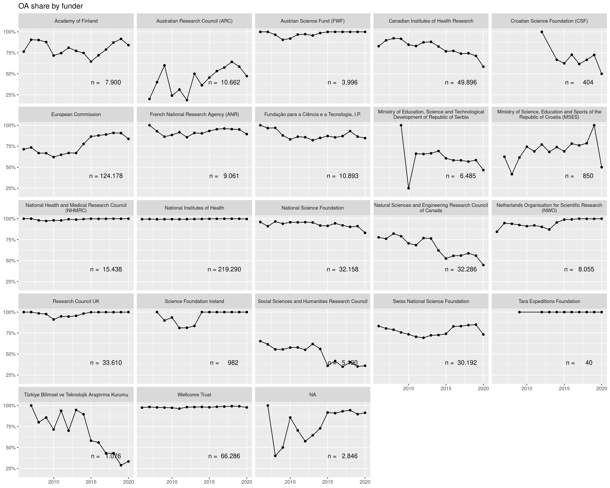

# OA by FOS and year

```r
# aggregate oa_status -----
oa_status <- papers %>%
  filter(!is.na(is_oa)) %>%
  select(paperid, fos_displayname, year, is_oa, oa_status) %>%
  distinct()


oa_per_year <- oa_status %>%
  count(fos_displayname, year, is_oa) %>%
  collect()

oa_status_per_year <- oa_status %>%
  count(fos_displayname, year, oa_status) %>%
  collect()
```


```r
oa_per_year %>%
  group_by(fos_displayname, year) %>%
  mutate(oa_share = n/sum(n)) %>%
  filter(is_oa) %>%
  ggplot(aes(as.factor(year), oa_share, colour = fos_displayname,
             group = fos_displayname)) +
  geom_point() +
  geom_line() +
  scale_y_continuous(labels = function(x) scales::percent(x, accuracy = 1)) +
  labs(x = NULL, title = "OA share by Field of Study",
       y = NULL, colour = NULL) +
  theme(legend.position = "top")
```

<!-- -->


```r
oa_status_per_year %>%
  group_by(fos_displayname, year) %>%
  filter(!is.na(oa_status)) %>%
  mutate(oa_share = n/sum(n)) %>%
  ggplot(aes(lubridate::ymd(year, truncated = 2L), oa_share,
             colour = fos_displayname,
             group = fos_displayname)) +
  geom_point() +
  geom_line() +
  facet_wrap(vars(oa_status)) +
  scale_y_continuous(labels = function(x) scales::percent(x, accuracy = 1)) +
  labs(x = NULL, title = "OA share by Field of Study",
       y = NULL, colour = NULL) +
  theme(legend.position = "top")
```

<!-- -->

The rise in OA is thus mainly due to rise in gold OA, slightly rise in hybrid.
However, unpaywall prefers gold over green: redo this figure with new 
categorisation.


# OA per funder 

```r
paper_oa_flag <- papers %>%
  select(paperid, is_oa, oa_status, year, fos_displayname)

oa_per_funder <- funded_projects %>%
  left_join(paper_oa_flag)
```

```
## Joining, by = "paperid"
```

```r
oa_per_funder_aggregated <- oa_per_funder %>%
  select(doi, funder_name, year, is_oa) %>%
  distinct() %>% # remove duplicate rows since many papers are funded by multiple projects
  group_by(year, funder_name) %>%
  count(is_oa) %>%
  filter(!is.na(is_oa)) %>%
  mutate(oa_share = n/sum(n),
         total_papers = sum(n)) %>%
  collect()
```


```r
text_labels <- oa_per_funder_aggregated %>%
  group_by(funder_name) %>%
  summarise(nn_papers = sum(total_papers)) %>%
  mutate(label = glue::glue("n = {format(nn_papers, big.mark = '.', decimal.mark = ',')}"))


oa_per_funder_aggregated %>%
  filter(is_oa) %>%
  ggplot(aes(lubridate::ymd(year, truncated = 2L), oa_share,
             group = funder_name)) +
  geom_point() +
  geom_line() +
  geom_text(aes(x = lubridate::ymd("2017-01-01"),
                y = .4,
                label = label),
            data = text_labels) +
  facet_wrap(vars(str_wrap(funder_name, 50))) +
  scale_y_continuous(labels = function(x) scales::percent(x, accuracy = 1)) +
  labs(x = NULL, title = "OA share by funder",
       y = NULL, colour = NULL) +
  theme(legend.position = "top")
```

<!-- -->

Share of OA going down for CA institutes of health. There is an explanation
for this in the Nature 2018 paper by Lariviere and Sugimoto.


# OA by country

```r
oa_per_affiliation <- paper_oa_flag %>%
  select(-fos_displayname) %>%
  left_join(author_paper_affiliations) %>%
  right_join(affils)
```

```
## Joining, by = "paperid"
```

```
## Joining, by = "affiliationid"
```

```r
oa_per_affiliation_selected <- oa_per_affiliation %>%
  group_by(paperid) %>%
  mutate(frac_count = 1 / max(authorsequencenumber, na.rm = TRUE)) %>%
  select(paperid, authorid, is_oa, oa_status, year, country, frac_count) %>%
  filter(!is.na(is_oa))


oa_per_country <- oa_per_affiliation_selected %>%
  group_by(country, is_oa) %>%
  summarise(sum_frac_oa = sum(frac_count)) %>%
  mutate(prop_oa = sum_frac_oa/sum(sum_frac_oa)) %>%
  collect()


wb_local <- wb_indicators %>%
  filter(year == 2018) %>%
  collect()
```


## Correlation between indicators

```r
cor_matrix <- wb_local %>% 
  select(country_code, country_name, indicator_name, value) %>% 
  pivot_wider(names_from = "indicator_name", values_from = "value") %>% 
  select(-starts_with("country")) %>% 
  cor(use = "pairwise.complete.obs")

plot_correlation(cor_matrix, cluster = TRUE)
```

<!-- -->


```r
## OA per gdp, % spent on research
oa_with_r_d_gdp <- oa_per_country %>%
  left_join(wb_local, by = c("country" = "country_code")) %>%
  select(-indicator_name) %>%
  filter(indicator_code %in% c("GB.XPD.RSDV.GD.ZS", "NY.GDP.MKTP.KD")) %>%
  pivot_wider(names_from = indicator_code, values_from = value) %>%
  drop_na() %>%
  filter(is_oa)

oa_with_r_d_gdp %>%
  ggplot(aes(GB.XPD.RSDV.GD.ZS, prop_oa, colour = NY.GDP.MKTP.KD)) +
  geom_point(aes(size = NY.GDP.MKTP.KD), show.legend = FALSE) +
  scale_colour_viridis_c(trans = "log", option = "D", end = .9) +
  ggrepel::geom_text_repel(aes(label = country_name), show.legend = FALSE) +
  labs(x = "Expenditure towards research", y = "OA share") +
  scale_y_continuous(labels = scales::percent)
```

<!-- -->


```r
oa_with_gdp_per_cap <- oa_per_country %>%
  left_join(wb_local, by = c("country" = "country_code")) %>%
  select(-indicator_name) %>%
  filter(indicator_code %in% c("GB.XPD.RSDV.GD.ZS", "NY.GDP.PCAP.KD")) %>%
  pivot_wider(names_from = indicator_code, values_from = value) %>%
  drop_na() %>%
  filter(is_oa)


oa_with_gdp_per_cap %>%
  ggplot(aes(NY.GDP.PCAP.KD, prop_oa)) +
  geom_point() +
  ggrepel::geom_text_repel(aes(label = country_name)) +
  labs(x = "GDP per capita", y = "OA share") +
  scale_y_continuous(labels = scales::percent) +
  scale_x_log10()
```

<!-- -->


