# SDG over time
## SDG overlap

```r
sdg_labels_local <- vroom::vroom("../../sdg_labels.csv", delim = ",")

set.seed(982374)
sdg_sample <- slice_sample(sdg_labels_local, n = 1e+6)

get_papers <- function(df, var) {
  df %>% 
    filter(SDG_label == var) %>% 
    pull(paperid)
}

sdgs <- c("SDG_2", "SDG_3", "SDG_13")

papers_list <- map(sdgs, ~get_papers(sdg_sample, .x))

venn.diagram(
  x = papers_list,
  category.names = sdgs,
  filename = '03-sdg_who_files/figure-html/venn_diagram.png',
  imagetype = "png",
  print.mode = "raw",
  main = "Overlap within a sample of 1 million papers"
)
```

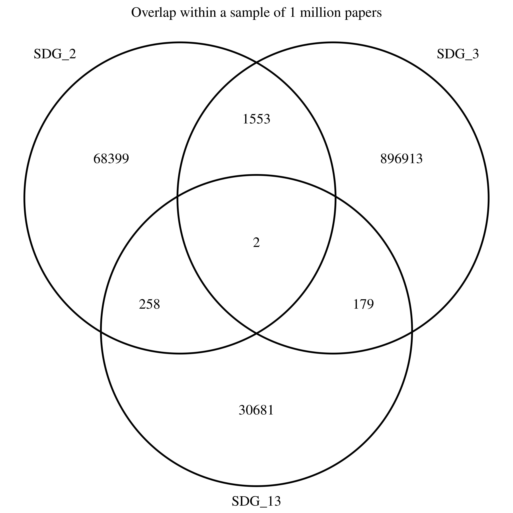


## Number of papers


```r
fos_counts <- papers %>% 
  count(SDG_label, year) %>% 
  collect()
  
p <- fos_counts %>% 
  drop_na() %>% 
  ggplot(aes(as_year(year), n, colour = SDG_label)) +
  geom_line() +
  geom_point() +
  scale_y_log10(labels = scales::comma,
                breaks = c(10e+3, 30e+3, 1e+5, 1e+6)) +
  labs(x = NULL, y = "# of papers", colour = NULL,
       title = "Development of SDG areas over time") 
p
```

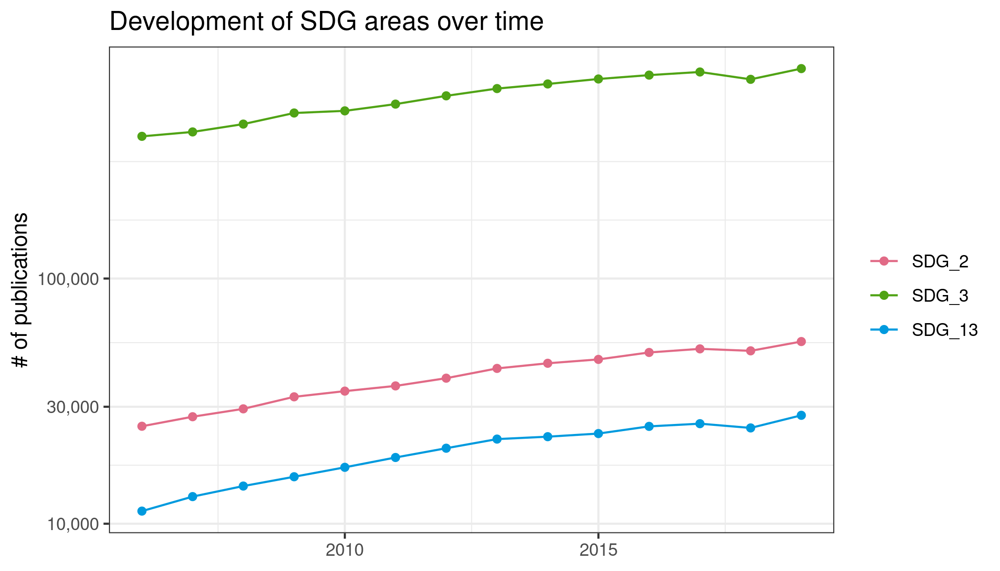<!-- -->


```r
plotly::ggplotly(p)
```

preserve4098315951d7e7b7


We can observe a slight upward trend, that could be attributable to the overall
growth of research.

Improvements:

- directly labeling the lines and removing the legend
- using not raw number of papers but % of MAG overall papers


## Citations/papers


```r
fos_citations <- papers %>% 
  group_by(year, SDG_label) %>% 
  summarise(across(citations_norm, .fns = c(mean = mean, sd = sd))) %>% 
  collect()

fos_citations  %>% 
  drop_na() %>% 
  ggplot(aes(as_year(year), citations_norm_mean, colour = SDG_label)) +
  geom_line() +
  geom_point() +
  labs(x = NULL, y = "mean normalized citations", colour = NULL,
       title = "Impact of SDG research over time")
```

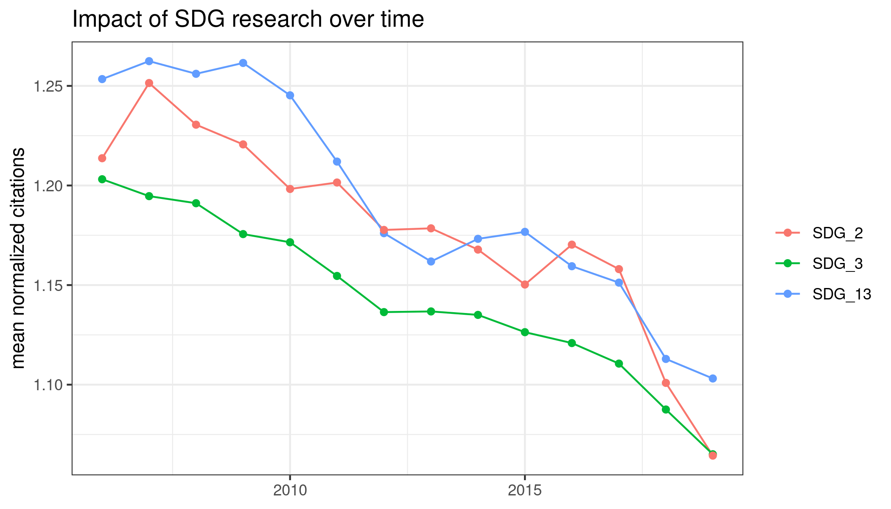<!-- -->
The figure displays normalised citations per SDG (+virus). Overall, the research
in medicine is close to the average impact in similar journals, presumably 
because this simply represents the whole corpus of medicine journals and 
research. Virus, as a comparison case, has a slightly higher impact.

Research on SDG 2 (approximated by agriculture) receives up to 20% more citations
than articles in similar journals. Research on SDG 13 (climate) receives 
substantially more citations (20%-60%), however with a strong downward trend. It
is unclear what the reason for this might be. It could be tied to the citation 
window (how quickly citations accrue), but I'm not sure why climate should have
a long one.

Caveats:

- Since we are using the mean here, this could be sensitive to extreme outliers


```r
fos_citations %>% 
  drop_na() %>% 
  ggplot(aes(as_year(year), citations_norm_sd, colour = SDG_label)) +
  geom_line() +
  geom_point() +
  labs(x = NULL, y = "SD of normalized citations", colour = NULL,
       title = "Variability of impact of SDG research over time")
```

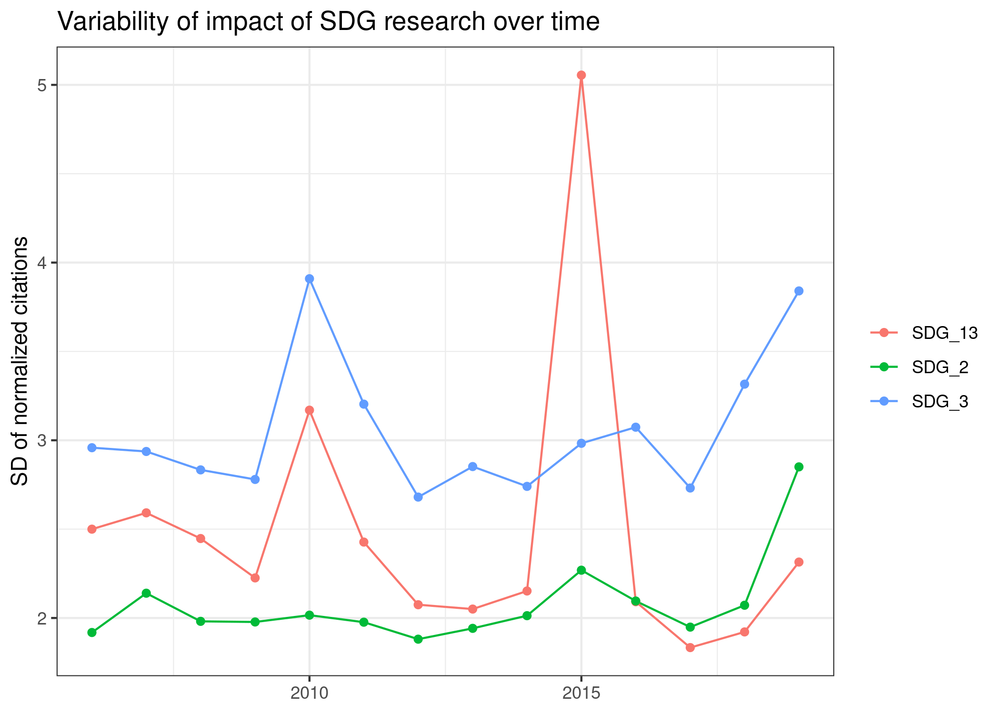<!-- -->

The variability is quite high. 

Caveats:

- Standard deviation might not make much sense for such a skewed distribution ->
what would be better? maybe to say something about quantiles/quartiles?


# Academic Age over time
## Counts

```r
author_paper_affiliations_w_groups <- make_author_groups(author_paper_affiliations)

age_base <- papers %>% 
  select(paperid, SDG_label, year) %>% 
  left_join(author_paper_affiliations_w_groups) %>% 
  left_join(author_metadata) %>% 
  select(paperid, SDG_label, year, author_position, authorid, 
         year_first_paper)
```

```
## Joining, by = "paperid"
```

```
## Joining, by = "authorid"
```

```r
age_cohorts <- age_base %>% 
  group_by(year, authorid) %>% 
  mutate(current_age = year - year_first_paper) %>% 
  filter(current_age > 0) %>% 
  mutate(age_cohort = case_when(
    year_first_paper < 1960 ~ NA_character_,
    year_first_paper < 1970 ~ "1960-1969",
    year_first_paper < 1980 ~ "1970-1979",
    year_first_paper < 1990 ~ "1980-1989",
    year_first_paper < 2000 ~ "1990-1999",
    year_first_paper < 2010 ~ "2000-2009",
    TRUE ~ "2010-2017"
  )) %>% 
  ungroup()

sdg_age <- age_cohorts %>% 
  count(SDG_label, year, author_position, age_cohort) %>% 
  collect()
```


```r
sdg_age %>% 
  filter(age_cohort != "NA") %>% 
  ggplot(aes(as_year(year), n, colour = SDG_label)) +
  geom_line() +
  geom_point() +
  facet_grid(rows = vars(age_cohort), 
             cols = vars(author_position)) +
  scale_y_log10(labels = scales::comma) +
  labs(y = "# of papers", x = NULL, colour = NULL)
```

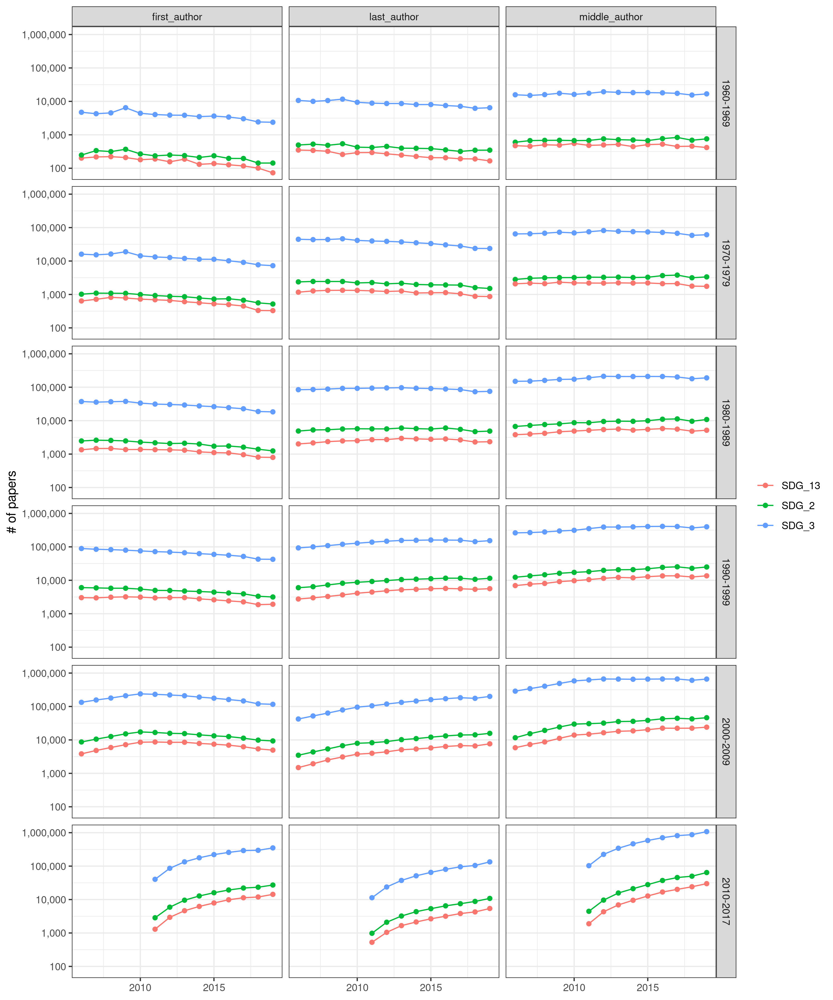<!-- -->

This is not very meaningful.

Better: simple averages/boxplots for how SDGs compare


```r
age_box_base <- age_cohorts %>% 
  filter(year == 2018, current_age > 0, current_age <= 50) %>% 
  db_compute_boxplot(SDG_label, current_age)
```


```r
# since the code for plotting the boxplot is currently not exported in the 
# dbplot package, I'm copying it here directly
colnames(age_box_base) <- c(
  "x", "n", "lower", "middle", "upper", "max_raw", "min_raw",
  "iqr", "min_iqr", "max_iqr", "ymax", "ymin"
)

ggplot(age_box_base) +
  geom_boxplot(
    aes(
      x = x,
      ymin = ymin,
      lower = lower,
      middle = middle,
      upper = upper,
      ymax = ymax,
      group = x,
      fill = x
    ),
    stat = "identity", show.legend = FALSE
  ) +
  labs(x = NULL, y = "Academic age", title = "Academic age as of 2018",
       caption = "Only ages above 0 and below 51 are included")
```

<!-- -->

The academic ages of researchers are quite similar, with researchers working on
climate having the highest average age, and those working on agriculture the 
lowest age.


```r
mean_ages <- age_cohorts %>% 
  group_by(SDG_label, year) %>% 
  filter(current_age > 0, current_age <= 50) %>% 
  summarise(mean_age = mean(current_age, na.rm = TRUE)) %>% 
  collect()
```


```r
ggplot(mean_ages, aes(as_year(year), mean_age, colour = SDG_label)) +
  geom_line() +
  geom_point() +
  labs(x = NULL, colour = NULL, y = "Mean age at publication",
       title = "Author ages over time", 
       caption = "Only ages above 0 and below 51 are included")
```

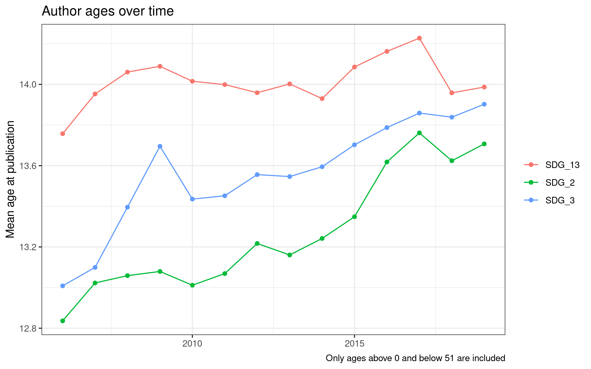<!-- -->

Compared to the medians in the boxplot, the mean values are quite a bit higher,
but the order is the same.


```r
mean_ages_p_position <- age_cohorts %>% 
  group_by(SDG_label, year, author_position) %>% 
  filter(current_age > 0, current_age <= 50) %>% 
  summarise(mean_age = mean(current_age, na.rm = TRUE)) %>% 
  collect()
```


```r
mean_ages_p_position %>% 
  mutate(author_position = recode(
    author_position,
    first_author = "First author", last_author = "Last author",
    middle_author = "Middle author")) %>% 
  ggplot(aes(as_year(year), mean_age, 
                                 colour = SDG_label)) +
  geom_line() +
  geom_point() +
  facet_wrap(vars(author_position), nrow = 2) +
  theme(legend.position = c(.8, .2)) +
  labs(x = NULL, colour = NULL, y = "Mean age at publication",
       title = "Author ages over time", 
       caption = "Only ages above 0 and below 51 are included")
```

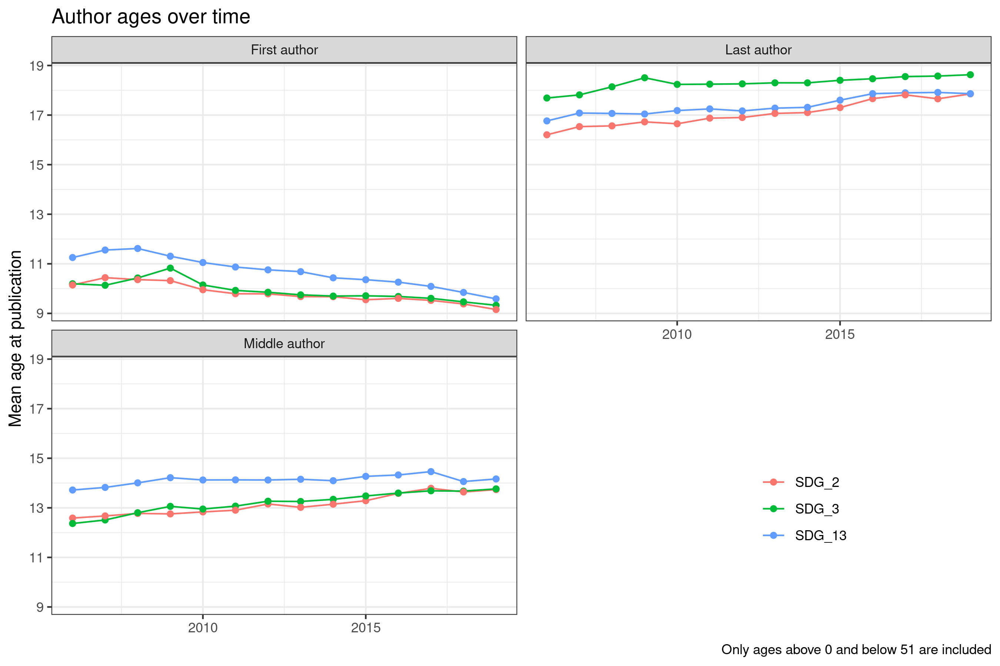<!-- -->

Multiple findings:

- Virus is most diametral: "very" young first authors, and old last authors
- First authors getting younger, last authors older -> seems like we can observe
either more multi-author papers and/or stronger split in authorship roles and 
positions
- climate research is strongest in this trend, maybe changing towards a 
knowledge dissemination model similar to other sciences?
  + It could be interesting to see whether there is some knowledge spillover,
  i.e. researchers coming from other disciplines and moving into climate, and
  with that brining their norms/traditions into climate research.

The question of how co-authorship evolves (more or less multi-author papers)
will be covered in another chapter.


```r
# plot age difference between first and last
mean_ages_p_position %>% 
  pivot_wider(names_from = "author_position", values_from = "mean_age") %>% 
  mutate(age_diff = last_author - first_author) %>% 
  ggplot(aes(as_year(year), age_diff, colour = SDG_label)) +
  geom_line() +
  geom_point() +
  coord_cartesian(ylim = c(0, 10)) +
  scale_y_continuous(breaks = seq(0, 10, 2)) +
  labs(x = NULL, colour = NULL, 
       y = "Difference between age of first and last author",
       title = "Developing age gap between first and last author",
       caption = "Only ages above 0 and below 51 are included")
```

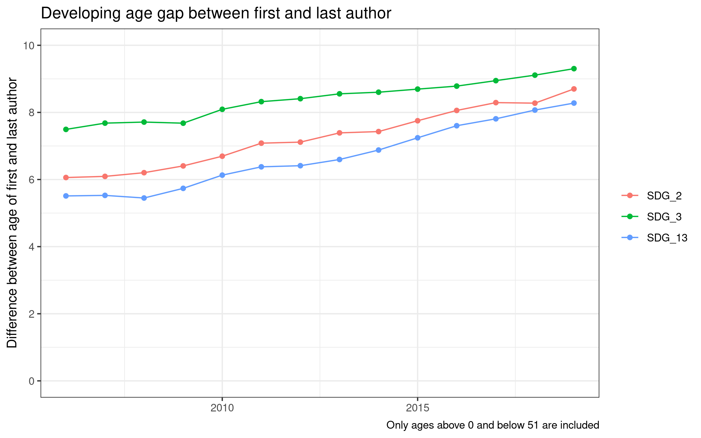<!-- -->

The gap is actually largening in all areas, but the strongest increase is in
climate. However: is this a big increase, i.e., is this relevant?


Still to do here: similar analyses for citations

# Institutional prestige

We use: 


> P. Total number of publications of a university.

> TNCS and MNCS. The total and the average number of citations of the publications of a university, normalized for field and publication year. An MNCS value of two for instance means that the publications of a university have been cited twice above the average of their field and publication year.


```r
papers_per_affiliation_per_fos <- papers %>% 
  left_join(author_paper_affiliations) %>% 
  left_join(affils) %>% 
  group_by(authorid, paperid) %>% 
  mutate(frac_value = 1/n()) %>% 
  group_by(affiliationid, year, SDG_label) %>% 
  summarise(n_frac_papers = sum(frac_value, na.rm = TRUE),
            n_frac_citations = sum(frac_value * citations_norm, na.rm = TRUE)) %>% 
  collect()
```

```
## Joining, by = "paperid"
```

```
## Joining, by = c("citationcount", "affiliationid")
```


```r
leiden_small_local <- leiden %>%
  filter(Field == "All sciences", Frac_counting == 1) %>%
  select(University, Country, Period, P_top10, PP_top10, impact_P) %>% 
  collect() %>% 
  mutate(across(c(P_top10, PP_top10, impact_P), as.numeric),
         last_year_of_period = str_extract(Period, "\\d{4}$"))

affil_leiden_key <- read_csv2(
  here::here("data/leiden matching/matching_leiden.csv")
)
```

```
## ℹ Using "','" as decimal and "'.'" as grouping mark. Use `read_delim()` for more control.
```

```
## 
## ── Column specification ────────────────────────────────────────────────────────
## cols(
##   affiliationid = col_double(),
##   normalizedname = col_character(),
##   displayname = col_character(),
##   university_normalized = col_character(),
##   University = col_character(),
##   Country = col_character(),
##   university_normalized_leiden = col_character()
## )
```

```r
papers_per_affiliation_per_w_leiden <- papers_per_affiliation_per_fos %>%
  mutate(affiliationid = as.numeric(affiliationid)) %>% # needed for merging
  left_join(affil_leiden_key) %>%
  left_join(leiden_small_local)
```

```
## Joining, by = "affiliationid"
```

```
## Joining, by = c("University", "Country")
```

## Check inclusion into Leiden

```r
papers_per_affiliation_per_w_leiden %>% 
  filter(year == 2018) %>% 
  mutate(in_leiden = if_else(!is.na(University), "matched", "unmatched")) %>% 
  pivot_longer(starts_with("n_"), names_to = "indicator") %>% 
  mutate(indicator = if_else(
    indicator == "n_frac_citations", 
    "# of citations (fractional)",
    "# of publications (fractional)"
  )) %>% 
  ggplot(aes(SDG_label, value, fill = in_leiden)) +
  facet_wrap(vars(indicator)) + 
  geom_boxplot() +
  scale_y_log10(labels = scales::comma) +
  labs(x = NULL, y = NULL, fill = "Leiden Ranking",
       title = "Difference according to mapping to Leiden ranking",
       caption = "Only papers from 2018 plotted") +
  theme(legend.position = "top")
```

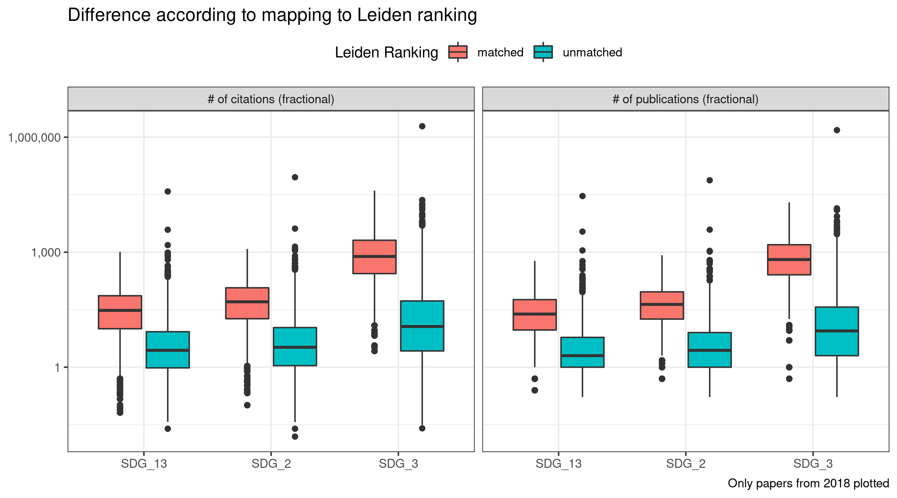<!-- -->


### Bivariate plots


```r
plot_bivariate <- function(df, var, x_pos = 1200, y_pos = 11000,
                           dv = n_frac_papers) {
  pdata <- df %>%
    filter(year == 2018, !is.na(impact_P))
  labels <- pdata %>%
    group_by(SDG_label) %>%
    summarise(cor = cor({{var}}, {{dv}}, use = "pairwise.complete.obs")) %>%
    mutate(x = x_pos, y = y_pos,
           label = glue::glue("r = {round(cor, 2)}"))
  pdata %>%
    ggplot(aes({{var}}, {{dv}})) +
    geom_point(alpha = .3) +
    scale_x_log10() +
    scale_y_log10(labels = scales::comma) +
    facet_wrap(vars(SDG_label)) +
    geom_smooth() +
    geom_text(data = labels, aes(x = x, y = y, label = label))
}
```


```r
papers_per_affiliation_per_w_leiden %>%
  filter(last_year_of_period == 2018) %>% 
  plot_bivariate(impact_P) +
  labs(x = "# of publications of University 2015-2018 (fractional)",
       y = "# of papers towards SDG in 2018 (fractional)",
       title = "University productivity vs. SDG productivity")
```

```
## `geom_smooth()` using method = 'gam' and formula 'y ~ s(x, bs = "cs")'
```

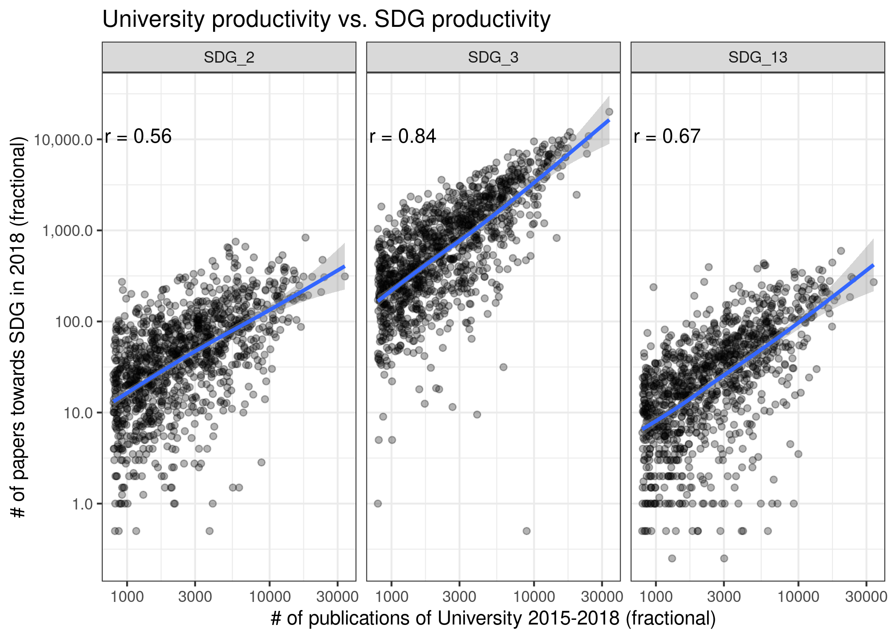<!-- -->


```r
papers_per_affiliation_per_w_leiden %>%
  filter(last_year_of_period == 2018) %>% 
  plot_bivariate(P_top10, 800, 20000) +
  labs(x = "# of publications of University that is in top 10% of citations 2015-2018 (fractional)",
       y = "# of papers towards SDG in 2018 (fractional)",
       title = "# of top 10% cited publications vs. SDG production")
```

```
## `geom_smooth()` using method = 'gam' and formula 'y ~ s(x, bs = "cs")'
```

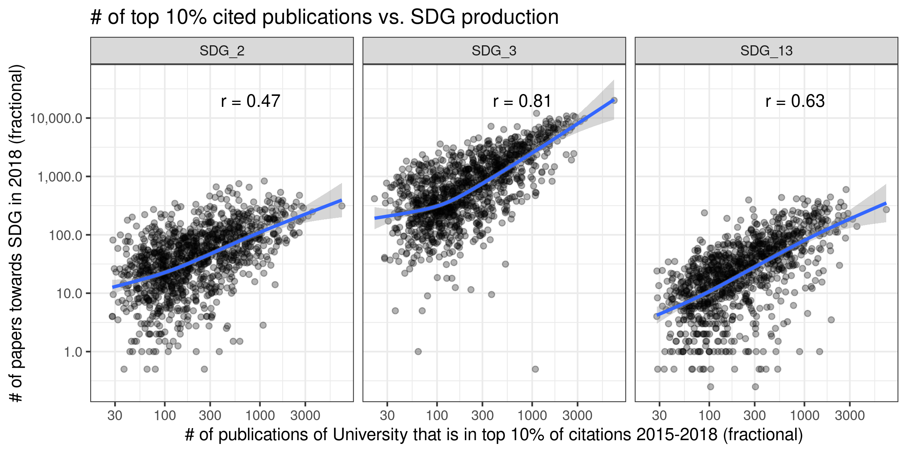<!-- -->


```r
papers_per_affiliation_per_w_leiden %>%
  filter(last_year_of_period == 2018) %>% 
  plot_bivariate(PP_top10, .03, 15000) +
  scale_x_log10(labels = scales::percent) +
  labs(x = "% of publications of University that is in top 10% of citations 2015-2018 (fractional)",
       y = "# of papers towards SDG in 2018 (fractional)",
       title = "% of top 10% cited publications vs. SDG production")
```

```
## Scale for 'x' is already present. Adding another scale for 'x', which will
## replace the existing scale.
```

```
## `geom_smooth()` using method = 'gam' and formula 'y ~ s(x, bs = "cs")'
```

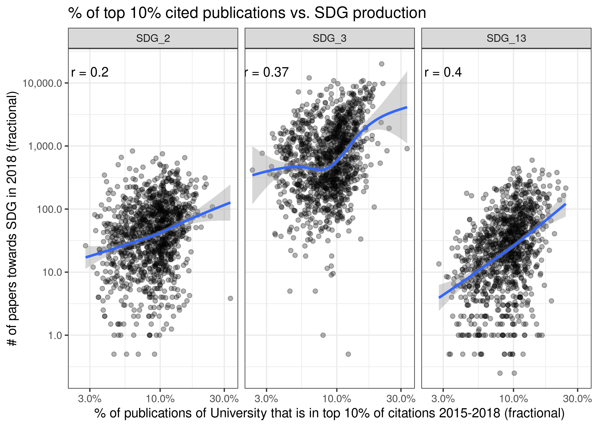<!-- -->

The highest value on the x axis is the rockefeller university, with a focus on
biomed. That's why they are not there for agriculture and only have one 
publication for climate change.

Questions arising here:

- Why is there an inflection point, in particular for medicine? Why do lower
prestige institutions (below ~8% of citations towards 10% papers) 
produce more and get cited even more than middle universities in medicine?

## By citations

```r
papers_per_affiliation_per_w_leiden %>%
  filter(last_year_of_period == 2018) %>% 
  plot_bivariate(PP_top10, .03, 15000, dv = n_frac_citations) +
  scale_x_log10(labels = scales::percent) +
  labs(x = "% of publications of University that is in top 10% of citations 2015-2018 (fractional)",
       y = "# of citations towards papers in SDG in 2018 (fractional)",
       title = "% of top 10% cited publications vs. SDG production")
```

```
## Scale for 'x' is already present. Adding another scale for 'x', which will
## replace the existing scale.
```

```
## `geom_smooth()` using method = 'gam' and formula 'y ~ s(x, bs = "cs")'
```

<!-- -->

## Over time

```r
# approach from https://stackoverflow.com/a/11728547/3149349
cut_quantiles <- function(x) {
    cut(x, breaks = quantile(x, probs = seq(0, 1, by = .2), na.rm = TRUE), 
        labels = {1:5*20} %>% map_chr(~paste("p", . - 20, ., sep = "-")), 
        include.lowest = TRUE)
}

pdata <- papers_per_affiliation_per_w_leiden %>% 
  filter(year == as.numeric(last_year_of_period), !is.na(P_top10)) %>% 
  group_by(Period) %>% 
  mutate(across(c(P_top10, PP_top10, impact_P), cut_quantiles)) 
```


```r
plot_over_time <- function(df, indicator, y_var) {
  df %>% 
    group_by(SDG_label, year, {{indicator}}) %>% 
    mutate(y_median = median({{y_var}}, na.rm = TRUE)) %>% 
    ggplot(aes(as_year(year), y_median, colour = {{indicator}})) +
    geom_line() +
    facet_wrap(vars(SDG_label)) +
    scale_y_log10() +
    guides(colour = guide_legend(reverse = TRUE)) +
    labs(x = NULL)
}
```


```r
pdata %>%
  plot_over_time(indicator = P_top10, n_frac_papers) +
  labs(y = "Median of # of papers (fractional)")
```

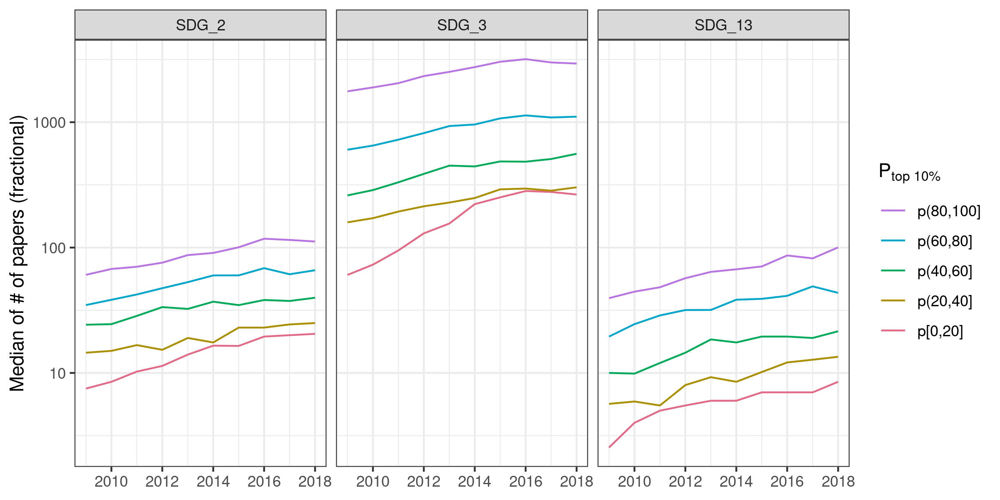<!-- -->


```r
pdata %>%
  plot_over_time(indicator = P_top10, n_frac_citations) +
  labs(y = "Median of # of citations (normalised and fractional)")
```

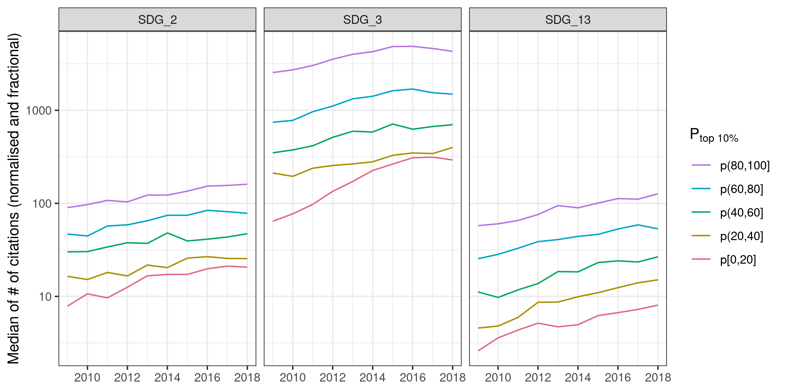<!-- -->


```r
pdata %>%
  plot_over_time(indicator = PP_top10, n_frac_papers) +
  labs(y = "Median of # of papers (fractional)")
```

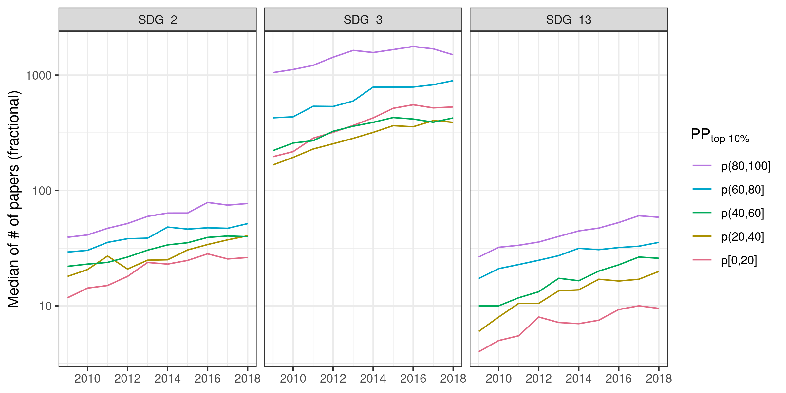<!-- -->


```r
pdata %>%
  plot_over_time(indicator = PP_top10, n_frac_citations) +
  labs(y = "Median of # of citations (normalised and fractional)")
```

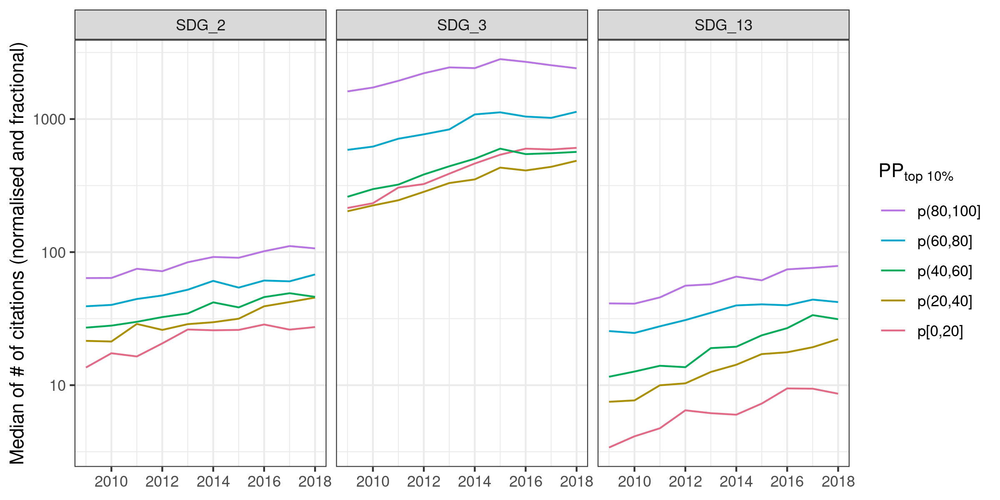<!-- -->

Maybe y-axis could be "normalised" to be the fraction of the total, i.e.
papers/all papers, and citations/all citations. This way would show the "share",
irrespective of size.

### Display as fraction

```r
plot_proportions <- function(df, indicator, y_var) {
  df %>% 
    group_by(SDG_label, year, {{indicator}}) %>% 
    summarise(n = sum({{y_var}}, na.rm = TRUE)) %>% 
    group_by(SDG_label, year) %>% 
    mutate(prop = n/sum(n)) %>% 
    ggplot(aes(as_year(year), prop, colour = {{indicator}})) +
    geom_line() +
    facet_wrap(vars(SDG_label)) + 
    guides(colour = guide_legend(reverse = TRUE)) +
    labs(x = NULL) +
    scale_y_continuous(labels = scales::percent)
}
```


```r
pdata %>%
  plot_proportions(indicator = P_top10, n_frac_papers) +
  labs(y = "% of publications (fractional)")
```

```
## `summarise()` has grouped output by 'SDG_label', 'year'. You can override using the `.groups` argument.
```

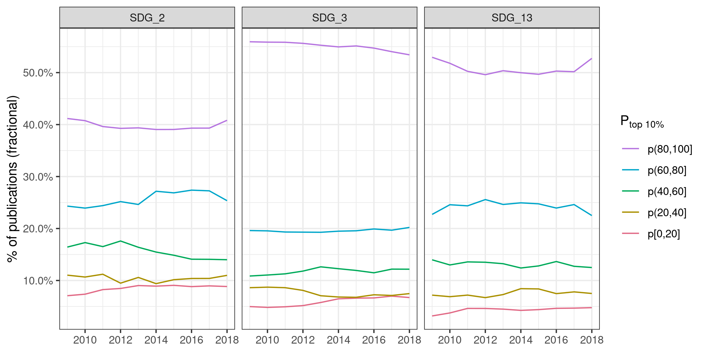<!-- -->

```r
pdata %>%
  plot_proportions(indicator = PP_top10, n_frac_papers) +
  labs(y = "% of publications (fractional)")
```

```
## `summarise()` has grouped output by 'SDG_label', 'year'. You can override using the `.groups` argument.
```

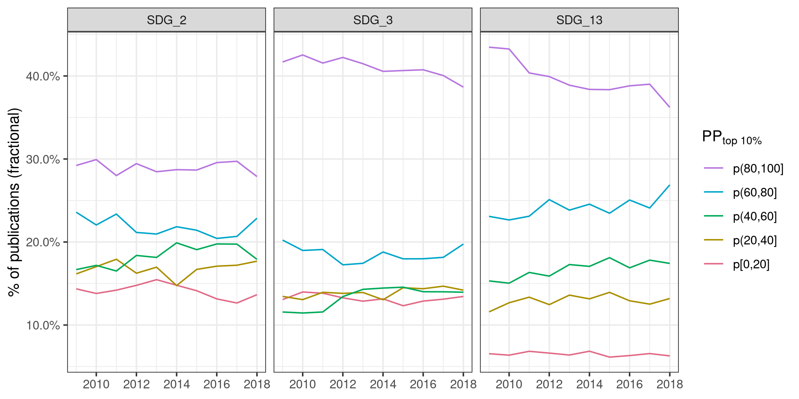<!-- -->


```r
pdata %>%
  plot_proportions(indicator = P_top10, n_frac_citations) +
  labs(y = "% of citations (fractional)")
```

```
## `summarise()` has grouped output by 'SDG_label', 'year'. You can override using the `.groups` argument.
```

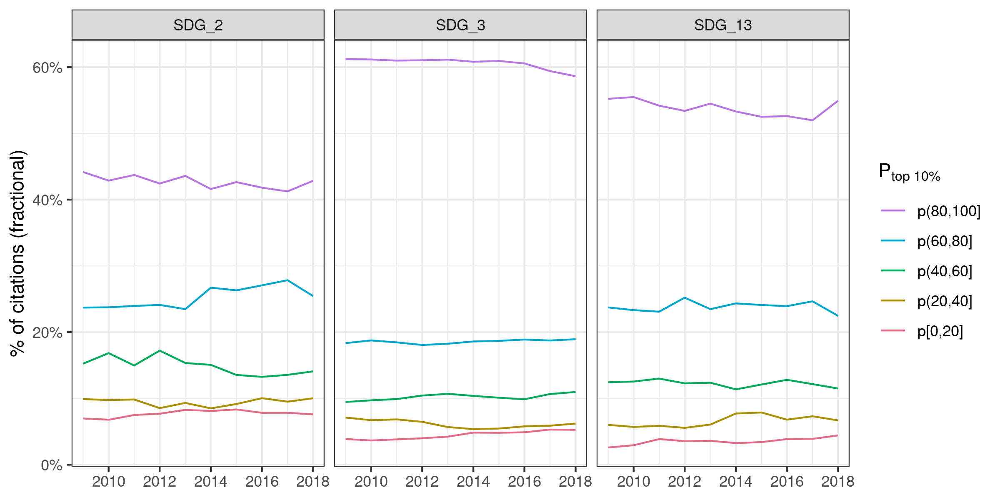<!-- -->


```r
pdata %>%
  plot_proportions(indicator = PP_top10, n_frac_citations) +
  labs(y = "% of citations (fractional)")
```

```
## `summarise()` has grouped output by 'SDG_label', 'year'. You can override using the `.groups` argument.
```

<!-- -->

# By Country
## Counts


```r
wb_local <- wb_indicators %>%
  filter(year >= 2014 & year <= 2018) %>%
  group_by(country_name, country_code, indicator_code, indicator_name) %>% 
  summarise(value = mean(value, na.rm = TRUE)) %>% 
  collect()

proper_countries <- wb_countries %>% 
  filter(!is.na(`Currency Unit`)) %>% 
  select(country_code = `Country Code`, short_name = `Short Name`, Region,
         income_group = `Income Group`)

wb_2014_2018 <- wb_local %>% 
  select(country_code, country_name, indicator_name, indicator_code, value) %>% 
  filter(indicator_code == "NY.GDP.PCAP.KD") %>% # only keep GDP p cap for now
  rename(gdp_per_cap = value) %>% 
  select(-starts_with("indicator")) %>% 
  right_join(proper_countries)
```

```
## Joining, by = "country_code"
```


```r
author_paper_affiliations_w_groups <- make_author_groups(author_paper_affiliations)

papers_w_affils <- papers %>% 
  select(paperid, SDG_label, year, citations_norm) %>% 
  left_join(author_paper_affiliations_w_groups) %>% 
  right_join(affils) %>% 
  select(paperid, SDG_label, year, authorid, affiliationid, country,
         paper_author_cat, author_position, citations_norm)
```

```
## Joining, by = "paperid"
```

```
## Joining, by = "affiliationid"
```


```r
papers_per_country_fos_author_pos <- papers_w_affils %>% 
  group_by(country, year, SDG_label, author_position) %>% 
  summarise(n = n(),
            tncs = sum(citations_norm, na.rm = TRUE),
            mncs = mean(citations_norm, na.rm = TRUE)) %>% 
  collect()
```


```r
papers_per_country_fos_author_pos_country <- papers_per_country_fos_author_pos %>% 
  filter(year == 2018) %>% 
  left_join(wb_2014_2018, by = c("country" = "country_code")) %>% 
  drop_na()

papers_per_country_fos_author_pos_country <- papers_per_country_fos_author_pos_country %>% 
  mutate(income_group = fct_relevel(income_group, "High income", 
                                    "Upper middle income", 
                                    "Lower middle income", "Low income"))
```


```r
papers_per_country_fos_author_pos_country %>% 
  filter(author_position == "first_author") %>% 
  ggplot(aes(gdp_per_cap, n, colour = Region, label = country_name)) +
  geom_point() +
  stat_dens2d_filter_g(geom = "text_repel", keep.fraction = .05) +
  scale_y_log10(labels = scales::comma) +
  scale_x_log10(labels = scales::comma) +
  facet_wrap(vars(SDG_label)) +
  theme(legend.position = "top") +
  labs(x = "GDP per capita", y = "# of publications (full counting)",
       title = "Productivity of research by country & region", 
       caption = "Only first authors; GDP is the average for 2014-2018; # of papers is for 2018",
       colour = NULL)
```

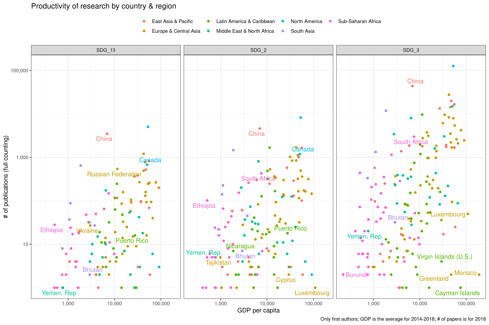<!-- -->


```r
papers_per_country_fos_author_pos_country %>% 
  ggplot(aes(author_position, n, fill = income_group)) +
  geom_boxplot() +
  facet_wrap(vars(SDG_label)) +
  # facet_grid(rows = vars(author_position),
  #            cols = vars(SDG_label)) +
  scale_y_log10() 
```

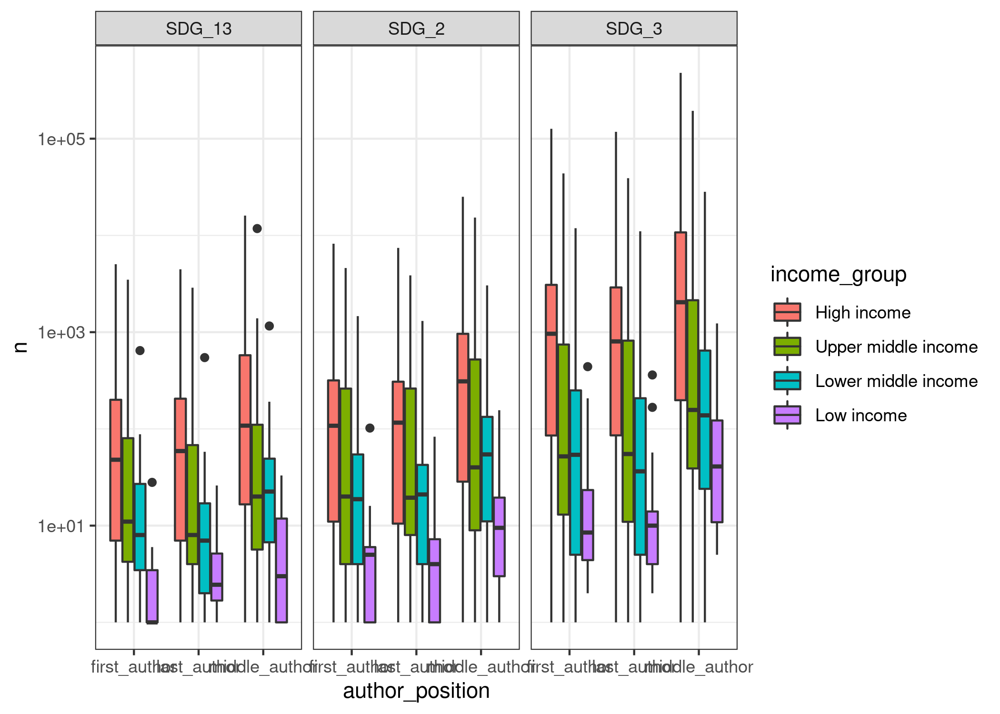<!-- -->


```r
plot_box <- function(df, var) {
  df %>% 
    filter(author_position == "first_author") %>% 
    ggplot(aes(SDG_label, {{var}}, fill = income_group)) +
    geom_boxplot() +
    scale_y_log10(labels = scales::comma)
}
```


```r
plot_box(papers_per_country_fos_author_pos_country, n) +
  labs(title = "Productivity by SDG",
       subtitle = "First authors only",
       y = "# of papers", x = NULL, fill = NULL)
```

<!-- -->

```r
plot_box(papers_per_country_fos_author_pos_country, tncs) +
  labs(title = "Total citations for research on SDGs",
       subtitle = "First authors only",
       y = "total citations (full counting)", x = NULL, fill = NULL)
```

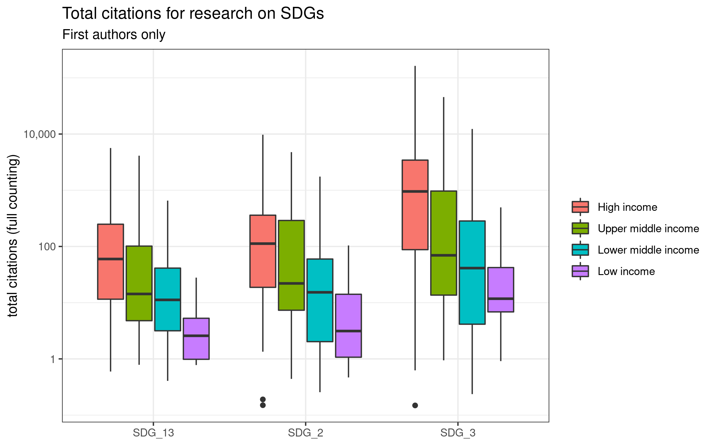<!-- -->


```r
plot_box(papers_per_country_fos_author_pos_country, mncs) +
  labs(title = "Mean citations for research on SDG",
       subtitle = "First authors only",
       y = "mean citations (full counting)", x = NULL, fill = NULL)
```

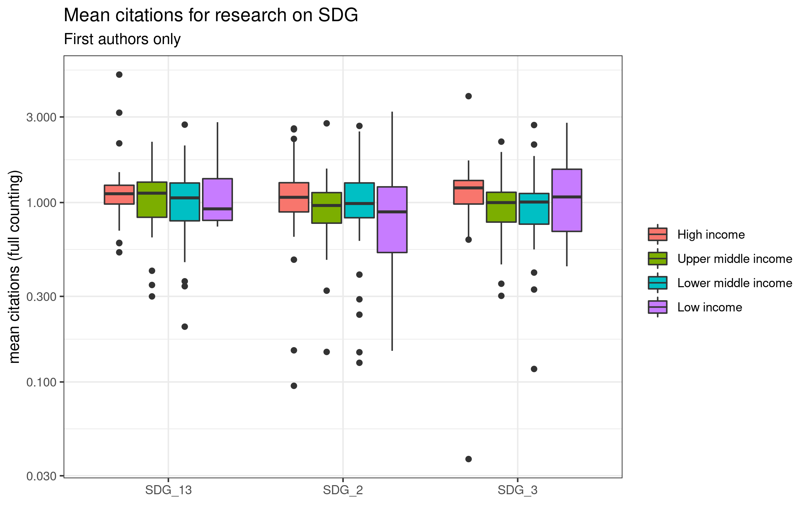<!-- -->


```r
papers_per_country_fos_author_pos_country %>% 
  filter(author_position == "first_author") %>% 
  ggplot(aes(n, mncs, colour = income_group)) +
  geom_point(size = .4) +
  scale_x_log10() +
  scale_y_log10() +
  geom_smooth(se = TRUE, alpha = .1)
```

```
## `geom_smooth()` using method = 'loess' and formula 'y ~ x'
```

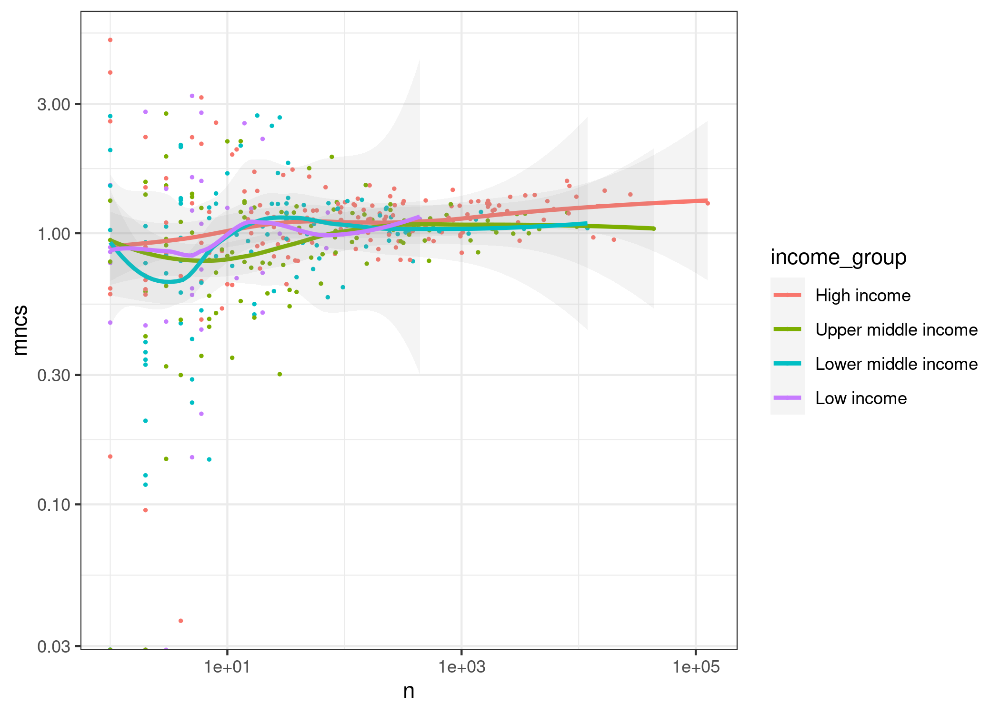<!-- -->


```r
papers_per_country_fos_author_pos_country %>% 
  filter(author_position == "first_author") %>% 
  # mutate(mncs = mncs + .1) %>% 
  # filter(mncs < 10) %>% 
  ggplot(aes(gdp_per_cap, mncs, colour = Region, label = country_name)) +
  geom_point(alpha = .8) + 
  # approach from https://github.com/slowkow/ggrepel/issues/17#issuecomment-364796450
  stat_dens2d_filter_g(geom = "text_repel", keep.fraction = .05) +
  facet_wrap(vars(SDG_label)) +
  scale_y_log10() +
  scale_x_log10(labels = scales::comma) +
  theme(legend.position = "top") +
  labs(x = "GDP per capita", y = "Mean normalized citations (full counting)",
       title = "Impact of research by country & region", 
       caption = "Only first authors; GDP is the average for 2014-2018; MNCS is for 2018",
       colour = NULL)
```

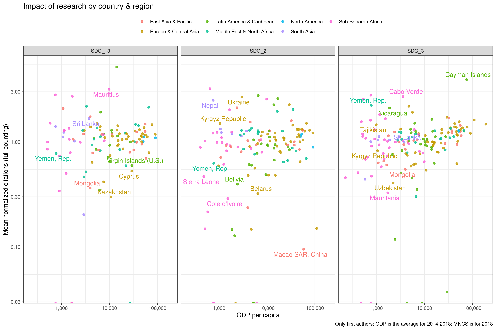<!-- -->

# SDG by funding
To which extent is research in these areas being funded?


```r
funder_overview <- papers %>% 
  filter(!is.na(is_funded)) %>% 
  group_by(is_funded, year, SDG_label) %>% 
  count() %>% 
  collect()
```


```r
funder_overview %>% 
  group_by(year, SDG_label) %>% 
  mutate(prop = n/sum(n)) %>% 
  filter(is_funded) %>% 
  ggplot(aes(as_year(year), prop, colour = fix_sdg(SDG_label))) +
  geom_line() +
  geom_point() +
  # facet_wrap(vars(fix_sdg(SDG_label))) +
  scale_y_continuous(labels = scales::percent) +
  labs(x = NULL, y = "% of publications which are funded", 
       title = "SDG by funding status",
       colour = NULL) +
  theme(legend.position = "top")
```

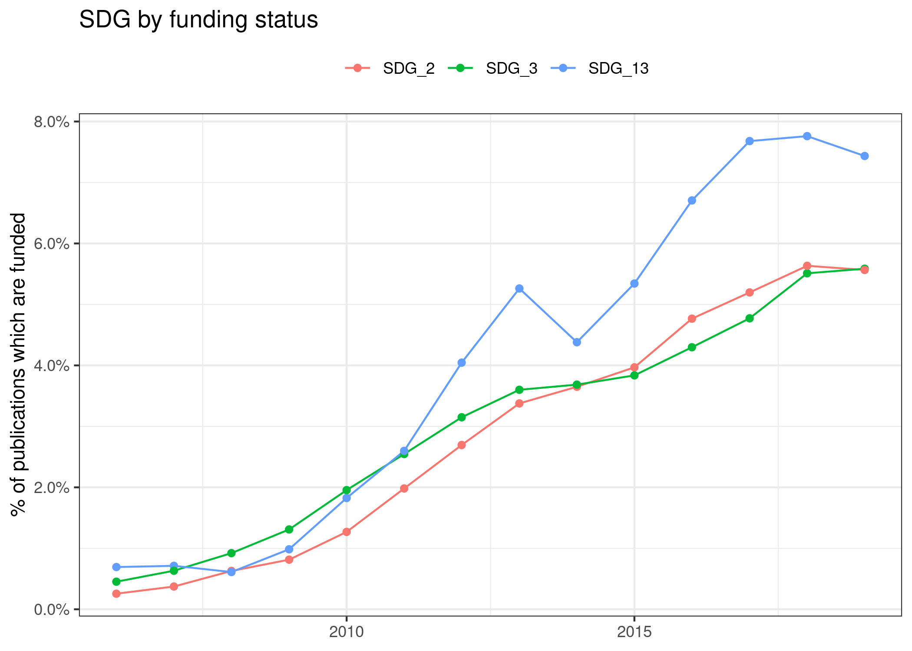<!-- -->


