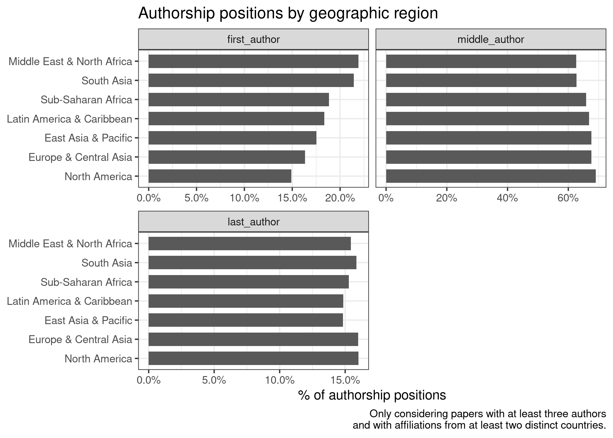
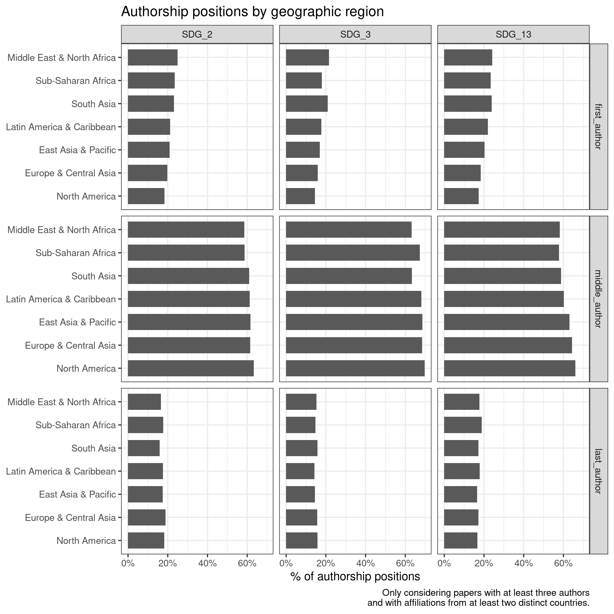
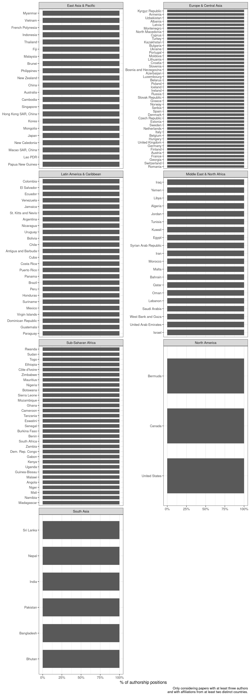

# Collaboration across countries
Q: How are authorship roles distributed with international collaborations?

Only take into account papers with more than one country on it.

Are we dealing in any way with authors having multiple affiliations?


```r
author_paper_affiliations_w_groups <- make_author_groups(author_paper_affiliations)

collaborative_papers <- papers %>% 
  select(paperid, year) %>% 
  left_join(author_paper_affiliations_w_groups) %>% 
  left_join(affils) %>% 
  group_by(paperid) %>% 
  # check if we have country for all authors
  mutate(country_available = sum(as.numeric(is.na(country))) == 0) %>% 
  filter(country_available, paper_author_cat == "multi") %>% 
  select(paperid, year, country, paper_author_cat, author_position)
```

```
## Joining, by = "paperid"
```

```
## Joining, by = "affiliationid"
```

```r
collaborative_n <- collaborative_papers %>% 
  distinct(paperid, country) %>% 
  group_by(paperid) %>% 
  count() %>% 
  mutate(cross_country = n > 1)

collaborative_papers_filtered <- collaborative_papers %>% 
  left_join(collaborative_n) %>% 
  filter(cross_country) %>% 
  select(-n, -cross_country)
```

```
## Joining, by = "paperid"
```


```r
collaboration_by_country <- collaborative_papers_filtered %>% 
  group_by(country) %>% 
  count(author_position) %>% 
  collect()

# then join with WDI, 
collaborative_countries <- collaboration_by_country %>% 
  left_join(wb_countries_selected, by = c("country" = "Country Code"))

# only keep countries where each position has at least 5 papers
collaborative_countries <- collaborative_countries %>% 
  group_by(country) %>% 
  mutate(include = all(n >= 5)) %>% 
  ungroup()
```


```r
# then plot by income region and geographical region
plot_countries <- function(df, facet) {
  pdata <- df %>% 
    group_by({{facet}}) %>% 
    add_proportion(n, order_var = author_position,
                   order_string = "first") %>% 
    drop_na() %>% 
    mutate(author_position = fct_relevel(author_position, "first_author", 
                                         after = 2))
  
  pdata %>% 
    ggplot(aes(fct_reorder({{facet}}, order), prop)) +
    geom_col(width = .7) +
    scale_y_continuous(labels = scales::percent) +
    facet_wrap(vars(fct_rev(author_position)), nrow = 2, scales = "free_x") +
    coord_flip() +
    labs(x = NULL, y = "% of authorship positions", fill = NULL,
         caption = "Only considering papers with at least three authors\nand with affiliations from at least two distinct countries.") +
    theme(legend.position = "top") +
    guides(fill = guide_legend(reverse = TRUE))
}


plot_countries(collaborative_countries, Region) +
  labs(title = "Authorship positions by geographic region")
```

<!-- -->


```r
plot_countries(collaborative_countries, `Income Group`) +
  labs(title = "Authorship positions by country income")
```

<!-- -->

Overall, there are no big differences. The hypothesis that LIC are driven 
towards certain positions is not clearly observable from this view. This might be
partly true for last author positions, where high income countries are more prevalent.
But there is likely two effects going on: collaborations between affiliations from
countries within a given bracket, and collaboration between brackets.
Maybe this could be the focus: how are authorship positions distributed
for collaborations between high income and all other countries?


```r
p <- collaborative_countries %>% 
  filter(include) %>% 
  plot_countries(`Short Name`) +
  labs(title = "Authorship position by country", 
       subtitle = "")
plotly::ggplotly(p)
```

preserve45acdf2c7238df36
This again is only considering papers with at least three authors and countries
with at least 5 papers per position.


```r
collaborative_countries %>% 
  mutate(Region = fct_relevel(Region, "North America", "South Asia", after = 5)) %>% 
  filter(include) %>% 
  plot_countries(`Short Name`) +
  facet_wrap(vars(Region), scales = "free_y", ncol = 2)
```

<!-- -->


# Remaining questions to cover

- Collaboration "network": which countries most commonly collaborate with which?
  + four levels:
    - within affiliations
    - between affiliations
    - between countries (by affiliations)
    - between regions
- The above figures, but split by SDG. Caveat: potentially low case numbers.


