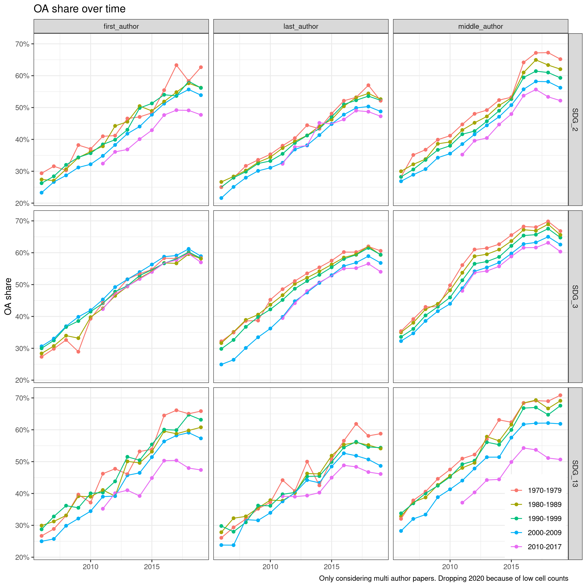
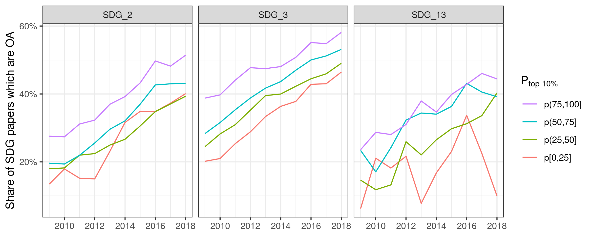
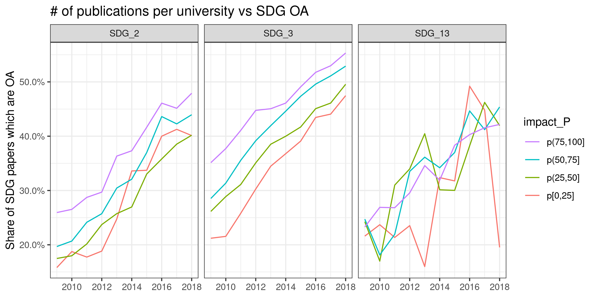
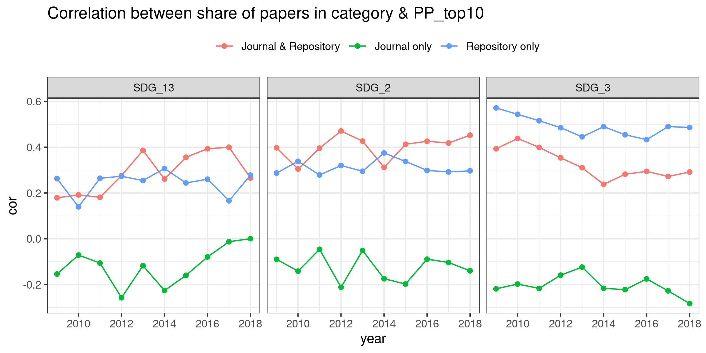
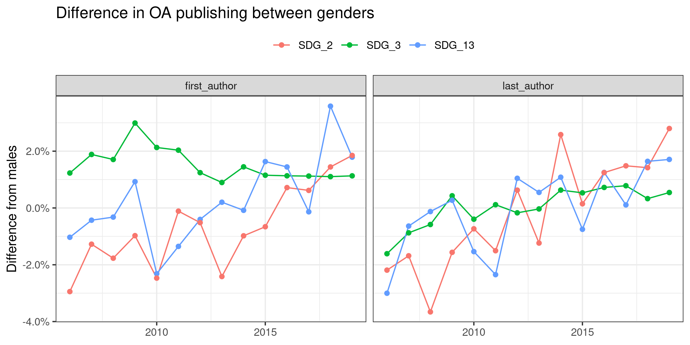
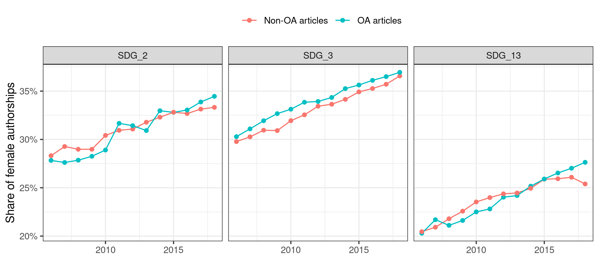

## Academic age

```r
author_w_year <- author_paper_affiliations %>%
  left_join(author_metadata) %>%
  select(paperid, authorid, authorsequencenumber, year_first_paper)
```

```
## Joining, by = "authorid"
```

```r
papers_w_age <- papers %>%
  # only take papers with OA status for now
  filter(!is.na(is_oa)) %>%
  left_join(author_w_year) %>%
  mutate(current_age = year - year_first_paper)
```

```
## Joining, by = "paperid"
```

```r
age_dist <- papers_w_age %>%
  filter(year == 2018) %>%
  distinct(authorid, current_age) %>%
  count(current_age) %>%
  collect()
```


```r
age_dist %>%
  ggplot(aes(current_age, n)) +
  geom_col() +
  scale_y_continuous(labels = function(x) format(x,
                                                 big.mark = ".",
                                                 decimal.mark = ",")) +
  labs(y = "Number of researchers", title = "Current age of researchers in 2018",
       caption = "Only taking authors on papers that have an OA status into account")
```

<!-- -->


```r
age_trunc <- papers_w_age %>%
  filter(current_age <= 50 | current_age > 0) %>%
  distinct(year, paperid, is_oa, oa_status, current_age, authorsequencenumber)

# make age groups
age_oa <- age_trunc %>%
  mutate(age_group = case_when(
    current_age > 0 & current_age < 10 ~ "1-9 years",
    current_age >= 10 & current_age < 20 ~ "10-19 years",
    current_age >= 20 & current_age < 30 ~ "20-39 years",
    current_age >= 30 & current_age < 40 ~ "30-39 years",
    current_age >= 40 & current_age < 50 ~ "40-49 years",
    current_age >= 50 & current_age < 60 ~ "50-59 years",
    TRUE ~ "60+ years"
  )) %>%
  group_by(year, age_group) %>%
  summarise(oa_share = mean(as.numeric(is_oa))) %>%
  collect()
```


```r
age_oa %>%
  ggplot(aes(as_year(year), oa_share, colour = age_group, group = age_group)) +
  geom_point() +
  geom_line() +
  scale_y_continuous(labels = function(x) scales::percent(x, accuracy = 1)) +
  theme_bw() +
  labs(x = NULL, y = "OA share", title = "OA share over time", colour = NULL)
```

<!-- -->


# Group into first, last, and middle author

```r
age_base <- papers %>% 
  select(paperid, SDG_label, year, is_oa) %>% 
  left_join(author_paper_affiliations_w_groups) %>% 
  left_join(author_metadata) %>% 
  select(paperid, SDG_label, year, author_position, authorid, 
         year_first_paper, is_oa, paper_author_cat)
```

```
## Joining, by = "paperid"
```

```
## Joining, by = "authorid"
```

```r
age_cohorts <- age_base %>% 
  group_by(year, authorid) %>% 
  mutate(current_age = year - year_first_paper) %>% 
  filter(current_age > 0) %>% 
  mutate(age_cohort = case_when(
    year_first_paper < 1960 ~ NA_character_,
    year_first_paper < 1970 ~ "1960-1969",
    year_first_paper < 1980 ~ "1970-1979",
    year_first_paper < 1990 ~ "1980-1989",
    year_first_paper < 2000 ~ "1990-1999",
    year_first_paper < 2010 ~ "2000-2009",
    TRUE ~ "2010-2017"
  )) %>% 
  ungroup()

age_oa_cohort <- age_cohorts %>% 
  group_by(year, age_cohort, SDG_label) %>%
  summarise(oa_share = mean(as.numeric(is_oa))) %>%
  collect()
```


```r
age_oa_cohort %>%
  filter(age_cohort != "NA") %>% 
  ggplot(aes(as_year(year), oa_share, colour = SDG_label)) +
  geom_point() +
  geom_line() +
  facet_wrap(vars(age_cohort)) +
  scale_y_continuous(labels = function(x) scales::percent(x, accuracy = 1)) +
  theme_bw() +
  labs(x = NULL, y = "OA share", title = "OA share by year of first paper",
       colour = NULL)
```

<!-- -->


```r
age_oa_cohort %>%
  filter(age_cohort != "NA") %>% 
  ggplot(aes(as_year(year), oa_share, colour = age_cohort)) +
  geom_point() +
  geom_line() +
  facet_wrap(vars(SDG_label), nrow = 2) +
  scale_y_continuous(labels = function(x) scales::percent(x, accuracy = 1)) +
  theme_bw() +
  theme(legend.position = c(.8, .2)) +
  labs(x = NULL, y = "OA share", title = "OA share over time", colour = NULL)
```

<!-- -->

## By author position

```r
age_oa_positions <- age_cohorts %>% 
  # only consider multi author papers
  filter(paper_author_cat == "multi") %>% 
  group_by(year, age_cohort, SDG_label, author_position) %>%
  summarise(oa_share = mean(as.numeric(is_oa)),
            n = n()) %>%
  collect()
```


```r
age_oa_positions %>%
  filter(age_cohort != "NA", year < 2020) %>% 
  ggplot(aes(as_year(year), oa_share, colour = age_cohort)) +
  geom_point() +
  geom_line() +
  facet_grid(rows = vars(SDG_label), cols = vars(author_position)) +
  scale_y_continuous(labels = function(x) scales::percent(x, accuracy = 1)) +
  theme_bw() +
  theme(legend.position = c(.9, .1)) +
  labs(x = NULL, y = "OA share", title = "OA share over time", colour = NULL,
       caption = "Only considering multi author papers. Dropping 2020 because of low cell counts")
```

<!-- -->

Findings:

- MEdicine for first authors: very narrow bandwith, compared to last and middle
authors - age is not very relevant there. 
- medicine last authors: younger researchers (from 2000) initially considerably
lower OA rate, more or less caught up with the rest
- Overall: OA share is lower for younger authors

# Individual prestige
Issue: the current perspective is agnostic to the timeline: citations are 
aggregated towards each author. To make a claim about whether being prestigious
makes you publish OA we would need to know the citations prior to publication.
but this data is not available in MAG. It could be generated from the raw graph:
counting the links to each paper per year. But probably out of scope for now.


```r
# get the ratio of OA publications by author
author_oa <- author_paper_affiliations %>% 
  left_join(papers) %>%
  # restrict to unpaywall set
  filter(!is.na(is_oa)) %>% 
  group_by(authorid) %>% 
  summarise(oa_pubs = sum(as.numeric(is_oa))) %>% 
  left_join(author_metadata, .)
```

```
## Joining, by = "paperid"
```

```
## Joining, by = "authorid"
```

```r
author_oa <- author_oa %>% 
  select(authorid, papercount, year_first_paper, n_citations_norm, 
         n_unique_co_authors, mean_co_authors, oa_pubs) %>% 
  mutate(oa_share = oa_pubs / papercount)

author_oa %>% 
  filter(papercount >= 5) %>% 
  summarise(oa_cit = cor(oa_share, n_citations_norm),
            oa_n_pap = cor(oa_share, papercount),
            oa_u_co_auth = cor(oa_share, n_unique_co_authors),
            oa_m_co_autho = cor(oa_share, mean_co_authors),
            oa_age = cor(oa_share, year_first_paper)) %>% 
  collect() %>% 
  knitr::kable()
```


|     oa_cit|   oa_n_pap| oa_u_co_auth| oa_m_co_autho|    oa_age|
|----------:|----------:|------------:|-------------:|---------:|
| -0.0491943| -0.1140835|   -0.0125805|     0.0135733| 0.2664612|

Two smallish effects: 

- more overall publications are associated with a lower 
share of OA publications
- older academics have a higher OA share (in line with above)

Citations and co-authors have no effect on this global level.

This should be further broken down into disciplines, and if somehow possible
across time.

Important note: the analysis of OA on the individual level will likely come from
the paper perspective: factors influencing whether a given paper is OA.
So different than the QSS paper, which looks at which author characteristics are
associated with more OA publications. 

Difficulty: time perspective. All variables would need to have a time-wise 
aspect, i.e. should relate to before the paper was published.


# Institutional prestige

```r
leiden_small_local <- leiden %>%
  filter(Field == "All sciences", Frac_counting == 1) %>%
  select(University, Country, Period, P_top10, PP_top10, impact_P, P_OA,
         PP_OA) %>% 
  collect() %>% 
  mutate(across(c(P_top10, PP_top10, impact_P, P_OA, PP_OA), as.numeric),
         last_year_of_period = str_extract(Period, "\\d{4}$"))

affil_leiden_key <- read_csv2(
  here::here("data/leiden matching/matching_leiden.csv")
)
```

```
## ℹ Using "','" as decimal and "'.'" as grouping mark. Use `read_delim()` for more control.
```

```
## 
## ── Column specification ────────────────────────────────────────────────────────
## cols(
##   affiliationid = col_double(),
##   normalizedname = col_character(),
##   displayname = col_character(),
##   university_normalized = col_character(),
##   University = col_character(),
##   Country = col_character(),
##   university_normalized_leiden = col_character()
## )
```


What is the question here? could simply take leiden ranking to investigate 
connex between prestige and oa publication. Interesting could be cross level
effects: are effects of age and gender (if they exist) different for more
prestiguous institutions?

maybe do this connex between prestige and OA first, then dig into further stuff
BUT: special question here is the contribution towards the SDG stuff, and maybe
within that the OA share.

maybe also more interesting to look into the type of OA publication, not simply
oa yes or no.


```r
papers_per_affiliation_per_sdg <- papers %>% 
  left_join(author_paper_affiliations) %>% 
  left_join(affils) %>% 
  group_by(authorid, paperid) %>% 
  mutate(frac_value = 1/n()) %>% 
  group_by(affiliationid, year, SDG_label) %>% 
  summarise(n_frac_papers = sum(frac_value, na.rm = TRUE),
            n_frac_oa_papers = sum(frac_value * as.numeric(is_oa), na.rm = TRUE),
            n_frac_citations = sum(frac_value * citations_norm, na.rm = TRUE)) %>% 
  collect()
```

```
## Joining, by = "paperid"
```

```
## Joining, by = c("citationcount", "affiliationid")
```


```r
papers_per_affiliation_per_w_leiden <- papers_per_affiliation_per_sdg %>%
  mutate(affiliationid = as.numeric(affiliationid)) %>% # needed for merging
  left_join(affil_leiden_key) %>%
  left_join(leiden_small_local)
```

```
## Joining, by = "affiliationid"
```

```
## Joining, by = c("University", "Country")
```


```r
affil_oa <- papers_per_affiliation_per_w_leiden %>% 
  mutate(match_period = year == last_year_of_period) %>% 
  filter(match_period) %>% 
  mutate(oa_share = n_frac_oa_papers / n_frac_papers)
```


```r
affil_oa %>% 
  group_by(year) %>% 
  filter(n_frac_papers > 50) %>% 
  summarise(cor = cor(oa_share, PP_OA, use = "pairwise.complete.obs")) %>% 
  knitr::kable()
```


| year|       cor|
|----:|---------:|
| 2009| 0.6684618|
| 2010| 0.6678632|
| 2011| 0.6931630|
| 2012| 0.6374927|
| 2013| 0.7103419|
| 2014| 0.6956760|
| 2015| 0.7043756|
| 2016| 0.7502294|
| 2017| 0.7753870|
| 2018| 0.7962919|

This gives the overall picture.


```r
affil_oa %>% 
  filter(year == 2018, n_frac_papers > 50) %>% 
  ggplot(aes(PP_OA, oa_share)) +
  geom_point() +
  labs(x = "OA share (leiden)", y = "OA share SDG", caption = "Data for 2018")
```

<!-- -->


Now by SDG


```r
affil_oa %>% 
  group_by(year, SDG_label) %>% 
  filter(n_frac_papers > 50) %>% 
  summarise(cor = cor(oa_share, PP_OA, use = "pairwise.complete.obs")) %>% 
  ggplot(aes(year, cor, colour = SDG_label)) +
  geom_line() +
  geom_point() +
  labs(y = "Correlation between OA shares in SDG & Leiden", x = NULL, 
       colour = NULL)
```

```
## `summarise()` has grouped output by 'year'. You can override using the `.groups` argument.
```

<!-- -->
The association between overall OA level publications and SDG OA level is
rising, in particular for SDG 13.

## Now correlate with prestige


```r
affil_oa %>% 
  group_by(year, SDG_label) %>% 
  filter(n_frac_papers > 50) %>% 
  summarise(cor = cor(oa_share, P_top10, use = "pairwise.complete.obs")) %>% 
  ggplot(aes(year, cor, colour = SDG_label)) +
  geom_line() +
  geom_point() +
  scale_y_continuous(limits = c(0, .6)) +
  labs(y = "Correlation between OA shares in SDG & P_top10", x = NULL, 
       colour = NULL)
```

```
## `summarise()` has grouped output by 'year'. You can override using the `.groups` argument.
```

<!-- -->


```r
affil_oa %>% 
  group_by(year, SDG_label) %>% 
  filter(n_frac_papers > 50) %>% 
  summarise(cor = cor(oa_share, PP_top10, use = "pairwise.complete.obs")) %>% 
  ggplot(aes(year, cor, colour = SDG_label)) +
  geom_line() +
  geom_point() +
  scale_y_continuous(limits = c(0, .6)) +
  labs(y = "Correlation between OA shares in SDG & PP_top10", x = NULL, 
       colour = NULL)
```

```
## `summarise()` has grouped output by 'year'. You can override using the `.groups` argument.
```

<!-- -->


Very interesting: while in 2008, the prestige of a university (measured both in
absolute (P_top10) and relative (PP_top10) terms was associated with the share
of OA publications within SDG, this association has been declining. Points to
a proliferation of OA?
This might be in opposition to our expectations, i.e. when we expected that OA
is only feasible for well-resourced actors?

Look at this in terms of types of OA, and with percentiles of the leiden ranks.


### Percentile ranks


```r
pdata <- affil_oa %>% 
  filter(!is.na(P_top10), n_frac_papers > 50) %>% 
  group_by(Period) %>% 
  mutate(across(c(P_top10, PP_top10, P_OA, PP_OA, impact_P), cut_quartiles)) 
```


```r
plot_over_time <- function(df, indicator, y_var) {
  df %>% 
    group_by(SDG_label, year, {{indicator}}) %>% 
    mutate(y_median = median({{y_var}}, na.rm = TRUE)) %>% 
    ggplot(aes(as_year(year), y_median, colour = {{indicator}})) +
    geom_line() +
    facet_wrap(vars(SDG_label)) +
    scale_y_continuous(labels = scales::percent) +
    guides(colour = guide_legend(reverse = TRUE)) +
    labs(x = NULL)
}
```


```r
pdata %>%
  plot_over_time(indicator = P_top10, oa_share) +
  labs(y = "Share of SDG papers which are OA")
```

<!-- -->


```r
pdata %>%
  plot_over_time(indicator = PP_top10, oa_share) +
  labs(y = "Share of SDG papers which are OA")
```

<!-- -->


```r
pdata %>%
  plot_over_time(indicator = impact_P, oa_share) +
  labs(y = "Share of SDG papers which are OA",
       title = "# of publications per university vs SDG OA")
```

<!-- -->

## Types of OA

```r
step1 <- papers %>% 
  left_join(author_paper_affiliations) %>% 
  left_join(affils) %>% 
  group_by(authorid, paperid) %>% 
  mutate(frac_value = 1/n()) 
```

```
## Joining, by = "paperid"
```

```
## Joining, by = c("citationcount", "affiliationid")
```

```r
oa_type_per_affiliation_per_sdg <- step1 %>% 
  group_by(affiliationid, year, SDG_label) %>% 
  count(provider_cat, wt = frac_value)

totals <- step1 %>% 
  group_by(affiliationid, year, SDG_label) %>% 
  summarise(n_frac_papers = sum(frac_value, na.rm = TRUE))

oa_type_per_affiliation_per_sdg <- oa_type_per_affiliation_per_sdg %>% 
  left_join(totals)
```

```
## Joining, by = c("affiliationid", "year", "SDG_label")
```

```r
oa_type_per_affiliation_per_sdg_local <- oa_type_per_affiliation_per_sdg %>% 
  filter(n_frac_papers > 50, !is.na(provider_cat)) %>% 
  collect()
```


```r
oa_type_affiliation_leiden <- oa_type_per_affiliation_per_sdg_local %>%
  mutate(affiliationid = as.numeric(affiliationid)) %>% # needed for merging
  left_join(affil_leiden_key) %>%
  left_join(leiden_small_local) %>% 
  # remove those institutions that are not in leiden ranking
  filter(!is.na(University), year == as.numeric(last_year_of_period))
```

```
## Joining, by = "affiliationid"
```

```
## Joining, by = c("University", "Country")
```


```r
oa_type_affiliation_leiden %>% 
  filter(provider_cat != "Not OA") %>% 
  mutate(oa_share = n/n_frac_papers) %>% 
  group_by(year, SDG_label, provider_cat) %>% 
  summarise(cor = cor(oa_share, P_top10, use = "pairwise.complete.obs")) %>% 
  ggplot(aes(year, cor, colour = provider_cat)) +
  geom_line() +
  geom_point() +
  facet_wrap(vars(SDG_label)) +
  theme(legend.position = "top") +
  labs(title = "Correlation between share of papers in category & P_top10",
       colour = NULL)
```

```
## `summarise()` has grouped output by 'year', 'SDG_label'. You can override using the `.groups` argument.
```

<!-- -->

What does this mean, especially the green negative correlation?


```r
oa_type_affiliation_leiden %>% 
  filter(provider_cat != "Not OA") %>% 
  mutate(oa_share = n/n_frac_papers) %>% 
  group_by(year, SDG_label, provider_cat) %>% 
  summarise(cor = cor(oa_share, PP_top10, use = "pairwise.complete.obs")) %>% 
  ggplot(aes(year, cor, colour = provider_cat)) +
  geom_line() +
  geom_point() +
  facet_wrap(vars(SDG_label)) +
  theme(legend.position = "top") +
  labs(title = "Correlation between share of papers in category & PP_top10",
       colour = NULL)
```

```
## `summarise()` has grouped output by 'year', 'SDG_label'. You can override using the `.groups` argument.
```

<!-- -->


```r
p <- oa_type_affiliation_leiden %>% 
  filter(provider_cat != "Not OA", year == 2018) %>% 
  group_by(year, SDG_label, affiliationid) %>% 
  mutate(oa_share = n/sum(n)) %>% 
  ggplot(aes(P_top10, oa_share, colour = provider_cat)) +
  geom_point(size = .7, alpha = .4) +
  scale_x_log10() +
  geom_smooth() +
  facet_wrap(vars(SDG_label)) +
  scale_y_continuous(labels = scales::percent) +
  theme(legend.position = "top") +
  labs(y = "Share of papers in category", colour = NULL,
       title = "Association between type of OA and institutional prestige (2018)")
p
```

```
## `geom_smooth()` using method = 'gam' and formula 'y ~ s(x, bs = "cs")'
```

<!-- -->

- Share of papers which are journal and repository hosted is similar across
institutions and SDGs
- Lower ranked universities have a low fraction of repository only, but a higher
fraction of journal only OA publications.
- High ranked institutions do not have a high share of journal only publications

Further investigating the split between low prestige universities in SDG 3:

```r
p <- oa_type_affiliation_leiden %>% 
  filter(provider_cat != "Not OA", year == 2018, SDG_label == "SDG_3") %>% 
  group_by(year, affiliationid) %>% 
  mutate(oa_share = n/sum(n)) %>% 
  ggplot(aes(P_top10, oa_share, colour = provider_cat, size = n_frac_papers)) +
  geom_point(alpha = .4) +
  scale_x_log10()

p <- p + aes(label = Country, text = University)
plotly::ggplotly(p)
```

preserve270feb4ab3f7fc74

Unclear where this split comes from. It is not related to size (in terms of 
number of publications), and seems also unrelated to country/continent. 


Further things to look at:

- does this translate to certain types of journals, i.e. according to APC or IF?
- how is this over time?


# Gender analysis

```r
gender_base <- papers %>% 
  select(paperid, SDG_label, year, is_oa) %>% 
  left_join(author_paper_affiliations_w_groups) %>% 
  left_join(author_metadata) %>% 
  select(paperid, SDG_label, year, author_position, authorid, 
         is_oa, paper_author_cat, gender)
```

```
## Joining, by = "paperid"
```

```
## Joining, by = "authorid"
```


```r
gender_rate <- gender_base %>% 
  filter(!is.na(is_oa)) %>% # restrict to unpaywall set only
  group_by(SDG_label, year, gender) %>% 
  count(is_oa) %>% 
  mutate(prop = n/sum(n)) %>% 
  collect()
```
Visalíse oa rate per gender over time


```r
gender_rate %>% 
  filter(is_oa, gender != "unknown", year < 2019) %>% 
  ggplot(aes(as_year(year), prop, colour = gender)) +
  geom_line() +
  geom_point() +
  facet_wrap(vars(SDG_label))
```

<!-- -->

This does not show big differences. At least in health, papers by women tend to
have slightly higher OA rates. 

But: what are we showing here? What is the y axis exactly? Should we maybe show
how the number of female authors, or how the gender split in the authors of a 
given paper is related to OA? would make more sense than overall.
Do this only for a specific year.

It will also be more productive to visualise this for first and last authors
only.


Split for author positions


```r
gender_rate_p_position <- gender_base %>% 
  filter(!is.na(is_oa), gender != "unknown") %>% # restrict to unpaywall set only
  group_by(SDG_label, year, gender, author_position) %>% 
  count(is_oa) %>% 
  mutate(prop = n/sum(n)) %>% 
  collect()
```


```r
gender_rate_p_position %>% 
  filter(is_oa, year < 2019) %>% 
  ggplot(aes(as_year(year), prop, colour = gender)) +
  geom_line() +
  geom_point() +
  facet_grid(rows = vars(SDG_label),
             cols = vars(author_position))
```

<!-- -->

Also here there is no difference. What does this show? The proportion of papers
which are OA per gender, SDG, author position and year. 


Then, lets look at this in terms of papers

```r
# only do this for papers where we have gender for all authors
gender_ratio_p_paper <- gender_base %>% 
  select(paperid, gender) %>% 
  group_by(paperid) %>% 
  mutate(all_genderized = sum(as.numeric(gender == "unknown")) == 0) %>% 
  filter(all_genderized) %>% 
  count(gender) %>% 
  mutate(prop = n/sum(n)) %>% 
  ungroup()

n_rows <- gender_ratio_p_paper %>% count() %>% collect() %>% pull(n)

gender_sample <- gender_ratio_p_paper %>% 
  sdf_sample(fraction = 1e+6/n_rows, replacement = FALSE, seed = 786243876) %>% 
  left_join(papers) %>% 
  # it could be interesting though to look at this via regression -> then keep
  # more variables
  select(paperid:prop, year, is_oa, SDG_label) %>% 
  filter(!is.na(is_oa)) %>% 
  collect()
```

```
## Joining, by = "paperid"
```

```r
pdata <- gender_sample %>% 
  distinct() %>% 
  pivot_wider(names_from = "gender", values_from = "prop") %>% 
  mutate(female = case_when(is.na(female) ~ 1 - male,
                            TRUE ~ female))
```


```r
pdata %>% 
  ggplot(aes(is_oa, female)) +
  geom_boxplot(width = .7) +
  # geom_jitter() +
  facet_wrap(vars(SDG_label)) +
  scale_y_continuous(labels = scales::percent) +
  labs(y = "% of female authors on paper", x = "Publication is OA?")
```

<!-- -->

At first there was a difference in SDG3, but with a bigger set, this went away.
So we ought to conclude: there is no difference in OA outcomes when considering
the general makeup of the gender split on papers.

Look at this over time and for first/last authors only.


Also: summarise per authors: do female authors have more or less OA 
publications? Isnt that the same as above? maybe not


```r
paper_oa_flag <- papers %>%
  filter(!is.na(is_oa)) %>% 
  select(paperid, year, is_oa)

papers_p_author <- author_metadata %>% 
  left_join(author_paper_affiliations) %>% 
  select(authorid, paperid, gender, lastknownaffiliationid) %>% 
  left_join(paper_oa_flag)
```

```
## Joining, by = "authorid"
```

```
## Joining, by = "paperid"
```

```r
papers_p_author %>% 
  group_by(authorid, gender) %>% 
  summarise(n_papers = n(),
            oa_share = sum(as.numeric(is_oa))/n()) %>% 
  group_by(gender) %>% 
  summarise(mean_oa = mean(oa_share),
            mean_papers = mean(n_papers))
```

```
## # Source: spark<?> [?? x 3]
##   gender  mean_oa mean_papers
##   <chr>     <dbl>       <dbl>
## 1 unknown   0.449        2.53
## 2 male      0.472        4.75
## 3 <NA>     NA          199   
## 4 female    0.484        3.40
```

Also from this perspective, there is not much difference, at least with 
full counting. 

There is no reason to suspect causal effect of gender on OA. Effect of gender 
would 
likely be the result of other effects that are related to gender.


```r
papers_p_author %>% 
  group_by(authorid, gender) %>% 
  summarise(n_papers = n(),
            oa_share = sum(as.numeric(is_oa))/n()) %>% 
  filter(n_papers > 1) %>% # only consider authors with more than one publication
  group_by(gender) %>% 
  summarise(mean_oa = mean(oa_share),
            mean_papers = mean(n_papers))
```

```
## # Source: spark<?> [?? x 3]
##   gender  mean_oa mean_papers
##   <chr>     <dbl>       <dbl>
## 1 female    0.462        6.82
## 2 male      0.439        9.65
## 3 unknown   0.419        6.40
## 4 <NA>     NA          199
```


From this perspective, we can see some differences: female authors having 
slightly higher OA rates than males, which in turn are higher than unknowns.

Maybe we should control for country here, since also the genderization might be
better in some countries. Maybe also for institutional ranking


```r
gender_country <- papers_p_author %>% 
  left_join(affils, by = c("lastknownaffiliationid" = "affiliationid")) %>% 
  group_by(country, gender, authorid) %>% 
  summarise(n_papers = n(),
            oa_share = sum(as.numeric(is_oa))/n()) %>% 
  filter(n_papers > 1) %>% # only consider authors with more than one publication
  group_by(gender, country) %>% 
  summarise(mean_oa = mean(oa_share),
            mean_papers = mean(n_papers)) %>% 
  collect()
```


```r
pdata <- gender_country %>% 
  left_join(wb_countries, by = c("country" = "Country Code"))
```


```r
pdata %>% 
  ggplot(aes(Region, mean_oa, fill = gender)) +
  geom_boxplot() +
  coord_flip() +
  labs(x = NULL)
```

<!-- -->


```r
pdata %>% 
  ggplot(aes(`Income Group`, mean_oa, fill = gender)) +
  geom_boxplot() +
  coord_flip() +
  labs(x = NULL)
```

<!-- -->

From this there seem to be gender differences: Especially in LIC, females tend
to have higher OA rates. Why?

South Asia seems like a counter point. 

Two caveates: 

- what are the case numbers within the countries? Maybe they are low
- We are boxplotting means for countries, not the distribution for the
whole data of the region. This should be changed.

Further: what are our inclusion criteria? Maybe we should drop authors with less
than 5 publications? Or even more?


```r
gender_country2 <- papers_p_author %>% 
  left_join(affils, by = c("lastknownaffiliationid" = "affiliationid")) %>% 
  group_by(country, lastknownaffiliationid, gender, authorid) %>% 
  summarise(n_papers = n(),
            oa_share = sum(as.numeric(is_oa))/n()) %>% 
  filter(n_papers >= 5) %>% # only consider authors with more than one publication
  group_by(gender, country, lastknownaffiliationid) %>% 
  summarise(mean_oa = mean(oa_share),
            mean_papers = mean(n_papers)) %>% 
  collect()
```


```r
pdata <- gender_country2 %>% 
  left_join(wb_countries, by = c("country" = "Country Code"))
```


```r
pdata %>% 
  ggplot(aes(Region, mean_oa, fill = gender)) +
  geom_boxplot() +
  coord_flip() +
  labs(x = NULL)
```

<!-- -->


```r
pdata %>% 
  ggplot(aes(`Income Group`, mean_oa, fill = gender)) +
  geom_boxplot() +
  coord_flip() +
  labs(x = NULL)
```

<!-- -->

The two above figures are per affiliation and gender, not per individual.


Now for the individuals


```r
gender_country3 <- papers_p_author %>% 
  left_join(affils, by = c("lastknownaffiliationid" = "affiliationid")) %>% 
  group_by(country, lastknownaffiliationid, gender, authorid) %>% 
  summarise(n_papers = n(),
            oa_share = sum(as.numeric(is_oa))/n()) %>% 
  filter(n_papers >= 5) %>% # only consider authors with more than one publication
  sdf_sample(fraction = .1, replacement = FALSE, seed = 7863232) %>% 
  collect()
```


```r
pdata <- gender_country3 %>% 
  left_join(wb_countries, by = c("country" = "Country Code"))
```


```r
pdata %>% 
  ggplot(aes(Region, oa_share, fill = gender)) +
  geom_boxplot() +
  coord_flip() +
  labs(x = NULL)
```

<!-- -->


```r
pdata %>% 
  ggplot(aes(`Income Group`, oa_share, fill = gender)) +
  geom_boxplot() +
  coord_flip() +
  labs(x = NULL)
```

<!-- -->

Also when plotting individuals the pattern is stable: females tend to publish 
more OA. 

Caveat:

- number of cases for LIC is low.


```r
pdata %>% 
  filter(`Income Group` == "Low income") %>% 
  count(gender)
```

```
## # A tibble: 3 x 2
##   gender      n
##   <chr>   <int>
## 1 female     54
## 2 male      175
## 3 unknown    77
```


```r
pdata %>% 
  ggplot(aes(`Income Group`, oa_share, fill = gender)) +
  geom_boxplot(notch = TRUE) +
  coord_flip() +
  labs(x = NULL)
```

<!-- -->


Last facet: how does gender interact with institutional prestige in terms of OA?


```r
pdata_w_leiden <- pdata %>%
  select(lastknownaffiliationid, gender, authorid, n_papers, oa_share) %>% 
  mutate(lastknownaffiliationid = as.numeric(lastknownaffiliationid)) %>% # needed for merging
  left_join(affil_leiden_key, by = c("lastknownaffiliationid" = "affiliationid")) %>%
  left_join(leiden_small_local) %>% 
  filter(last_year_of_period == "2018")
```

```
## Joining, by = c("University", "Country")
```


```r
p <- pdata_w_leiden %>% 
  ggplot(aes(P_top10, oa_share, colour = gender)) +
  geom_smooth() +
  scale_y_continuous(labels = function(x) scales::percent(x, 1)) +
  labs(y = "% of an author's papers which are OA")
p
```

```
## `geom_smooth()` using method = 'gam' and formula 'y ~ s(x, bs = "cs")'
```

<!-- -->


```r
p +
  scale_x_log10()
```

```
## `geom_smooth()` using method = 'gam' and formula 'y ~ s(x, bs = "cs")'
```

<!-- -->


```r
p <- pdata_w_leiden %>% 
  slice_sample(n = 5000) %>% 
  ggplot(aes(P_top10, oa_share, colour = gender)) +
  geom_jitter(alpha = .2) +
  geom_smooth() +
  scale_x_log10() +
  scale_y_continuous(labels = function(x) scales::percent(x, 1)) +
  labs(y = "% of an author's papers which are OA")
plotly::ggplotly(p)
```

```
## `geom_smooth()` using method = 'gam' and formula 'y ~ s(x, bs = "cs")'
```

preserve75242d32da5f8371


