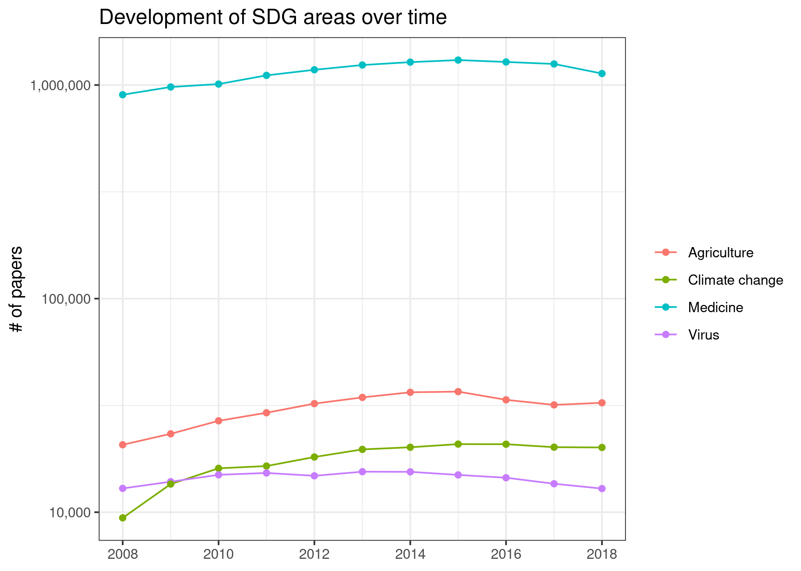
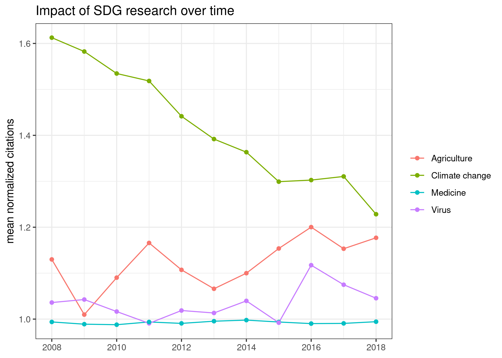
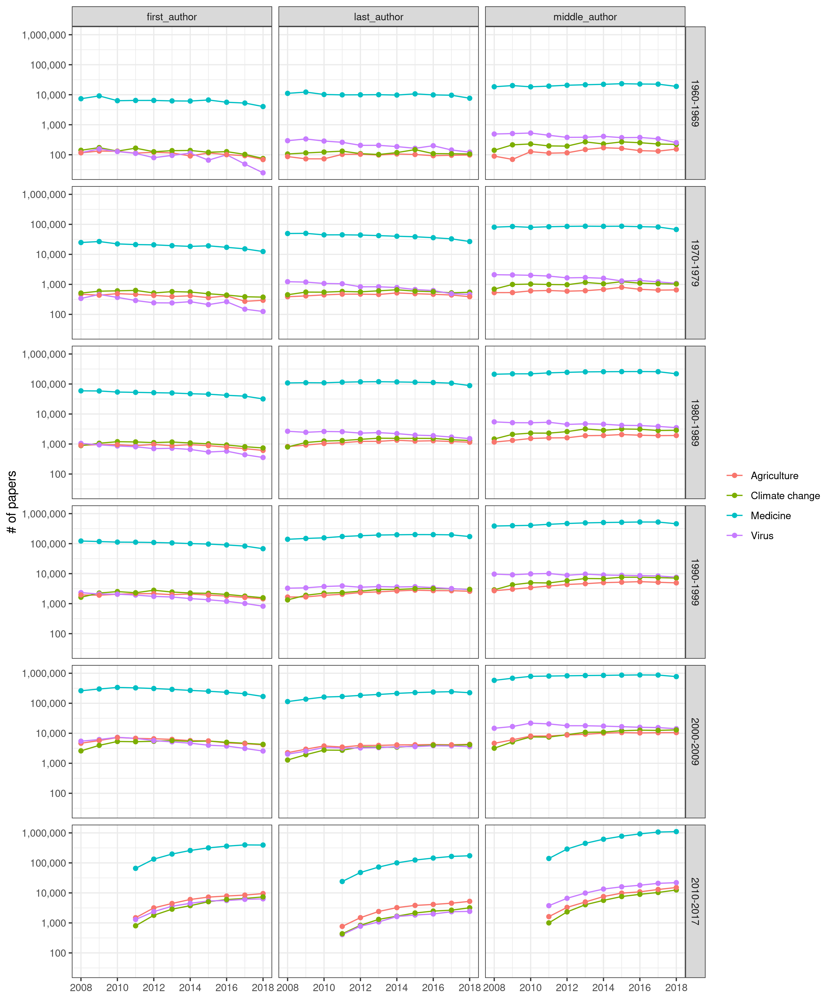
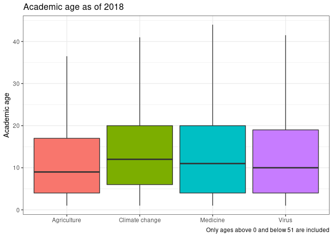
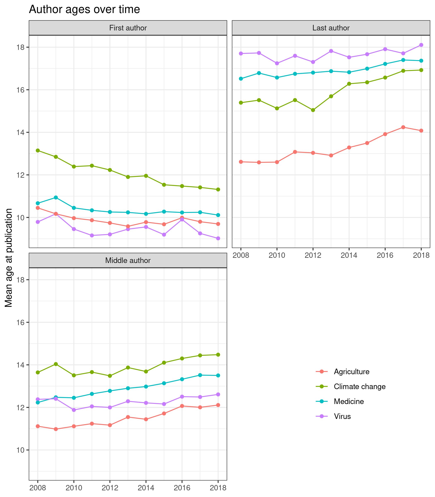
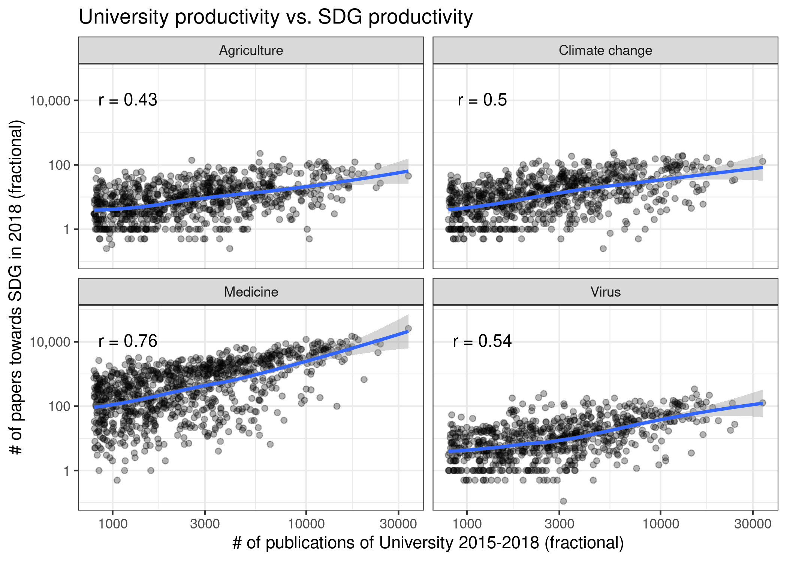
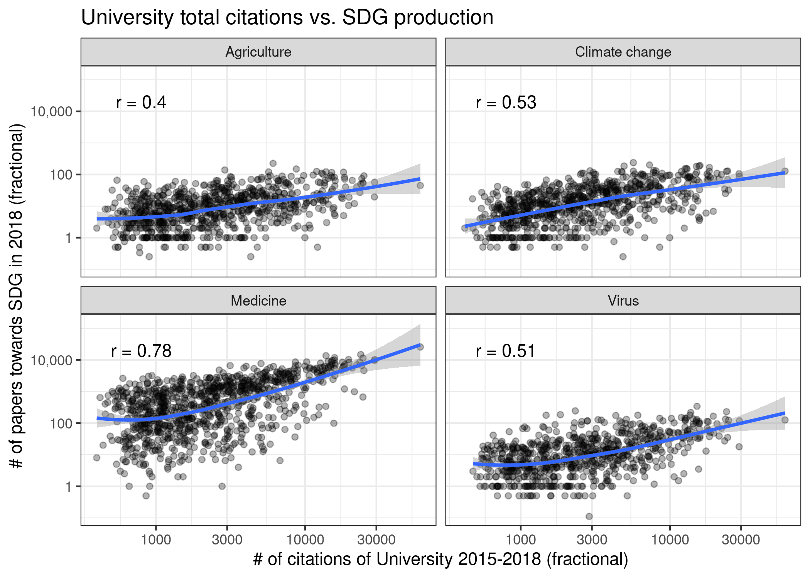
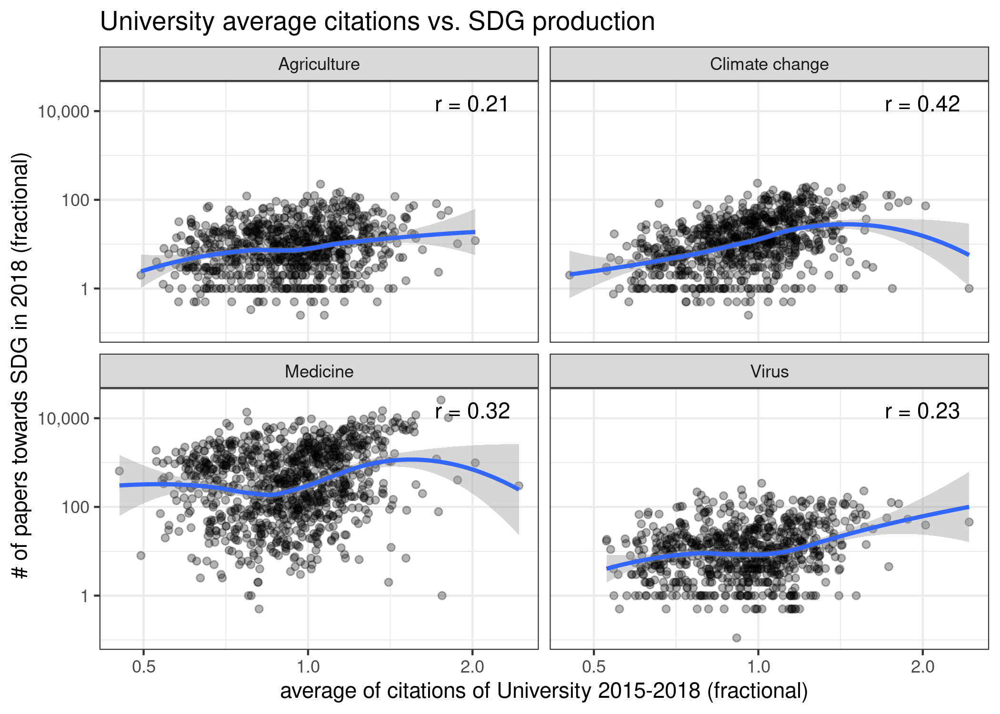

# SDG over time
## Number of papers


```r
fos_counts <- papers %>% 
  count(fos_displayname, year) %>% 
  collect()
  
fos_counts %>% 
  drop_na() %>% 
  ggplot(aes(as_year(year), n, colour = fos_displayname)) +
  geom_line() +
  geom_point() +
  scale_y_log10(labels = scales::comma) +
  labs(x = NULL, y = "# of papers", colour = NULL,
       title = "Development of SDG areas over time") 
```

<!-- -->

We can observe a slight upward trend, that could be attributable to the overall
growth of research.

Improvements:

- directly labeling the lines and removing the legend
- using not raw number of papers but % of MAG overall papers


## Citations/papers


```r
fos_citations <- papers %>% 
  group_by(year, fos_displayname) %>% 
  summarise(across(citations_norm, .fns = c(mean = mean, sd = sd))) %>% 
  collect()

fos_citations  %>% 
  drop_na() %>% 
  ggplot(aes(as_year(year), citations_norm_mean, colour = fos_displayname)) +
  geom_line() +
  geom_point() +
  labs(x = NULL, y = "mean normalized citations", colour = NULL,
       title = "Impact of SDG research over time")
```

<!-- -->
The figure displays normalised citations per SDG (+virus). Overall, the research
in medicine is close to the average impact in similar journals, presumably 
because this simply represents the whole corpus of medicine journals and 
research. Virus, as a comparison case, has a slightly higher impact.

Research on SDG 2 (approximated by agriculture) receives up to 20% more citations
than articles in similar journals. Research on SDG 13 (climate) receives 
substantially more citations (20%-60%), however with a strong downward trend. It
is unclear what the reason for this might be. It could be tied to the citation 
window (how quickly citations accrue), but I'm not sure why climate should have
a long one.

Caveats:

- Since we are using the mean here, this could be sensitive to extreme outliers


```r
fos_citations %>% 
  drop_na() %>% 
  ggplot(aes(as_year(year), citations_norm_sd, colour = fos_displayname)) +
  geom_line() +
  geom_point() +
  labs(x = NULL, y = "SD of normalized citations", colour = NULL,
       title = "Variability of impact of SDG research over time")
```

<!-- -->

The variability is quite high. 

Caveats:

- Standard deviation might not make much sense for such a skewed distribution ->
what would be better? maybe to say something about quantiles/quartiles?


# Academic Age over time
## Counts

```r
author_paper_affiliations_w_groups <- make_author_groups(author_paper_affiliations)

age_base <- papers %>% 
  select(paperid, fos_displayname, year) %>% 
  left_join(author_paper_affiliations_w_groups) %>% 
  left_join(author_metadata) %>% 
  select(paperid, fos_displayname, year, author_position, authorid, 
         year_first_paper)
```

```
## Joining, by = "paperid"
```

```
## Joining, by = "authorid"
```

```r
age_cohorts <- age_base %>% 
  group_by(year, authorid) %>% 
  mutate(current_age = year - year_first_paper) %>% 
  filter(current_age > 0) %>% 
  mutate(age_cohort = case_when(
    year_first_paper < 1960 ~ NA_character_,
    year_first_paper < 1970 ~ "1960-1969",
    year_first_paper < 1980 ~ "1970-1979",
    year_first_paper < 1990 ~ "1980-1989",
    year_first_paper < 2000 ~ "1990-1999",
    year_first_paper < 2010 ~ "2000-2009",
    TRUE ~ "2010-2017"
  )) %>% 
  ungroup()

sdg_age <- age_cohorts %>% 
  count(fos_displayname, year, author_position, age_cohort) %>% 
  collect()
```


```r
sdg_age %>% 
  filter(age_cohort != "NA") %>% 
  ggplot(aes(as_year(year), n, colour = fos_displayname)) +
  geom_line() +
  geom_point() +
  facet_grid(rows = vars(age_cohort), 
             cols = vars(author_position)) +
  scale_y_log10(labels = scales::comma) +
  labs(y = "# of papers", x = NULL, colour = NULL)
```

<!-- -->

This is not very meaningful.

Better: simple averages/boxplots for how SDGs compare


```r
age_box_base <- age_cohorts %>% 
  filter(year == 2018, current_age > 0, current_age <= 50) %>% 
  db_compute_boxplot(fos_displayname, current_age)
```


```r
# since the code for plotting the boxplot is currently not exported in the 
# dbplot package, I'm copying it here directly
colnames(age_box_base) <- c(
  "x", "n", "lower", "middle", "upper", "max_raw", "min_raw",
  "iqr", "min_iqr", "max_iqr", "ymax", "ymin"
)

ggplot(age_box_base) +
  geom_boxplot(
    aes(
      x = x,
      ymin = ymin,
      lower = lower,
      middle = middle,
      upper = upper,
      ymax = ymax,
      group = x,
      fill = x
    ),
    stat = "identity", show.legend = FALSE
  ) +
  labs(x = NULL, y = "Academic age", title = "Academic age as of 2018",
       caption = "Only ages above 0 and below 51 are included")
```

<!-- -->

The academic ages of researchers are quite similar, with researchers working on
climate having the highest average age, and those working on agriculture the 
lowest age.


```r
mean_ages <- age_cohorts %>% 
  group_by(fos_displayname, year) %>% 
  filter(current_age > 0, current_age <= 50) %>% 
  summarise(mean_age = mean(current_age, na.rm = TRUE)) %>% 
  collect()
```


```r
ggplot(mean_ages, aes(as_year(year), mean_age, colour = fos_displayname)) +
  geom_line() +
  geom_point() +
  labs(x = NULL, colour = NULL, y = "Mean age at publication",
       title = "Author ages over time")
```

<!-- -->

Compared to the medians in the boxplot, the mean values are quite a bit higher,
but the order is the same.


```r
mean_ages_p_position <- age_cohorts %>% 
  group_by(fos_displayname, year, author_position) %>% 
  filter(current_age > 0, current_age <= 50) %>% 
  summarise(mean_age = mean(current_age, na.rm = TRUE)) %>% 
  collect()
```


```r
mean_ages_p_position %>% 
  mutate(author_position = recode(
    author_position,
    first_author = "First author", last_author = "Last author",
    middle_author = "Middle author")) %>% 
  ggplot(aes(as_year(year), mean_age, 
                                 colour = fos_displayname)) +
  geom_line() +
  geom_point() +
  facet_wrap(vars(author_position), nrow = 2) +
  theme(legend.position = c(.8, .2)) +
  labs(x = NULL, colour = NULL, y = "Mean age at publication",
     title = "Author ages over time")
```

<!-- -->

Multiple findings:

- Virus is most diametral: "very" young first authors, and old last authors
- First authors getting younger, last authors older -> seems like we can observe
either more multi-author papers and/or stronger split in authorship roles and 
positions
- climate research is strongest in this trend, maybe changing towards a 
knowledge dissemination model similar to other sciences?
  + It could be interesting to see whether there is some knowledge spillover,
  i.e. researchers coming from other disciplines and moving into climate, and
  with that brining their norms/traditions into climate research.

The question of how co-authorship evolves (more or less multi-author papers)
will be covered in another chapter.


Still to do here: similar analyses for citations

# Institutional prestige

We use: 


> P. Total number of publications of a university.
> TNCS and MNCS. The total and the average number of citations of the publications of a university, normalized for field and publication year. An MNCS value of two for instance means that the publications of a university have been cited twice above the average of their field and publication year.


```r
papers_per_affiliation_per_fos <- papers %>% 
  left_join(author_paper_affiliations) %>% 
  left_join(affils) %>% 
  group_by(authorid, paperid) %>% 
  mutate(frac_value = 1/n()) %>% 
  group_by(affiliationid, year, fos_displayname) %>% 
  summarise(n_frac_papers = sum(frac_value, na.rm = TRUE)) %>% 
  collect()
```

```
## Joining, by = "paperid"
```

```
## Joining, by = c("citationcount", "affiliationid")
```


```r
leiden_small_local <- leiden %>%
  filter(Field == "All sciences", Period == "2015–2018",
         Frac_counting == 1) %>%
  select(University, Country, TNCS, MNCS, impact_P) %>% 
  collect() %>% 
  mutate(across(c(TNCS, MNCS), as.numeric))

affil_leiden_key <- read_csv(here::here("data/processed/leiden_matched.csv"))
```

```
## 
## ── Column specification ────────────────────────────────────────────────────────
## cols(
##   affiliationid = col_double(),
##   normalizedname = col_character(),
##   displayname = col_character(),
##   university_normalized = col_character(),
##   University = col_character(),
##   Country = col_character()
## )
```

```r
papers_per_affiliation_per_w_leiden <- papers_per_affiliation_per_fos %>%
  mutate(affiliationid = as.numeric(affiliationid)) %>% # needed for merging
  left_join(affil_leiden_key) %>%
  left_join(leiden_small_local)
```

```
## Joining, by = "affiliationid"
```

```
## Joining, by = c("University", "Country")
```


```r
plot_bivariate <- function(df, var, x_pos = 1200, y_pos = 11000) {
  pdata <- df %>%
    filter(year == 2018, !is.na(impact_P))
  labels <- pdata %>%
    group_by(fos_displayname) %>%
    summarise(cor = cor({{var}}, n_frac_papers)) %>%
    mutate(x = x_pos, y = y_pos,
           label = glue::glue("r = {round(cor, 2)}"))
  pdata %>%
    ggplot(aes({{var}}, n_frac_papers)) +
    geom_point(alpha = .3) +
    scale_x_log10() +
    scale_y_log10(labels = scales::comma) +
    facet_wrap(vars(fos_displayname)) +
    geom_smooth() +
    geom_text(data = labels, aes(x = x, y = y, label = label))
}
```


```r
papers_per_affiliation_per_w_leiden %>%
  plot_bivariate(impact_P) +
  labs(x = "# of publications of University 2015-2018 (fractional)",
       y = "# of papers towards SDG in 2018 (fractional)",
       title = "University production vs. SDG production")
```

```
## `geom_smooth()` using method = 'loess' and formula 'y ~ x'
```

<!-- -->


```r
papers_per_affiliation_per_w_leiden %>%
  plot_bivariate(TNCS, 800, 20000) +
  labs(x = "# of citations of University 2015-2018 (fractional)",
       y = "# of papers towards SDG in 2018 (fractional)",
       title = "University total citations vs. SDG production")
```

```
## `geom_smooth()` using method = 'loess' and formula 'y ~ x'
```

<!-- -->


```r
papers_per_affiliation_per_w_leiden %>%
  plot_bivariate(MNCS, 2, 15000) +
  labs(x = "average of citations of University 2015-2018 (fractional)",
       y = "# of papers towards SDG in 2018 (fractional)",
       title = "University average citations vs. SDG production")
```

```
## `geom_smooth()` using method = 'loess' and formula 'y ~ x'
```

<!-- -->

Todo here: look into highest value on x axis (probably harvard) -> why not there
for agriculture?


