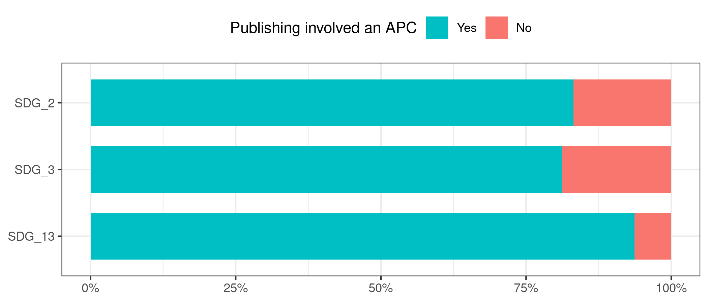

Are researchers from lower ranking universities publishing with higher or 
lower APCs? In journals with higher or lower IF?

Repeat figure from OA Who about university ranking and publishing types, but
this time with APC yes, no, and IF mean.


```r
step1 <- papers %>% 
  # we can only look at journals, since doaj only is for journals
  # also only look at fairly recent papers
  # also only look at papers which actually are OA
  filter(!is.na(journalid), year %in% 2015:2018, is_oa) %>% 
  left_join(author_paper_affiliations) %>% 
  left_join(affils) %>% 
  left_join(journals, by = "journalid") %>% 
  # need to filter out some NAs, since the journal table seems to be older than
  # the rest of MAG? at least it does not contain some journals for which we
  # have papers
  filter(!is.na(APC)) %>% 
  group_by(authorid, paperid) %>% 
  mutate(frac_value = 1/n()) 
```

```
## Joining, by = "paperid"
```

```
## Joining, by = c("citationcount", "affiliationid")
```

```r
# step1 %>% select(journalid, APC, APC_in_dollar) %>% filter(APC != "NA")
#
# step1 %>% filter(is.na(APC)) %>% head(20) %>% collect()

apc_per_affiliation_per_sdg <- step1 %>% 
  mutate(APC = if_else(APC == "NA", "Not in DOAJ", APC)) %>% 
  group_by(affiliationid, SDG_label) %>% 
  count(APC, wt = frac_value)

# apc_per_affiliation_per_sdg %>% ungroup() %>% count(APC)

totals <- step1 %>% 
  group_by(affiliationid, SDG_label) %>% 
  summarise(n_frac_papers = sum(frac_value, na.rm = TRUE))

apc_per_affiliation_per_sdg <- apc_per_affiliation_per_sdg %>% 
  left_join(totals)
```

```
## Joining, by = c("affiliationid", "SDG_label")
```

```r
apc_per_affiliation_per_sdg_local <- apc_per_affiliation_per_sdg %>% 
  filter(n_frac_papers > 50) %>% 
  collect()
```


```r
apc_affiliation_leiden <- apc_per_affiliation_per_sdg_local %>%
  mutate(affiliationid = as.numeric(affiliationid)) %>% # needed for merging
  left_join(affil_leiden_key) %>%
  left_join(leiden_small_local) %>% 
  # remove those institutions that are not in leiden ranking
  filter(!is.na(University), Period == "2015–2018")
```

```
## Joining, by = "affiliationid"
```

```
## Joining, by = c("University", "Country")
```


```r
p <- apc_affiliation_leiden %>% 
  group_by(SDG_label, affiliationid) %>% 
  mutate(apc_share = n/sum(n)) %>% 
  ggplot(aes(P_top10, apc_share, colour = APC)) +
  geom_point(size = .7, alpha = .4) +
  scale_x_log10() +
  geom_smooth() +
  facet_wrap(vars(SDG_label)) +
  scale_y_continuous(labels = scales::percent) +
  theme(legend.position = "top") +
  labs(y = "Share of papers in category", colour = NULL,
       title = "Association between institutional prestige (2015-2018)\nand whether APCs are involved or not")
p
```

```
## `geom_smooth()` using method = 'gam' and formula 'y ~ s(x, bs = "cs")'
```

<!-- -->

Very interesting: really high universities publish less in DAOJ journals. Why is
that? which types of journals are these? This is especially true in medicine.
Maybe there is something specific going on here?


```r
p2 <- apc_affiliation_leiden %>% 
  filter(APC != "Not in DOAJ") %>%
  group_by(SDG_label, affiliationid) %>% 
  mutate(apc_share = n/sum(n)) %>% 
  ggplot(aes(P_top10, apc_share, colour = APC)) +
  geom_point(size = .7, alpha = .4) +
  scale_x_log10() +
  geom_smooth() +
  facet_wrap(vars(SDG_label)) +
  scale_y_continuous(labels = scales::percent) +
  theme(legend.position = "top") +
  labs(y = "Share of papers in category", colour = NULL,
       title = "Association between institutional prestige (2015-2018) and\nwhether APCs are ionvolved or not")
p2
```

```
## `geom_smooth()` using method = 'gam' and formula 'y ~ s(x, bs = "cs")'
```

<!-- -->

We can conclude:

- higher prestige institutions generally publish a larger share of their research
in OA journals that involve an APC

Next question: Is this also visible in terms of APC prices?
Then: how does this relate to IF?

And: is the APC (yes/no) divide also visible on regional level? Alternative 
explanation: lower ranked affiliations publish locally, and these local journals
might not have APCs. It still means: those researchers are not able to participate
in the high-ranking journal game.

Maybe correspondence analysis to relate these? IF in quartiles from SJR

What do we learn? 
