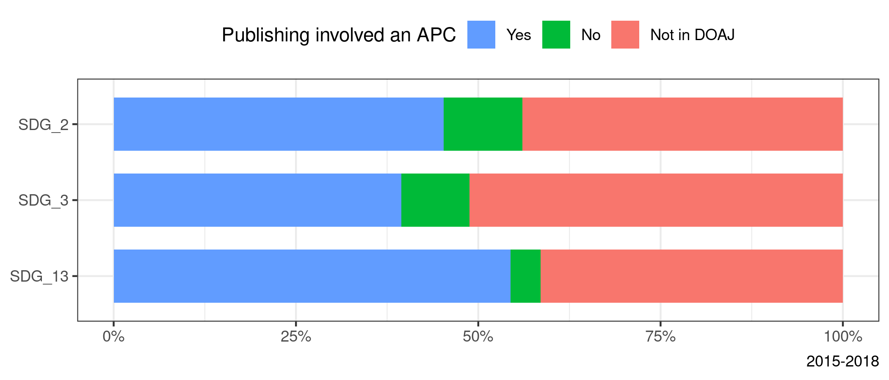
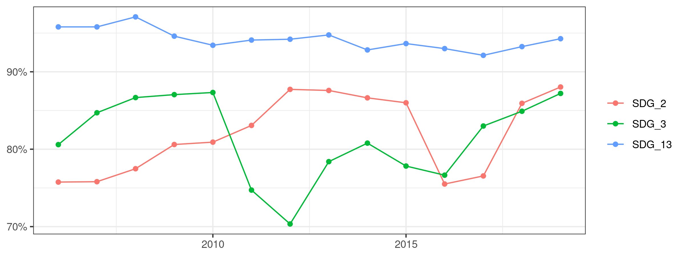
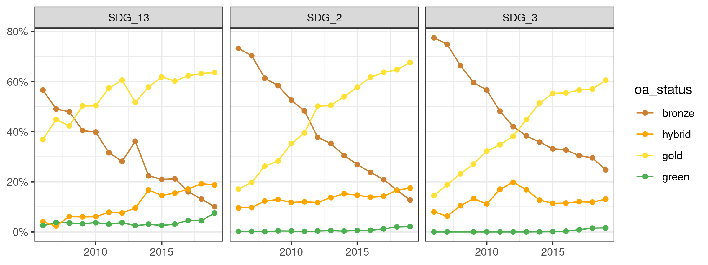
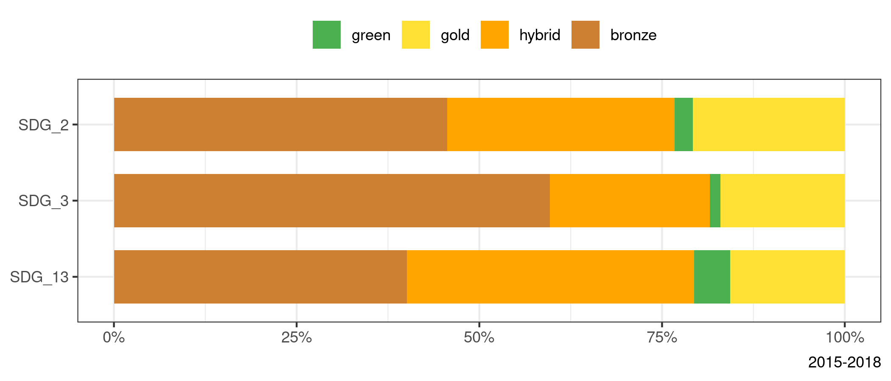
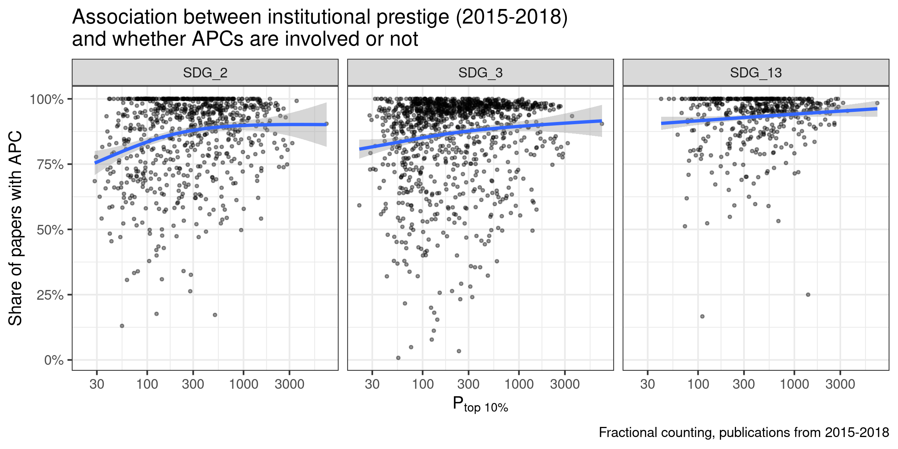
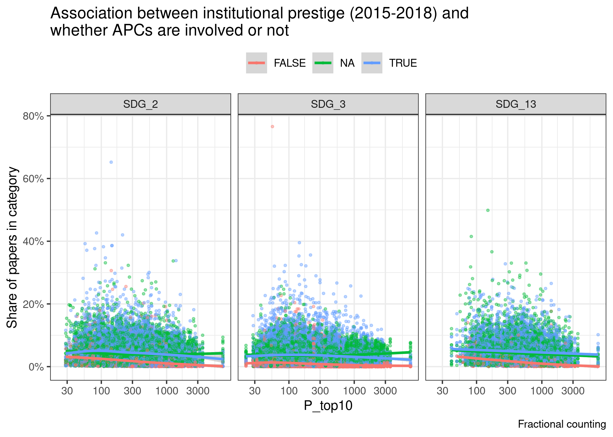
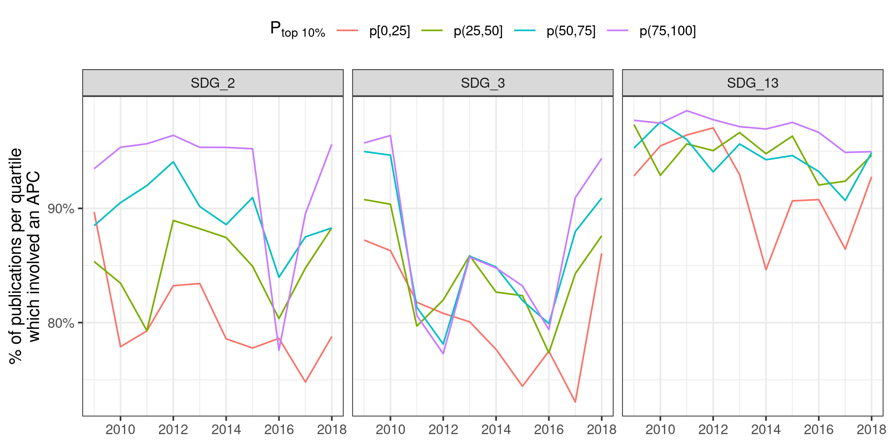
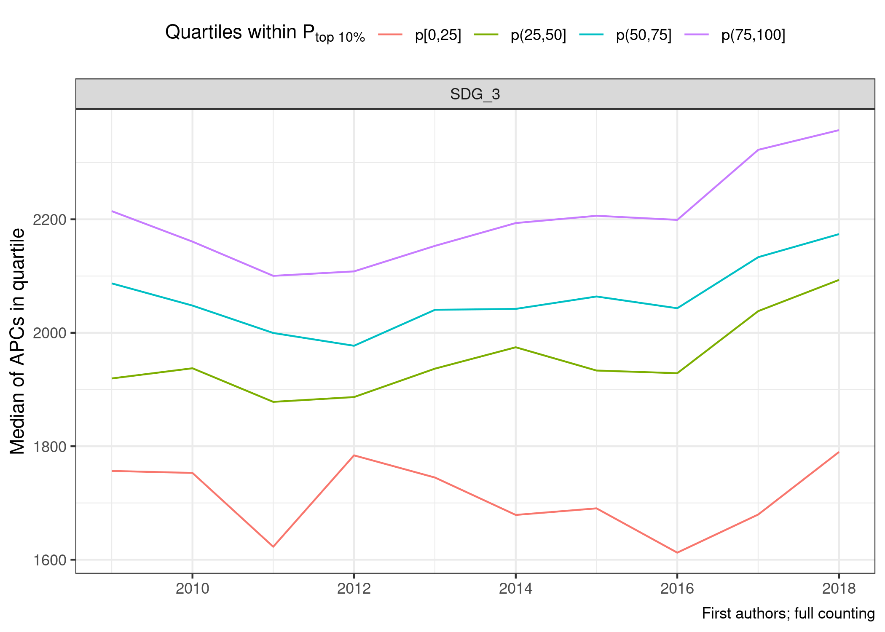

# APC by sdg

```r
step1 <- papers %>% 
  # we can only look at journals, since doaj only is for journals
  # also only look at fairly recent papers
  # also only look at papers which actually are OA
  filter(!is.na(journalid), is_oa, year < 2020) %>% 
  left_join(author_paper_affiliations) %>% 
  left_join(affils) %>% 
  left_join(journals, by = "journalid") %>% 
  # need to filter out some NAs, since the journal table seems to be older than
  # the rest of MAG? at least it does not contain some journals for which we
  # have papers
  filter(!is.na(APC), provider_cat != "Repository only") %>% 
  group_by(authorid, paperid) %>% 
  mutate(frac_value = 1/n()) 
```

```
## Joining, by = "paperid"
```

```
## Joining, by = c("citationcount", "affiliationid")
```

```r
apc_per_sdg <- step1 %>% 
  mutate(APC = if_else(APC == "NA", "Not in DOAJ", APC)) %>% 
  group_by(SDG_label, year) %>% 
  count(APC) %>% 
  collect()
```


```r
p <- apc_per_sdg %>% 
  filter(year %in% 2015:2018) %>%
  group_by(SDG_label, APC) %>% 
  summarise(n = sum(n)) %>% 
  mutate(prop = n / sum(n)) %>% 
  mutate(APC = factor(APC, levels = c("Not in DOAJ", "FALSE", "TRUE"),
                      labels = c("Not in DOAJ", "No", "Yes"))) %>%
  ggplot(aes(prop, fct_relevel(SDG_label, "SDG_3", after = 1), fill = APC)) +
  geom_col(width = .7) +
  scale_x_continuous(labels = scales::percent) +
  theme_bw() +
  labs(x = NULL, y = NULL, fill = "Publishing involved an APC",
       caption = "2015-2018") +
  theme(legend.position = "top") +
  guides(fill = guide_legend(reverse = TRUE))
```

```
## `summarise()` has grouped output by 'SDG_label'. You can override using the `.groups` argument.
```

```r
p
```

<!-- -->


```r
plotly::ggplotly(p)
```

preserve2aa76f85a9412fa1


```r
p <- apc_per_sdg %>% 
  filter(year < 2020) %>% 
  group_by(year, SDG_label) %>% 
  mutate(prop = n/sum(n)) %>% 
  ggplot(aes(as_year(year), prop, colour = APC)) +
  geom_line() +
  geom_point() +
  facet_wrap(vars(SDG_label)) +
  scale_y_continuous(labels = scales::percent) +
  theme_bw() +
  labs(x = NULL, y = NULL) +
  theme(legend.position = "top")
p
```

<!-- -->


```r
plotly::ggplotly(p)
```

preserve944bc135eed20029


```r
apc_merged_hybrid <- step1 %>% 
  mutate(APC = case_when(oa_status %in% c("hybrid") ~ "TRUE",
                         TRUE ~ APC)) %>%  
  group_by(SDG_label, year) %>% 
  count(APC) %>% 
  collect()

p <- apc_merged_hybrid %>% 
  filter(APC != "NA") %>% 
  group_by(year, SDG_label) %>% 
  mutate(prop = n/sum(n)) %>% 
  filter(APC == "TRUE") %>% 
  ggplot(aes(as_year(year), prop, colour = fix_sdg(SDG_label))) +
  geom_line() +
  geom_point() +
  scale_y_continuous(labels = scales::percent) +
  theme_bw() +
  labs(x = NULL, y = NULL, colour = NULL)
p
```

<!-- -->


```r
plotly::ggplotly(p)
```

preserve4b6c3cedd14b263a

is this decline in non DOAJ based on the rise of Gold OA and the decline of 
hybrid/bronze?

Yes it is, see below!


```r
oa_colours <- step1 %>% 
  group_by(SDG_label, year) %>% 
  count(oa_status) %>% 
  collect()
```


```r
oa_colour_scheme <- c(bronze = "#cd7f32", hybrid = "#ffa500", 
                                gold = "#ffe135", green = "#4CAF50")


p <- oa_colours %>% 
  drop_na() %>% 
  group_by(year, SDG_label) %>% 
  mutate(prop = n/sum(n)) %>% 
  ggplot(aes(as_year(year), prop, colour = oa_status)) +
  geom_line() +
  geom_point() +
  facet_wrap(vars(SDG_label)) +
  scale_y_continuous(labels = scales::percent) +
  scale_color_manual(values = oa_colour_scheme) +
  theme_bw() +
  labs(x = NULL, y = NULL)
p
```

<!-- -->


```r
plotly::ggplotly(p)
```

preserve3a463b2c0b7d785e

what is the share of stuff that is "not in doaj" in terms of hybrid/bronze, etc?


```r
not_in_doaj <- step1 %>% 
  # only keep those that are not in DAOJ
  filter(APC == "NA") %>% 
  group_by(SDG_label, year) %>% 
  count(oa_status) %>% 
  collect()

p <- not_in_doaj %>% 
  group_by(year, SDG_label) %>% 
  mutate(prop = n/sum(n)) %>% 
  ggplot(aes(as_year(year), prop, colour = oa_status)) +
  geom_line() +
  geom_point() +
  facet_wrap(vars(SDG_label)) +
  scale_y_continuous(labels = scales::percent) +
  scale_color_manual(values = oa_colour_scheme) +
  theme_bw() +
  labs(x = NULL, y = NULL)
p
```

<!-- -->


```r
plotly::ggplotly(p)
```

preserve80ee00906cddc9f8


```r
p <- not_in_doaj %>% 
  filter(year %in% 2015:2018) %>%
  group_by(SDG_label, oa_status) %>% 
  summarise(n = sum(n)) %>% 
  mutate(prop = n / sum(n),
         oa_status = factor(oa_status, levels = c("gold", "green", "hybrid",
                                                  "bronze"))) %>% 
  ggplot(aes(prop, fct_relevel(SDG_label, "SDG_3", after = 1), fill = oa_status)) +
  geom_col(width = .7) +
  scale_x_continuous(labels = scales::percent) +
  scale_fill_manual(values = oa_colour_scheme) +
  theme_bw() +
  labs(x = NULL, y = NULL, fill = NULL,
       caption = "2015-2018") +
  theme(legend.position = "top") +
  guides(fill = guide_legend(reverse = TRUE))
```

```
## `summarise()` has grouped output by 'SDG_label'. You can override using the `.groups` argument.
```

```r
p
```

<!-- -->


```r
plotly::ggplotly(p)
```

preserve8558153972ffd32c


Are researchers from lower ranking universities publishing with higher or 
lower APCs? In journals with higher or lower IF?

# OA with or without APC

Repeat figure from OA Who about university ranking and publishing types, but
this time with APC yes, no, and IF mean.


```r
apc_per_affiliation_per_sdg <- step1 %>% 
  mutate(APC = case_when(oa_status %in% c("hybrid") ~ "TRUE",
                         TRUE ~ APC)) %>%  
  group_by(affiliationid, SDG_label, year) %>% 
  count(APC, wt = frac_value)

# apc_per_affiliation_per_sdg %>% ungroup() %>% count(APC)

totals <- step1 %>% 
  group_by(affiliationid, SDG_label) %>% 
  summarise(n_frac_papers = sum(frac_value, na.rm = TRUE))

apc_per_affiliation_per_sdg <- apc_per_affiliation_per_sdg %>% 
  left_join(totals)
```

```
## Joining, by = c("affiliationid", "SDG_label")
```

```r
apc_per_affiliation_per_sdg_local <- apc_per_affiliation_per_sdg %>% 
  filter(n_frac_papers > 50) %>% 
  collect()
```


```r
apc_affiliation_leiden <- apc_per_affiliation_per_sdg_local %>%
  mutate(affiliationid = as.numeric(affiliationid)) %>% # needed for merging
  left_join(affil_leiden_key) %>%
  left_join(leiden_small_local) %>% 
  # remove those institutions that are not in leiden ranking
  filter(!is.na(University), Period == "2015–2018")
```

```
## Joining, by = "affiliationid"
```

```
## Joining, by = c("University", "Country")
```

The figure below uses fractional counting.


```r
p <- apc_affiliation_leiden %>% 
  filter(year %in% 2015:2018) %>%
  group_by(SDG_label, P_top10, APC) %>% 
  summarise(n = sum(n)) %>%
  # remove those journals for which we really do not have APC information
  filter(APC != "NA") %>% 
  mutate(apc_share = n/sum(n)) %>% 
  mutate(APC = if_else(APC == "TRUE", "Yes", "No")) %>% 
  ggplot(aes(P_top10, apc_share, colour = APC)) +
  geom_point(size = .7, alpha = .4) +
  scale_x_log10() +
  geom_smooth() +
  facet_wrap(vars(SDG_label)) +
  scale_y_continuous(labels = scales::percent) +
  theme(legend.position = "top") +
  labs(y = "Share of papers in category", colour = "APC involved",
       title = "Association between institutional prestige (2015-2018)\nand whether APCs are involved or not",
       caption = "Fractional counting",
       x = expression(P["top 10%"]))
```

```
## `summarise()` has grouped output by 'SDG_label', 'P_top10'. You can override using the `.groups` argument.
```

```r
p
```

```
## `geom_smooth()` using method = 'gam' and formula 'y ~ s(x, bs = "cs")'
```

<!-- -->

Very interesting: really high universities publish less in DAOJ journals. Why is
that? which types of journals are these? This is especially true in medicine.
Maybe there is something specific going on here?


```r
p2 <- apc_affiliation_leiden %>% 
  filter(APC != "Not in DOAJ") %>%
  group_by(SDG_label, affiliationid) %>% 
  mutate(apc_share = n/sum(n)) %>% 
  ggplot(aes(P_top10, apc_share, colour = APC)) +
  geom_point(size = .7, alpha = .4) +
  scale_x_log10() +
  geom_smooth() +
  facet_wrap(vars(SDG_label)) +
  scale_y_continuous(labels = scales::percent) +
  theme(legend.position = "top") +
  labs(y = "Share of papers in category", colour = NULL,
       title = "Association between institutional prestige (2015-2018) and\nwhether APCs are involved or not",
       caption = "Fractional counting")
p2
```

```
## `geom_smooth()` using method = 'gam' and formula 'y ~ s(x, bs = "cs")'
```

<!-- -->

We can conclude:

- higher prestige institutions generally publish a larger share of their research
in OA journals that involve an APC

Next question: Is this also visible in terms of APC prices?
Then: how does this relate to IF?

And: is the APC (yes/no) divide also visible on regional level? Alternative 
explanation: lower ranked affiliations publish locally, and these local journals
might not have APCs. It still means: those researchers are not able to participate
in the high-ranking journal game.

Maybe correspondence analysis to relate these? IF in quartiles from SJR

What do we learn? 


## collapsing hybrid + DOAJ APC

```r
apc_per_affiliation_per_sdg <- step1 %>% 
  mutate(APC = case_when(oa_status %in% c("hybrid") ~ "TRUE",
                         TRUE ~ APC)) %>%  
  group_by(affiliationid, SDG_label, year) %>% 
  count(APC, wt = frac_value)

# apc_per_affiliation_per_sdg %>% ungroup() %>% count(APC)

totals <- step1 %>% 
  group_by(affiliationid, SDG_label, year) %>% 
  summarise(n_frac_papers = sum(frac_value, na.rm = TRUE))

apc_per_affiliation_per_sdg <- apc_per_affiliation_per_sdg %>% 
  left_join(totals)
```

```
## Joining, by = c("affiliationid", "SDG_label", "year")
```

```r
apc_per_affiliation_per_sdg_local <- apc_per_affiliation_per_sdg %>% 
  # filter(n_frac_papers > 50) %>% 
  collect()
```


```r
apc_value_affiliation_leiden <- apc_per_affiliation_per_sdg_local %>%
  mutate(affiliationid = as.numeric(affiliationid)) %>% # needed for merging
  left_join(affil_leiden_key) %>%
  left_join(leiden_small_local) %>% 
  # remove those institutions that are not in leiden ranking
  filter(!is.na(University), year == as.integer(last_year_of_period)) %>% 
  mutate(P_top10 = cut_quartiles(P_top10)) %>% 
  filter(!is.na(P_top10))
```

```
## Joining, by = "affiliationid"
```

```
## Joining, by = c("University", "Country")
```


```r
p <- apc_value_affiliation_leiden %>% 
  mutate(prop_apc = n / n_frac_papers) %>% 
  filter(APC == "TRUE") %>% 
  group_by(SDG_label, year, P_top10) %>% 
  mutate(y_median = weighted.mean(prop_apc, n_frac_papers, na.rm = TRUE)) %>% 
  ggplot(aes(as_year(year), y_median, colour = P_top10)) +
  geom_line() +
  # geom_point() +
  facet_wrap(vars(fct_relevel(SDG_label, "SDG_13", after = 3))) +
  scale_y_continuous(labels = scales::percent) +
  guides(colour = guide_legend(reverse = FALSE)) +
  labs(x = NULL, y = "% of publications per quartile\nwhich involved an APC") +
  theme_bw() +
  theme(legend.position = "top")
p
```

<!-- -->


```r
plotly::ggplotly(p)
```

preserve464618853044915a

# APC prices
The figures below use full counting, but for first and last authors separately.

```r
step1_apc_prices <- papers %>% 
  # we can only look at journals, since doaj only is for journals
  # also only look at fairly recent papers
  # also only look at papers which actually are OA
  filter(!is.na(journalid), year %in% 2015:2018, is_oa) %>% 
  left_join(author_paper_affiliations_w_groups) %>% 
  left_join(affils) %>% 
  left_join(journals, by = "journalid") %>% 
  # need to filter out some NAs, since the journal table seems to be older than
  # the rest of MAG? at least it does not contain some journals for which we
  # have papers
  filter(!is.na(APC), provider_cat != "Repository only") %>% 
  # keep only last and first authors
  filter(author_position %in% c("last_author", "first_author"))
```

```
## Joining, by = "paperid"
```

```
## Joining, by = c("citationcount", "affiliationid")
```

```r
mean_apc_per_affiliation_per_sdg <- step1_apc_prices %>% 
  group_by(affiliationid, SDG_label, author_position) %>% 
  summarise(mean_apc = mean(APC_in_dollar),
            n_papers = n())

mean_apc_per_affiliation_per_sdg_local <- mean_apc_per_affiliation_per_sdg %>% 
  filter(n_papers > 20) %>% 
  collect()
```


```r
apc_val_affiliation_leiden <- mean_apc_per_affiliation_per_sdg_local %>%
  mutate(affiliationid = as.numeric(affiliationid)) %>% # needed for merging
  left_join(affil_leiden_key) %>%
  left_join(leiden_small_local) %>% 
  # remove those institutions that are not in leiden ranking
  filter(!is.na(University), Period == "2015–2018")
```

```
## Joining, by = "affiliationid"
```

```
## Joining, by = c("University", "Country")
```

```r
firsts <- apc_val_affiliation_leiden %>% 
  filter(author_position == "first_author")

lasts <- apc_val_affiliation_leiden %>% 
  filter(author_position == "last_author")
```


```r
labels <- lasts %>% 
  group_by(SDG_label) %>% 
  summarise(cor = cor(mean_apc, P_top10)) %>% 
  mutate(cor = glue::glue("r = {format(cor, nsmall = 2, digits = 2)}"))

lasts_p <- lasts %>% 
  ggplot(aes(P_top10, mean_apc)) +
  geom_point(aes(colour = n_papers), alpha = .4, show.legend = FALSE) +
  geom_smooth(show.legend = FALSE, colour = "grey30") +
  geom_text(data = labels, aes(label = cor, x = 50, y = 3700)) +
  facet_wrap(vars(fix_sdg(SDG_label)), nrow = 1) +
  scale_x_log10() +
  scale_colour_viridis_c(trans = "log10") +
  theme_bw() +
  labs(colour = "Number of papers per institution",
       caption = "Full counting; last authors only",
       y = "Mean APC",
       x = expression(P["top 10%"]))
```

Inclusion criterion was for an institution to have at least 20 papers per last
author. in SDG 13 the lower ranked institutions do not have that.

In general, higher prestige is related to higher APCs. The effect is strongest 
for SDG 2, with a steep incline at the lowest ranking universities.


```r
labels <- firsts %>% 
  group_by(SDG_label) %>% 
  summarise(cor = cor(mean_apc, P_top10)) %>% 
  mutate(cor = glue::glue("r = {format(cor, nsmall = 2, digits = 2)}"))

firsts_p <- firsts %>% 
  ggplot(aes(P_top10, mean_apc)) +
  geom_point(aes(colour = n_papers), alpha = .4) +
  geom_smooth(show.legend = FALSE, colour = "grey30") +
  geom_text(data = labels, aes(label = cor, x = 50, y = 3700)) +
  facet_wrap(vars(fix_sdg(SDG_label)), nrow = 1) +
  scale_x_log10() +
  scale_colour_viridis_c(trans = "log10") +
  theme_bw() +
  labs(colour = "Number of papers per institution",
       caption = "Full counting; first authors only",
       y = "Mean APC",
       x = expression(P["top 10%"]))
```


```r
firsts_p / lasts_p + 
  plot_layout(guides = "collect") +
  plot_annotation(title = "Mean APC per institution by institutional prestige (2015-2018)",
                  tag_levels = "A") &
  theme(legend.position = "top", legend.key.width = unit(1.8, "lines"))
```

```
## `geom_smooth()` using method = 'gam' and formula 'y ~ s(x, bs = "cs")'
## `geom_smooth()` using method = 'gam' and formula 'y ~ s(x, bs = "cs")'
```

<!-- -->


Same as above, but with zero apcs included into the mean


```r
mean_0_apc_per_affiliation_per_sdg <- step1_apc_prices %>% 
  mutate(APC_in_dollar = case_when(APC == "FALSE" ~ 0,
                                   TRUE ~ APC_in_dollar)) %>% 
  group_by(affiliationid, SDG_label, author_position) %>% 
  summarise(mean_apc = mean(APC_in_dollar),
            n_papers = n())

mean_0_apc_per_affiliation_per_sdg_local <- mean_0_apc_per_affiliation_per_sdg %>% 
  filter(n_papers > 20) %>% 
  collect()
```


```r
apc_val_affiliation_leiden <- mean_0_apc_per_affiliation_per_sdg_local %>%
  mutate(affiliationid = as.numeric(affiliationid)) %>% # needed for merging
  left_join(affil_leiden_key) %>%
  left_join(leiden_small_local) %>% 
  # remove those institutions that are not in leiden ranking
  filter(!is.na(University), Period == "2015–2018")
```

```
## Joining, by = "affiliationid"
```

```
## Joining, by = c("University", "Country")
```

```r
firsts <- apc_val_affiliation_leiden %>% 
  filter(author_position == "first_author")

lasts <- apc_val_affiliation_leiden %>% 
  filter(author_position == "last_author")
```


```r
labels <- lasts %>% 
  group_by(SDG_label) %>% 
  summarise(cor = cor(mean_apc, P_top10)) %>% 
  mutate(cor = glue::glue("r = {format(cor, nsmall = 2, digits = 2)}"))

lasts_p <- lasts %>% 
  ggplot(aes(P_top10, mean_apc)) +
  geom_point(aes(colour = n_papers), alpha = .4, show.legend = FALSE) +
  geom_smooth(show.legend = FALSE, colour = "grey30") +
  geom_text(data = labels, aes(label = cor, x = 50, y = 3700)) +
  facet_wrap(vars(fix_sdg(SDG_label)), nrow = 1) +
  scale_x_log10() +
  scale_colour_viridis_c(trans = "log10") +
  theme_bw() +
  labs(colour = "Number of papers per institution",
       caption = "Full counting; last authors only; including no APC as '0'",
       y = "Mean APC",
       x = expression(P["top 10%"]))
```


```r
labels <- firsts %>% 
  group_by(SDG_label) %>% 
  summarise(cor = cor(mean_apc, P_top10)) %>% 
  mutate(cor = glue::glue("r = {format(cor, nsmall = 2, digits = 2)}"))

firsts_p <- firsts %>% 
  ggplot(aes(P_top10, mean_apc)) +
  geom_point(aes(colour = n_papers), alpha = .4) +
  geom_smooth(show.legend = FALSE, colour = "grey30") +
  geom_text(data = labels, aes(label = cor, x = 50, y = 3700)) +
  facet_wrap(vars(fix_sdg(SDG_label)), nrow = 1) +
  scale_x_log10() +
  scale_colour_viridis_c(trans = "log10") +
  theme_bw() +
  labs(colour = "Number of papers per institution",
       caption = "Full counting; first authors only; including no APC as '0'",
       y = "Mean APC",
       x = expression(P["top 10%"]))
```


```r
firsts_p / lasts_p + 
  plot_layout(guides = "collect") +
  plot_annotation(title = "Mean APC per institution by institutional prestige (2015-2018)",
                  tag_levels = "A") &
  theme(legend.position = "top", legend.key.width = unit(1.8, "lines"))
```

```
## `geom_smooth()` using method = 'gam' and formula 'y ~ s(x, bs = "cs")'
## `geom_smooth()` using method = 'gam' and formula 'y ~ s(x, bs = "cs")'
```

<!-- -->


Visualise time component:

- do quantiles over time, with mean of APC per quantile of Ptop10


```r
apc_time <- papers %>% 
  # we can only look at journals, since doaj only is for journals
  # also only look at fairly recent papers
  # also only look at papers which actually are OA
  filter(!is.na(journalid), is_oa) %>% 
  left_join(author_paper_affiliations_w_groups) %>% 
  left_join(affils) %>% 
  left_join(journals, by = "journalid") %>% 
  # need to filter out some NAs, since the journal table seems to be older than
  # the rest of MAG? at least it does not contain some journals for which we
  # have papers
  filter(!is.na(APC), provider_cat != "Repository only") %>% 
  # keep only last and first authors
  filter(author_position %in% c("last_author", "first_author"))
```

```
## Joining, by = "paperid"
```

```
## Joining, by = c("citationcount", "affiliationid")
```


```r
apc_time_summarised <- apc_time %>% 
  mutate(APC_in_dollar = case_when(APC == "FALSE" ~ 0,
                                   TRUE ~ APC_in_dollar)) %>% 
  group_by(affiliationid, SDG_label, year, author_position) %>% 
  summarise(mean_apc = mean(APC_in_dollar),
            n_papers = n()) %>% 
  collect()
```


```r
apc_time_leiden <- apc_time_summarised %>%
  mutate(affiliationid = as.numeric(affiliationid)) %>% # needed for merging
  left_join(affil_leiden_key) %>%
  left_join(leiden_small_local) %>% 
  # remove those institutions that are not in leiden ranking
  filter(!is.na(University), year == as.integer(last_year_of_period)) %>% 
  mutate(P_top10 = cut_quartiles(P_top10)) %>% 
  filter(!is.na(P_top10))
```

```
## Joining, by = "affiliationid"
```

```
## Joining, by = c("University", "Country")
```

```r
firsts <- apc_time_leiden %>% 
  filter(author_position == "first_author")

lasts <- apc_time_leiden %>% 
  filter(author_position == "last_author")
```


```r
plot_over_time <- function(df, indicator, y_var) {
  df %>% 
    group_by(SDG_label, year, {{indicator}}) %>% 
    mutate(y_median = median({{y_var}}, na.rm = TRUE)) %>% 
    ggplot(aes(as_year(year), y_median, colour = {{indicator}})) +
    geom_line() +
    facet_wrap(vars(fct_relevel(SDG_label, "SDG_13", after = 3))) +
    #scale_y_log10() +
    guides(colour = guide_legend(reverse = FALSE)) +
    labs(x = NULL, y = "Median of APCs in quartile",
         colour = expression(paste("Quartiles within P"["top 10%"]))) +
    theme_bw() +
    theme(legend.position = "top")
}
```


```r
firsts_p <- firsts %>% 
  plot_over_time(P_top10, mean_apc) +
  labs(caption = "First authors; full counting")
```


```r
plotly::ggplotly(firsts_p)
```

preserve4061aa01a7b6e6fe


```r
lasts_p <- lasts %>% 
  plot_over_time(P_top10, mean_apc) +
  labs(caption = "Last authors; full counting")
```


```r
plotly::ggplotly(lasts_p)
```

preservef472d71a6d2eeeb2


```r
firsts_p / lasts_p + 
  plot_layout(guides = "collect") +
  plot_annotation(tag_levels = "A") &
  theme(legend.position = "top")
```

<!-- -->

Only SDG 3 really has a clear picture for the lowest percentile.


```r
firsts %>% 
  filter(SDG_label == "SDG_3") %>% 
  plot_over_time(P_top10, mean_apc) +
  labs(caption = "First authors; full counting")
```

<!-- -->


```r
lasts %>% 
  filter(SDG_label == "SDG_3") %>% 
  plot_over_time(P_top10, mean_apc) +
  labs(caption = "Last authors; full counting")
```

<!-- -->

