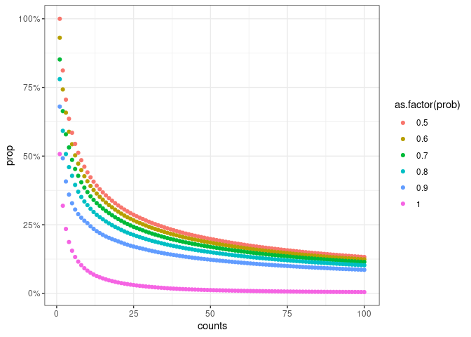
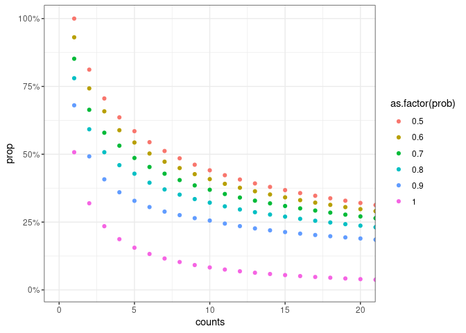

# How many unique names were genderized?

```r
unique_names %>% 
  left_join(genderized_names, by = c("first_name" = "name")) %>% 
  summarise(n = n(),
            n_genderized = sum(!is.na(gender)),
            prop_genderized = n_genderized/n)
```

```
## # A tibble: 1 x 3
##        n n_genderized prop_genderized
##    <int>        <int>           <dbl>
## 1 509731       290469           0.570
```


```r
sampling_grid <- expand_grid(counts = 1:100,
                             prob = seq(.5, 1, by = .1))


get_n <- function(df, counts, prob) {
  df %>% 
    filter(count >= counts, probability >= prob) %>% 
    nrow()
}


res <- sampling_grid %>% 
  mutate(resulting_n = map2_int(counts, prob, ~get_n(genderized_names, .x, .y)))

res %>% 
  head(20) %>% 
  knitr::kable()
```


| counts| prob| resulting_n|
|------:|----:|-----------:|
|      1|  0.5|      290469|
|      1|  0.6|      270409|
|      1|  0.7|      247486|
|      1|  0.8|      226638|
|      1|  0.9|      197611|
|      1|  1.0|      147415|
|      2|  0.5|      235801|
|      2|  0.6|      215741|
|      2|  0.7|      192818|
|      2|  0.8|      171970|
|      2|  0.9|      142943|
|      2|  1.0|       92747|
|      3|  0.5|      204945|
|      3|  0.6|      191188|
|      3|  0.7|      168265|
|      3|  0.8|      147417|
|      3|  0.9|      118390|
|      3|  1.0|       68194|
|      4|  0.5|      184723|
|      4|  0.6|      170966|


```r
pdata <- res %>% 
  mutate(prop = resulting_n/nrow(genderized_names))

p <- pdata %>% 
  ggplot(aes(counts, prop, colour = as.factor(prob))) +
  geom_point() +
  scale_y_continuous(labels = scales::percent)
p
```

<!-- -->


```r
p +
  coord_cartesian(xlim = c(0, 20))
```

<!-- -->

In terms of unique names, setting count higher than abou 3-5 already leads to 
way less names being covered. From this I would maybe choose to include names
that appear more than three times and have at least 80% probability. This would
result in only including about 50% of the genderized names.


However: how does this translate to actual authors in our dataset?


```r
joined_genders <- gender_key %>% 
  left_join(genders, by = c("first_name" = "name"))


genderize_overview <- joined_genders %>% 
  summarise(n_authors = n(),
            n_first_names = sum(as.numeric(!is.na(first_name))),
            n_genderized = sum(as.numeric(!is.na(gender)))) %>% 
  mutate(prop_first_names = n_first_names/n_authors,
         prop_genderized_first_names = n_genderized/n_first_names,
         prop_genderized_total = n_genderized/n_authors) %>% 
  collect()
```

```
## Warning: Missing values are always removed in SQL.
## Use `SUM(x, na.rm = TRUE)` to silence this warning
## This warning is displayed only once per session.
```

```r
genderize_overview %>% 
  knitr::kable()
```


| n_authors| n_first_names| n_genderized| prop_first_names| prop_genderized_first_names| prop_genderized_total|
|---------:|-------------:|------------:|----------------:|---------------------------:|---------------------:|
|  13999384|      11474798|     11059364|        0.8196645|                    0.963796|             0.7899893|

We got a reply from the API on
 of the authors, which is
quite ok.

Let's see now how this translates if we start setting thresholds.


```r
eval_res <- joined_genders %>% 
  filter(!is.na(gender)) %>% 
  mutate(c1_p7 = probability >= .7,
         c1_p85 = probability >= .85,
         c1_p9 = probability >= .9,
         c3_p7 = count >= 3 & c1_p7,
         c3_p75 = count >= 3 & probability >= .75,
         c3_p85 = count >= 3 & c1_p85,
         c3_p9 = count >= 3 & c1_p9,
         c5_p7 = count >= 5 & c1_p7,
         c5_p85 = count >= 5 & c1_p85,
         c5_p9 = count >= 5 & c1_p9) %>% 
  mutate(across(matches("^c\\d"), as.numeric)) %>% 
  summarise(n = n(),
            across(matches("^c\\d"), .fns = sum)) %>% 
  collect()
```


```r
eval_res %>% 
  pivot_longer(matches("^c\\d")) %>% 
  mutate(prop = value/n)
```

```
## # A tibble: 10 x 4
##           n name     value  prop
##       <int> <chr>    <dbl> <dbl>
##  1 11059364 c1_p7  9827345 0.889
##  2 11059364 c1_p85 8777640 0.794
##  3 11059364 c1_p9  8342958 0.754
##  4 11059364 c3_p7  9539831 0.863
##  5 11059364 c3_p75 9223300 0.834
##  6 11059364 c3_p85 8490126 0.768
##  7 11059364 c3_p9  8055444 0.728
##  8 11059364 c5_p7  9391004 0.849
##  9 11059364 c5_p85 8369073 0.757
## 10 11059364 c5_p9  7934391 0.717
```


Looking at some of the papers we collected, we would potentially end up with a
low number of authors that have been assigned a gender (lit seems to be at 
80-90%). Since we only got a reply from the API on about 80% of the authors,
if we multiply this with say 85% or 80% we end up at 64-68% of all authors having
an assigned gender.

Potential explanations:

- large scale approach, much larger than other papers in terms of number of 
papers and authors.
- More geterogenous sample, with lots of asian names -> comparison study shows
that asian names are far less well predicted.

We should therefore (for the paper at least) include a sensitivity analysis,
looking into the split in terms of gender prediction between countries/regions.

From the above table, let us take the following numbers:

- counts = 5
- probability = .85

This leads to gender assigned for about ??% of all authors.


Maybe we also didn't use the API to its full potential. What we could do:
run the full names through findGivenNames (to avoid the issue of choosing the
wrong part of the name), then genderize the strings. We could also include 
county information. However, this might bump our usage right up to 10mio requests
(we have 14mio authors, which will likely be at or above 10mio unique combinations
of full names with countries).


# Final properties

```r
author_metadata %>% 
  count(gender) %>% 
  mutate(prop = n/sum(n)) %>% 
  collect() %>% 
  knitr::kable()
```

```
## Warning: Missing values are always removed in SQL.
## Use `SUM(x, na.rm = TRUE)` to silence this warning
## This warning is displayed only once per session.
```


|gender  |       n|      prop|
|:-------|-------:|---------:|
|unknown | 5630112| 0.4021686|
|female  | 3505606| 0.2504114|
|NA      |     199| 0.0000142|
|male    | 4863467| 0.3474058|


